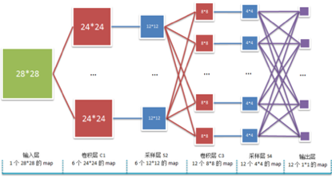

# 卷积神经网络

- [概述](#概述)
- [卷积网络的结构组成](#卷积网络的结构组成)
- [前向计算](#前向计算)
- [反向传播](#反向传播)

## 概述

卷积神经网络是一种多层前馈网络, 可以看成是多层感知器的一种特例, 卷积神经网络的作用对象是二维平面图, 多用在图像识别中。 在多层感知器中, 层与层之间的权值链接是**全连接**的方式, 而卷积网络在输出层之前的卷积层中, 层与层之间的权值链接采用**局部连接, 权值共享**的方式, 而最后一层与输出层的权值采用**全连接**的方式, 如下图:

## 卷积网络的结构组成

## 前向计算

## 反向传播

