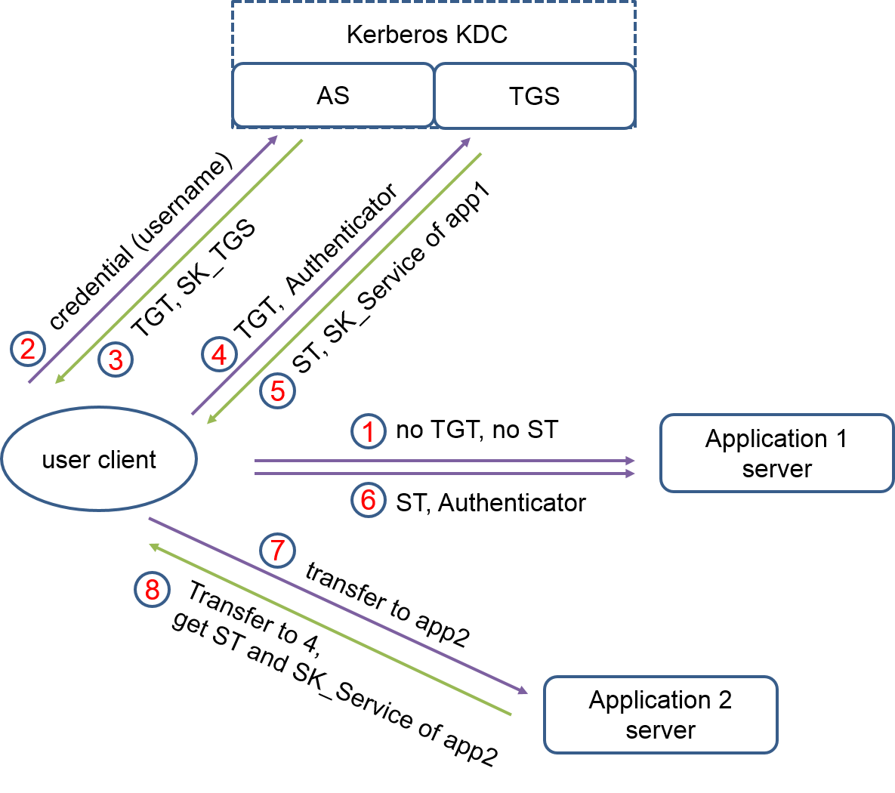

# Kerberos  

- 简介:  

Kerberos简单来说就是一个用于安全认证第三方协议, 实现了网络环境不一定保证安全的环境下, client 和 server 之间的通信, 适用于 client/server 模型。

- 相关术语介绍  

术语 | 描述  
---|---  
KDC(Key Distribution Center) | 密钥发放中心  
AS(authentication server) | 认证服务, 索取 credential , 发放 TGT  
ST(Service Ticket) | 服务票据, 任何一个应用都需要一个有效的服务票据进行有效访问, 如果能正确接收 ST , 说明 Client 和 Server 之间的信任关系已经建立起来。  
TGS(Ticket Granting Service) | 服务票据, 索取 TGT , 发放 TS。   
TGT(Ticket Granting Ticket) | 票据授权票据, 由 KDC 的 AS 发放, 获得票据后, 以后申请其他应用服务票据就不需要像 KDC 提交身份认证信息。  
Authenticator | 验证器, 与票据结合用, 来真名提交的 user 就是其申明的身份, 内容包括 {user, address, start_time, lifetime}, 这些内容使用 user 和 service 之间的 session key 加密。验证器由 user client 自己构建, 只能被使用一次。

- KDC, AS, ST, TGS, TGT 之间的关系:  

KDC 由 AS 和 TGS 组成, AS 进行身份认证发放 TGT , TGT 是用来避免多次请求而需要重复认证的凭证: TGS 发放 ST , ST 用来访问某个 service 时的凭证, ST 相当于告诉 service 你的身份被 KDC 认证为合法的一个凭证。可以参考 Kerberos 原理中所画的图来理解这些术语。

术语 | 介绍  
---|---  
client master key | KDC 中存储的 Client 的密钥  
server master key | KDC 中存储的 Server 的密钥  
Client-Server | Client 与 Server 之间会话的密钥  
Client Info | 记录了 Client 本身的 IP 等信息  
realm | Kerberos 的一个管理域, 同一个域中的所有实体共享同一个数据库
principal | Kerberos 主体, 即我们通常所说的 Kerberos 账号 (name@realm) , 可以为某个服务或者某个用户所使用 

进程 | 说明  
---|---  
kbr5kdc | Kerberos 的主进程, 也就是 KDC  
kadmind | 用于远程管理 principal 数据库  
kpropd | slave 同步数据库  


详细可以参考:  
[kerberos 简介](http://www.360doc.com/content/15/0803/10/13047933_489182493.shtml)

- 工作原理(认证流程): 



1. User 向 KDC 中的 AS 请求身份验证, AS 为 user 和 TGS 生成一个 session key , SK_TGS , 并发送 { TGT, SK_TGS }K_USER;  
    其中, { TGT, SK_TGS }K_USER 表示使用 user 的密码加密的 packet ， 包含 TGT 和用户与 TGS 的 session key ; 这个请求验证过程实际由 kinit 完成, kinit 将 user 传给 AS , AS 查找 username 的密码, 将 TGT 和 SK_TGS 使用用户密码加密后发送给 kinit , kinit 要求用户输入密码, 解密后得到 TGT 和 SK , 其中, TGT 使用 TGS 的密码加密, 信息内容为: {user, address, start_time, SK_TGS}K_TGS。

2. User 向 KDC 中的 TGS 请求访问某个 Service 的 ST, 发送 [ TGT, Authenticator ];  
    Authenticator 用于验证发送该请求的 user 就是 TGT 中声明的 user , 内容为 {user, address, start_time, lifetime}; Authenticator 使用的 TGS 和 user 之间的 session key 加密, 防止 TGT 被盗取, TGS 先使用自己的密码解开 TGT , 获取与 user 的session key , 然后使用 session key 解密 Authenticator , 验证用户的有效期。

3. TGS 判断无误后, 为 user 和 service 之间生成一个新的 session key : SK_Service , 发送给 user 一个包 [{SK_Server} SK_TGS]:  
    ST 是使用 Service 密码加密的, SK_Service 使用 TGS 和 user 之间的 session key 加密的; ST 的内容为: { user, address, start_time, lifetime, SK_Service } K_Service

4. User 使用与 TGS 之间的会话密钥解开包得到与 service 之间的会话密钥 SK_service , 使用 SK_service 生成一个 Authenticator , 向 service 发送 [ ST, Authenticator];
    此处的 Authenticator 是使用 user 和service 之间的会话密钥加密的 , service 收到包后先使用自己的密码解密 ST , 或者使用会话密钥 SK_service 解密 Authenticator 来验证发送请求的用户就是票据中声明的用户。

5. Service 向用户发送一个包证明自己的身份, 使用 SK_Service 加密。
    此后 user 与 Service 之间使用 SK_Service 进行通信, 且在TGT有效期内, user 直接跳过第一步直接从第二步使用 TGT 向 TGS 证明自己的身份。**注意: user client 会等待 service server 发送确认信息, 如果不是正确的 service server , 就无法解开 ST , 也就无法获得会话秘钥，从而避免用户使用错误的服务器。**  

## note  待整理

1. /etc/krb5.conf

```conf
[log]
...

[libdefaults]
# 域名全部大写
  default_realm = XXX.XXX.XXX

[realms]
# 可以配置多个 KDC , 几个 REALM , 几个 KDC 。
XXX.XXX.XXX = {
  # 保存所有用户的用户名和密钥
  database_name =
  # 
  acl_file =
  # 支持的加解密算法, aes256-cts:normal 需要手工支持。 KDC 的操作系统支持
  supported_enctypes = 
}
```

2. /var/kerberos/krb5kdc/kadmin5.conf

3. 

principal -> username 

4. 

klist -e -k -t xxx.keytab

加解密算法和系统支持的加解密算法不一致导致无法连接 kdc


5. 

kinit -kt xxx.keytab xxx@XXX.COM
