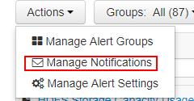
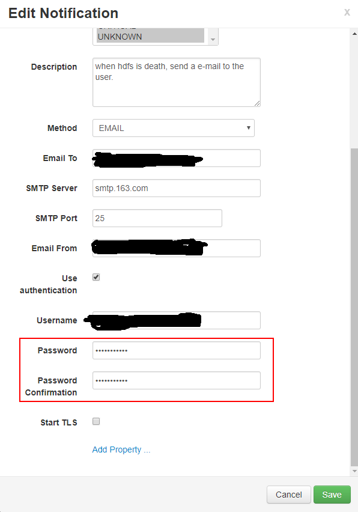
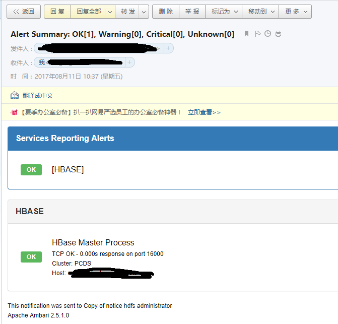

# alert email notice

配置参考: 
- [Ambari User's Guide/Customizing Notification Templates](https://docs.hortonworks.com/HDPDocuments/Ambari-2.2.0.0/bk_Ambari_Users_Guide/content/_customizing_notification_templates.html)
- [ambari邮件告警配置](http://blog.csdn.net/smarthhl/article/details/53643630)
- [javax.mail.AuthenticationFailedException异常的处理](http://blog.csdn.net/zouxucong/article/details/60578824)

场景说明: 

- 第一次尝试: 

直接配置邮箱。


配置完成后未生效。

- 第二次尝试

通过查询相关资料发现需要定义 ambari 的邮件格式。可以通过在源码中获得, 地址为: ```<ambari_source>/ambari-server/src/main/resource/alert-templates.xml ```。  
将该文件放到 ```/var/log/ambari-server/resource/``` 路径下, 修改 ```/etc/ambari-server/conf/ambari.properties``` 文件, 添加内容: ```alerts.template.file=/var/lib/ambari-server/resources/alert-templates.xml```

重启 ambari-server, 查看日志文件, 出现以下日志表示开启邮箱告警成功。

```
09 Aug 2017 10:27:39,769  INFO [AlertNoticeDispatchService RUNNING] AlertNoticeDispatchService:279 - There are 4 pending alert notices about to be dispatched...
09 Aug 2017 10:27:39,886  INFO [alert-dispatch-1] EmailDispatcher:94 - Sending email: Notification{ type=ALERT, subject=Alert Summary: OK[0], Warning[2], Critical[0], Unknown[0]}
```

开启成功后:  


此处红框内的密码为邮箱的登陆密码, 制造出告警后, 未收到邮件通知。

查看日志内容如下: 

```
javax.mail.AuthenticationFailedException: 535 Error: authentication failed

        at com.sun.mail.smtp.SMTPTransport$Authenticator.authenticate(SMTPTransport.java:892)
        at com.sun.mail.smtp.SMTPTransport.authenticate(SMTPTransport.java:814)
        at com.sun.mail.smtp.SMTPTransport.protocolConnect(SMTPTransport.java:728)
        at javax.mail.Service.connect(Service.java:386)
        at javax.mail.Service.connect(Service.java:245)
        at javax.mail.Service.connect(Service.java:194)
        at javax.mail.Transport.send0(Transport.java:253)
        at javax.mail.Transport.send(Transport.java:124)
        at org.apache.ambari.server.notifications.dispatchers.EmailDispatcher.dispatch(EmailDispatcher.java:160)
        at org.apache.ambari.server.notifications.DispatchRunnable.run(DispatchRunnable.java:58)
        at java.util.concurrent.ThreadPoolExecutor.runWorker(ThreadPoolExecutor.java:1145)
        at java.util.concurrent.ThreadPoolExecutor$Worker.run(ThreadPoolExecutor.java:615)
        at java.lang.Thread.run(Thread.java:744)
```

该错误是由于身份认证错误引起。需要检查邮箱是否开启 pop3/smtp 服务, 填写的密码应该是 **开通 pop3/smtp 的授权码** 。

重新配置后, 结果如下:  


