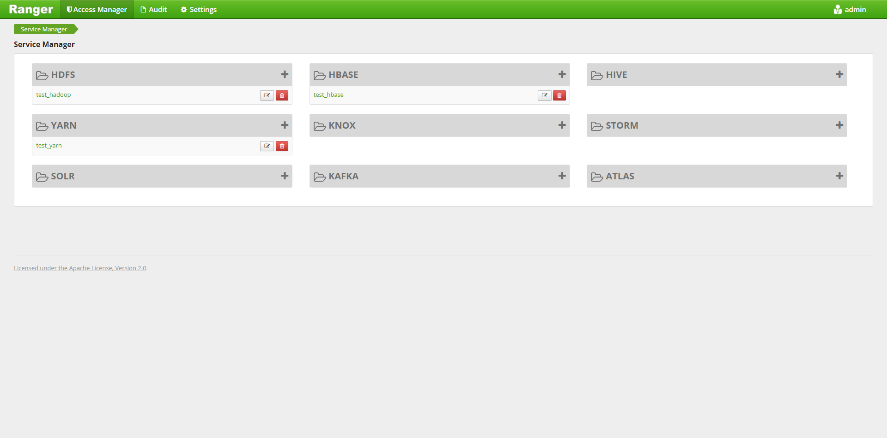
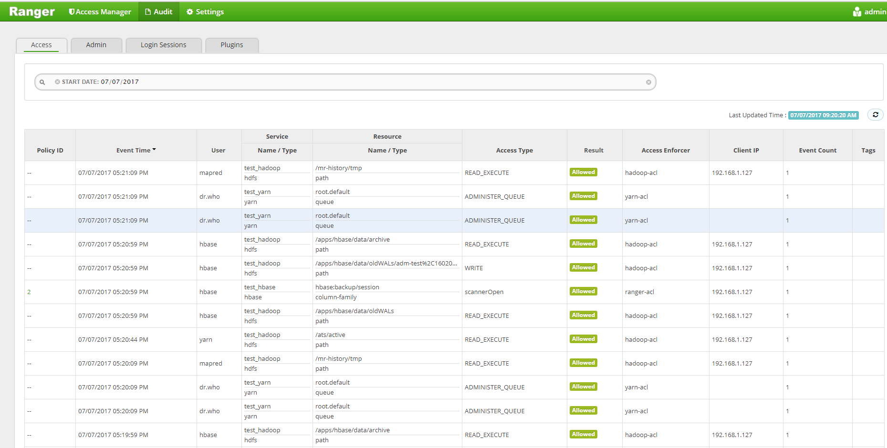

# ranger  

[审计功能](#jump)
## LDAP  

```note
passwore:
123456
{SSHA}RYlNdA/suToUctt0X6p0uffltsrwO0qP
```

## 通过 ambari 安装 ranger

- 数据库配置
     数据库可以使用 MySQL , Postgres , Oracle 。以 postgres 为例。
    
    需要依赖: 
    1. postgres
    2. postgresql-jdbc.jar (postgres driver)

```bash
# 建立数据库表
echo "CREATE DATABASE $dbname;" | sudo -u $postgres psql -U postgres
echo "CREATE USER $rangerdba WITH PASSWORD '$passwd';" | sudo -u $postgres psql -U postgres
echo "GRANT ALL PRIVILEGES ON DATABASE $dbname TO $rangerdba;" | sudo -u postgres psql -U $postgres
```

```shell
# 执行以下指令，配置 ambari 
ambari-server setup --jdbc-db={database-type} --jdbc-driver={/jdbc/driver/path}
```

修改 postgres 配置文件```postgresql.conf``` 和 ```pg_hba.conf``` , 并 reload 数据库: 

```
# postgresql.conf
listen_addresses='*'

# pg_hba.conf
local all postgres,rangerdba trust
local all postgres,rangerdba    0.0.0.0:0   trust
local all postgres,rangerdba    ::/0    trust

# reload pgsql
sudo -u postgres /usr/bin/pg_ctl -D $PGDATA reload
```

- 准备工作完成, 剩余按照引导界面操作进行安装。

## 使用(通过 ranger 管理权限)  

TODO


### 管理权限  

步骤:  

1. 启用 Ranger plugins , 对于

权限管理可以通过在 Access Manager 界面进行配置, 能够将指定 service 的权限分享给某个用户和用户组， 




### 审计功能  

在 audit 界面，包含支持审计的service, 包含权限审计, 管理员审计, 登陆审计。

地址: ```http://<ranger-server>:6080/index.html#!/reports/audit/bigData```

- 权限审计: 



可以通过搜索来查看上图中某个具体类型的审计或多个类型的组合。


