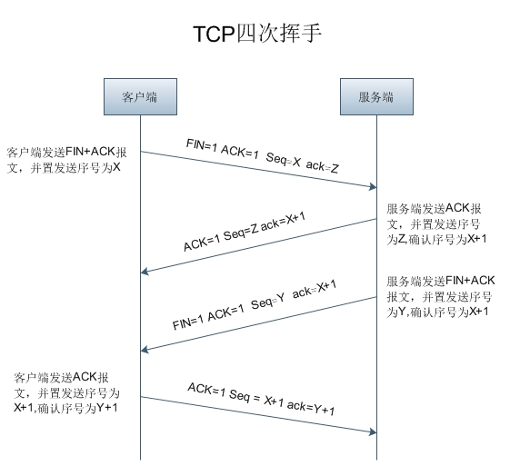

# TCP  

- 定义:

TCP（Transmission Control Protocol 传输控制协议）是一种面向连接的、可靠的、基于字节流的传输层通信协议。  

TCP/IP 协议是 Internet 最基本的协议、 Internet 国际互联网络的基础。协议采用了 4 层的层级结构, 每一层都呼叫它的下一层所提供的协议来完成自己的需求。 而IP是给因特网的每一台联网设备规定一个地址。  

TCP/IP 不是一个协议，而是一个协议族的统称。里面包括了 IP 协议, IMCP 协议, TCP 协议, 以及 http、ftp、pop3 协议等等。  

## 协议分层  

TCP/IP 四层模型: 应用层、传输层、网络层、数据链路层。  

每一抽象层建立在低一层提供的服务上: 并且为高一层提供服务:  

1. 应用层  

    应用层确定进程间通信的性质, 以满足用户的需要。在应用层提供了多个常用协议, 如:  
    1. FTP(File Transfer Protocol): 文件传输协议  
    2. SMTP(Simple Mail Transfer Protocol): 简单邮件传输协议  
    3. POP3(Post Office Protocol 3): 第三代邮局协议  
    4. HTTP(Hyper Text Transfer Protocol): 超文本传输协议  
    5. NNTP(Network News Transfer Protocol): 网络新闻传输协议

2. 传输层

    主要任务是向上一层提供可靠的端到端服务，确保 “报文” 无差错、有序、不丢失、无重复地传输。它向高层屏蔽了下层数据通信的细节, 是计算机通信体系结构中最关键的一层。包含以下 2 个重要协议：
    - TCP: TCP 是 TCP/IP 体系中的传输层协议处于第 4 层传输层, 负责数据的可靠传输（“三次握手”-建立连接、数据传送、关闭连接）。  

    - UDP: 和 TCP 相比, 数据传输的可靠性低, 适合少量的可靠性要求不高的数据传输。  

3. 网络层  

    主要功能是要完成网络中主机间“分组” (Packet) 的传输。包含 4 个协议:  
        1. 网际协议 IP: 负责分组数据的传输，各个IP数据之间是相互独立的。  
        2. 互联网控制报文协议 ICMP: IP 层内特殊的报文机制，起控制作用，能发送报告差错或提供有关意外情况的信息。  
        3. 地址转换协议 ARP: 将IP地址转换为相应的网络地址。  
        4. 反向地址转换协议 RARP: RARP 用于特殊情况，当只有自己的物理地址没有IP地址时，可通过 RARP 获得 IP 地址，如果遇到断电或重启状态下，开机后还必需再使用 RARP 重新获取IP地址。

4. 数据链路层  
    数据链路层是物理传输通道，可使用多种传输介质传输，可建立在任何物理传输网上。

## 连接

- TCP 的三次握手  

    三次握手（Three-Way Handshake）即建立 TCP 连接，就是指建立一个 TCP 连接时，需要客户端和服务端总共发送3个包以确认连接的建立。在 socket 编程中，这一过程由客户端执行 connect 来触发，整个流程如下图所示：

    

    1. 第一次握手:  
    Client 将标志位 SYN 置为1，随机产生一个值 seq=J，并将该数据包发送给 Server , Client 进入 SYN_SENT 状态，等待 Server 确认。  

    2. 第二次握手:   
    Server 收到数据包后由标志位SYN=1知道 Client 请求建立连接， Server 将标志位 SYN 和 ACK 都置为 1, ack=J+1, 随机产生一个值 seq=K, 并将该数据包发送给 Client 以确认连接请求, Server 进入 SYN_RCVD 状态。

    3. 第三次握手:  
    Client 收到确认后, 检查 ack 是否为 J+1, ACK 是否为 1, 如果正确则将标志位 ACK 置为 1 , ack=K+1 , 并将该数据包发送给 Server , Server 检查 ack 是否为 K+1 , ACK 是否为 1 , 如果正确则连接建立成功 , Client 和 Server 进入 ESTABLISHED 状态 , 完成三次握手 , 随后 Client 与 Server 之间可以开始传输数据了。

- 四次挥手
    所谓四次挥手 (Four-Way Wavehand ) 即终止 TCP 连接, 就是指断开一个 TCP 连接时, 需要客户端和服务端总共发送 4 个包以确认连接的断开。在 socket 编程中, 这一过程由客户端或服务端任一方执行 close 来触发, 整个流程如下图所示：

    

    1. 第一次挥手:  
    Client 发送一个 FIN , 用来关闭 Client 到 Server 的数据传送 , Client 进入 FIN_WAIT_1 状态。

    2. 第二次挥手:  
    Server 收到 FIN 后, 发送一个 ACK 给 Client , 确认序号为收到序号 +1 ( 与 SYN 相同, 一个 FIN 占用一个序号 ) , Server 进入 CLOSE_WAIT 状态。

    3. 第三次挥手:  
    Server 发送一个 FIN , 用来关闭 Server 到 Client 的数据传送, Server 进入 LAST_ACK 状态。

    4. 第四次挥手:  
    Client 收到 FIN 后, Client 进入 TIME_WAIT 状态, 接着发送一个 ACK 给 Server , 确认序号为收到序号 +1 , Server 进入 CLOSED 状态, 完成四次挥手。

- 建立连接是三次握手, 而关闭连接却是四次挥手的原因:  

    因为服务端在 LISTEN 状态下, 收到建立连接请求的 SYN 报文后, 把 ACK 和 SYN 放在一个报文里发送给客户端。而关闭连接时, 当收到对方的 FIN 报文时, 仅仅表示对方不再发送数据了但是还能接收数据, 己方也未必全部数据都发送给对方了, 所以己方可以立即 close , 也可以发送一些数据给对方后, 再发送 FIN 报文给对方来表示同意现在关闭连接, 因此, 己方 ACK 和 FIN 一般都会分开发送。

- TIME_WAIT 状态需要经过 2MSL (最大报文段生存时间) 才能返回到 CLOSE 状态的原因:  

    1. 保证 TCP 协议的全双工连接能够可靠关闭。  
    如果 Client 直接 CLOSED 了, 那么由于 IP 协议的不可靠性或者是其它网络原因, 导致 Server 没有收到 Client 最后回复的 ACK 。 那么 Server 就会在超时之后继续发送 FIN , 此时由于 Client 已经 CLOSED了, 就找不到与重发的 FIN 对应的连接, 最后 Server 就会收到 RST 而不是 ACK , Server 就会以为是连接错误把问题报告给高层。这样的情况虽然不会造成数据丢失, 但是却导致 TCP 协议不符合可靠连接的要求。所以, Client 不是直接进入 CLOSED , 而是要保持 TIME_WAIT , 当再次收到FIN的时候, 能够保证对方收到 ACK , 最后正确的关闭连接。
    2. 保证这次连接的重复数据段从网络中消失。
    如果 Client 直接 CLOSED , 然后又再向 Server 发起一个新连接, 我们不能保证这个新连接与刚关闭的连接的端口号是不同的, 也就是说有可能新连接和老连接的端口号是相同的。一般来说不会发生什么问题, 但是还是有特殊情况出现：假设新连接和已经关闭的老连接端口号是一样的, 如果前一次连接的某些数据仍然滞留在网络中，这些延迟数据在建立新连接之后才到达 Server , 由于新连接和老连接的端口号是一样的, 又因为 TCP 协议判断不同连接的依据是 socket pair , 于是, TCP 协议就认为那个延迟的数据是属于新连接的, 这样就和真正的新连接的数据包发生混淆了。所以 TCP 连接还要在 TIME_WAIT 状态等待 2 倍 MSL , 这样可以保证本次连接的所有数据都从网络中消失。

- TCP 调用 socket 的 `accept()` 方法; UDP 调用 socket 的 `recvfrom()` 方法(for python)。

## 套接字(socket)

网络上的两个程序通过一个双向的通信连接实现数据的交换, 这个连接的一端称为一个 socket 。
