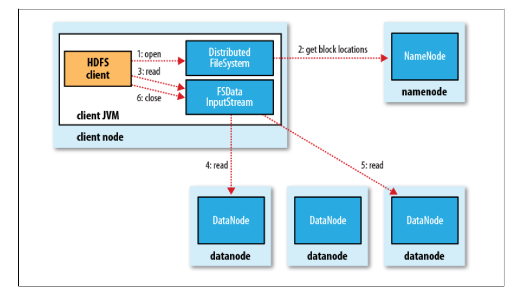
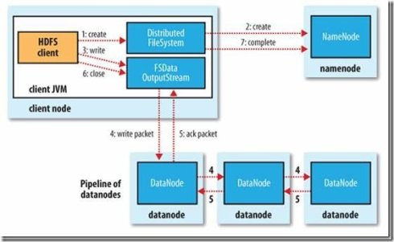

# HDFS 读写流程

## 读

客户端将要读取的文件路径发送给 Namenode, Namenode 获取文件的元信息(主要是block的存放位置信息)返回给客户端, 客户端根据返回的信息找到相应 Datanode 逐个获取文件的 block 并在客户端本地进行数据追加合并从而获得整个文件。

详细过程:

1. 客户端通过调用 `FileSystem` 对象的 open() 来读取希望打开的文件。 对于 HDFS 来说, 这个对象是分布式文件系统的一个实例;
2. `DistributedFileSystem` 通过 RPC 来调用 Namenode, 以确定文件的开头部分的块位置。 对于每一块, Namenode 返回具有该块副本的Datanode地址。 此外, 这些Datanode根据他们与 client 的距离来排序 (根据网络集群的拓扑)。 如果该 client 本身就是一个Datanode, 便从本地Datanode中读取。 `DistributedFileSystem` 返回一个FSDataInputStream对象给client读取数据, `FSDataInputStream` 转而包装了一个 `DFSInputStream` 对象;
3. 接着 client 对这个输入流调用 read()。 存储着文件开头部分块的数据节点地址的 `DFSInputStream` 随即与这些块最近的Datanode相连接。
4. 通过在数据流中反复调用 read(), 数据会从 Datanode 返回 client;
5. 到达块的末端时, `DFSInputStream` 会关闭与 Datanode 间的联系, 然后为下一个块找到最佳的 Datanode。 client 端只需要读取一个连续的流, 这些对于 client 来说都是透明的。

注意:

1. 在读取的时候, 如果 client 与 Datanode 通信时遇到一个错误, 那么它就会去尝试对这个块来说下一个最近的块。 它也会记住那个故障节点的Datanode, 以保证不会再对之后的块进行徒劳无益的尝试。 client 也会确认 Datanode 发来的数据的校验和。 如果发现一个损坏的块, 它就会在 client 试图从别的 Datanode 中读取一个块的副本之前报告给 Namenode。
2. 这个设计的一个重点是, client 直接联系 Datanode 去检索数据, 并被 Namenode 指引到块中最好的 Datanode。 因为数据流在此集群中是在所有 Datanode 分散进行的。 所以这种设计能使 HDFS 可扩展到最大的并发 client 数量。 同时, Namenode只不过提供块的位置请求 (存储在内存中, 十分高效), 不是提供数据。 否则如果客户端数量增长, Namenode 就会快速成为一个瓶颈。

## 写

client 和 Namenode 通信, 确认可以写文件, 并获取可以接收文件的 Datanode; client 按照顺序将文件的 block 发送给 Datanode; 接收到 block 的 Datanode 复制 block 到其他 Datanode。

详细过程:

1. 客户端通过在 `DistributedFileSystem` 中调用 create() 来创建文件;
2. `DistributedFileSystem` 使用 RPC 去调用 Namenode, 在文件系统的命名空间创一个新的文件, 没有块与之相联系。 Namenode 执行各种不同的检查以确保这个文件不会已经存在, 并且在 client 有可以创建文件的适当的许可。 如果检查通过, Namenode 就会生成一个新的文件记录; 否则, 文件创建失败并向 client 抛出一个 `IOException` 异常。 分布式文件系统返回一个文件系统数据输出流, 让 client 开始写入数据。 就像读取事件一样, 文件系统数据输出流控制一个 `DFSOutputStream`, 负责处理 Datanode 和 Namenode 之间的通信;
3. 在 client 写入数据时, `DFSOutputStream` 将它分成一个个的包, 写入内部队列, 称为数据队列。 数据流处理数据队列, 数据流的责任是根据适合的 Datanode 的列表要求 Namenode 分配适合的新块来存储数据副本;
4. 数据流将包分流给管线中第一个的 Datanode, 这个节点会存储包并且发送给管线中的第二个 Datanode。 同样地, 第二个 Datanode 存储包并且传给管线中的第三个数据节点;
5. `DFSOutputStream` 也有一个内部的数据包队列来等待 Datanode 收到确认, 称为确认队列。 一个包只有在被管线中所有的节点确认后才会被移除出确认队列。 如果在有数据写入期间, Datanode 发生故障,  则会执行下面的操作, 当然这对写入数据的 client 而言是透明的。 首先管线被关闭, 确认队列中的任何包都会被添加回数据队列的前面, 以确保故障节点下游的 Datanode不 会漏掉任意一个包。 为存储在另一正常 Datanode 的当前数据块制定一个新的标识, 并将该标识传给 Namenode, 以便故障节点 Datanode 在恢复后可以删除存储的部分数据块。 从管线中删除故障数据节点并且把余下的数据块写入管线中的两个正常的 Datanode。 Namenode 注意到块复本量不足时, 会在另一个节点上创建一个新的复本。 后续的数据块继续正常接收处理。 只要 `dfs.replication.min` 的副本(默认是 1)被写入, 写操作就是成功的, 并且这个块会在集群中被异步复制, 直到其满足目标副本数(`dfs.replication` 默认值为 3);
6. client 完成数据的写入后, 就会在流中调用 close();
7. 在向 Namenode 节点发送完消息之前, 此方法会将余下的所有包放入 Datanode 管线并等待确认。 Namenode 节点已经知道文件由哪些块组成(通过Data streamer 询问块分配), 所以它只需在返回成功前等待块进行最小量的复制。

- 复本的布局: 需要对可靠性、写入带宽和读取带宽进行权衡。 Hadoop 的默认布局策略是在运行客户端的节点上放第 1 个复本(如果客户端运行在集群之外, 就随机选择一个节点, 不过系统会避免挑选那些存储太满或太忙的节点), 第 2 个复本放在与第 1 个复本不同且随机另外选择的机架的节点上(离架)。 第 3 个复本与第 2 个复本放在相同的机架, 且随机选择另一个节点。 其他复本放在集群中随机的节点上, 不过系统会尽量避免相同的机架放太多复本。
- 总的来说, 这一方法不仅提供了很好的稳定性(数据块存储在两个机架中)并实现很好的负载均衡, 包括写入带宽(写入操作只需要遍历一个交换机)、读取性能(可以从两个机架中选择读取)和集群中块的均匀分布(客户端只在本地机架上写入一个块)。
