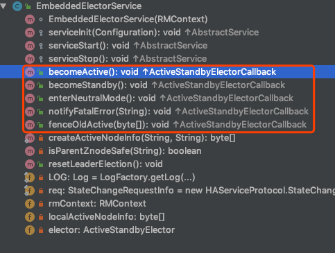

# Yarn ResourceManager High Availability

- [体系结构](#体系结构)
  - [手动转换和故障转移](#手动转换和故障转移)
  - [自动故障转移](#自动故障转移)
  - [RM 故障转移中的 Client、ApplicationMaster、NodeManager](#rm-故障转移中的-clientapplicationmasternodemanager)
  - [Active-RM 状态恢复](#active-rm-状态恢复)
- [配置清单](#配置清单)
  - [切换 Active RM](#切换-active-rm)
- [RM HA & ZK](#rm-ha--zk)
  - [ZKRMStateStore](#zkrmstatestore)
    - [实现隔离](#实现隔离)
    - [还原状态](#还原状态)
  - [ActiveStandbyElector](#activestandbyelector)
    - [实现分析](#实现分析)
    - [对 ActiveStandbyElector 主被选举状态变化的处理](#对-activestandbyelector-主被选举状态变化的处理)

在 Hadoop 生态中(Hadoop2.x及以后版本), JobTracker 和 TaskTracker 演变为 Yarn 作为 Hadoop 的资源管理器。 同时, MapReduce、Spark、Flink、等计算框架也支持 Yarn 来调度, 因此, Yarn 高可用极为重要。 关于 Yarn 相关内容, 详情查看[Apache Hadoop YARN Architecture](https://hadoop.apache.org/docs/r2.7.3/hadoop-yarn/hadoop-yarn-site/YARN.html), 这里对 Yarn ResourceManager 的 HA 做一个简单介绍。 文章部分来自官方文档。

ResourceManager HA 的目的是当 Active RM 无法工作时, Standby RM 能够阶梯正在服务的 Active RM, 防止集群出现不可用状态。

## 体系结构


ResourceManager HA 通过 Active/Standby 体系结构实现, 即在任意时刻, 都有一个 RM(ResourceManager) 处于 Active 状态, 一个或多个 RM 处于 Standby 状态, 如果 Active RM 发生故障, 由 Standby 的 RM 接管 Active RM 的工作。 启动自动故障转移时, 通过 Admin 接口或集成故障转移器将 Standby RM 转换为 Active RM。

### 手动转换和故障转移

不启动自动故障转移时, 管理员必须手动将其中一个 RM 转换成 Active 状态。 要从另一个 RM 进行故障转移到另一个 RM, 需要先将 Active-RM 转换成 Standby, 并将备用的 RM 转换成 Active。 这些操作可以通过 Yarn admin client 完成。

### 自动故障转移

RM 可以选择基于 zookeeper 的 `ActiveStandbyElector` 来决定那个 RM 是 Active 的, 当 Active 的 RM 停止或无响应时, 自动选择一个 Standby RM 作为 Active RM 来接管。 RM 的 HA 不需要单独的守护进程(如 HDFS 的 ZKFC), 而是由嵌入到 RM 中的 `ActiveStandbyElector` 充当故障检测器和 leader elector。

### RM 故障转移中的 Client、ApplicationMaster、NodeManager

当存在多个 RM 时, Client 和 所有节点的配置(`yarn-site.xml`)中需要列出所有的 RM, Client、AM(ApplicationMaster)、NodeManager 将循环尝试连接 RM, 知道连接到 Active 的 RM。 如果 Active 的 RM 停止了, 将继续轮询, 直到能连接到新的 Active 的 RM 为止。 可以通过实现 `org.apache.hadoop.yarn.client.RMFailoverProxyProvider` 或者 配置 `yarn.client.failover-proxy-provider` 来实现。

### Active-RM 状态恢复

启用 ResourceManager 后, 将 RM 状态转换成 Active 状态需要加载 RM 内部状态, 并根据 RM Restart 特性尽可能从之前停止的位置继续执行。 对于之前提交给 RM 托管的 Application, 都会生成一个新的 Application。 Application 可以定期 CheckPoint, 以免丢失任何 work。 状态存储必须在 Active & Standby 的 RM 中可见, 目前有两种用于持久化的 `RMStateStore` 实现: `FileSystemRMStateStore` 和 `ZKRMStateStore`。 `ZKRMStateStore` 隐式允许任何时间任何节点对单个 RM 进行写访问, 因此官方推荐使用 `ZKRMStateStore`。 在使用 `ZKRMStateStore` 时, 不需要单独的隔离机制来处理潜在的脑裂情况。 在这种情况下, 多个 RM 可以潜在地承担活动角色。 在使用 `ZKRMStateStore` 时, 官方建议不要在 zookeeper 集群中设置 `zookeeper.DigestAuthenticationProvider`, 同时 zookeeper 管理员用户不能有 Yarn 的 application/user 的凭证信息。

## 配置清单

配置项 | 描述
---|---
yarn.resourcemanager.zk-address | zk-quorum的地址。同时用于状态存储和leader选举。
yarn.resourcemanager.ha.enabled | Enable RM HA.
yarn.resourcemanager.ha.rm-ids | RM 的逻辑 ID, 比如 `rm1`, `rm2`
yarn.resourcemanager.hostname.rm-id | 为每个 rm-id 声明一个对应的主机名, 也可以声明 RM 的服务地址来替换。
yarn.resourcemanager.address.rm-id | 为每个 rm-id 声明一个对应的 RM 服务地址, 也可以声明 rm 对应主机名来替换。
yarn.resourcemanager.scheduler.address.rm-id | For each rm-id, specify scheduler host:port for ApplicationMasters to obtain resources. If set, overrides the hostname set inv yarn.resourcemanager.hostname.rm-id.
yarn.resourcemanager.resource-tracker.address.rm-id | For each rm-id, specify host:port for NodeManagers to connect. If set, overrides the hostname set in yarn.resourcemanager.hostname.rm-id.
yarn.resourcemanager.admin.address.rm-id | For each rm-id, specify host:port for administrative commands. If set, overrides the hostname set in yarn.resourcemanager.hostname.rm-id.
yarn.resourcemanager.webapp.address.rm-id | For each rm-id, specify host:port of the RM web application corresponds to. You do not need this if you set yarn.http.policy to HTTPS_ONLY. If set, overrides the hostname set in yarn.resourcemanager.hostname.rm-id.
yarn.resourcemanager.webapp.https.address.rm-id | For each rm-id, specify host:port of the RM https web application corresponds to. You do not need this if you set yarn.http.policy to HTTP_ONLY. If set, overrides the hostname set in yarn.resourcemanager.hostname.rm-id.
yarn.resourcemanager.ha.id | Identifies the RM in the ensemble. This is optional; however, if set, admins have to ensure that all the RMs have their own IDs in the config.
yarn.resourcemanager.ha.automatic-failover.enabled | 启动自动故障转移, 启用 RM HA 后默认开启。
yarn.resourcemanager.ha.automatic-failover.embedded | 启用后, 通过内置的 leader 选举来选 Active RM。 启用 RM HA 时默认开启。
yarn.resourcemanager.cluster-id | 集群标识, 确保 RM 不会接管另一个集群(即不会成为其他集群的 Active RM)。
yarn.client.failover-proxy-provider | Client、AM、NM 连接 Active RM 故障转移的类。
yarn.client.failover-max-attempts | `FailoverProxyProvider` 尝试故障转移的最大次数。
yarn.client.failover-sleep-base-ms | 故障转移之间计算延迟的 sleep 毫秒数。
yarn.client.failover-sleep-max-ms | 故障转移之间的 sleep 最大毫秒数。
yarn.client.failover-retries | 每次连接 RM 的重试次数。
yarn.client.failover-retries-on-socket-timeouts | 每次连接 RM 的 socket 超时重试次数。

可以根据以上配置项对 RM HA 进行优化。

简单文件 sample:

```xml
<property>
  <name>yarn.resourcemanager.ha.enabled</name>
  <value>true</value>
</property>
<property>
  <name>yarn.resourcemanager.cluster-id</name>
  <value>cluster1</value>
</property>
<property>
  <name>yarn.resourcemanager.ha.rm-ids</name>
  <value>rm1,rm2</value>
</property>
<property>
  <name>yarn.resourcemanager.hostname.rm1</name>
  <value>master1</value>
</property>
<property>
  <name>yarn.resourcemanager.hostname.rm2</name>
  <value>master2</value>
</property>
<property>
  <name>yarn.resourcemanager.webapp.address.rm1</name>
  <value>master1:8088</value>
</property>
<property>
  <name>yarn.resourcemanager.webapp.address.rm2</name>
  <value>master2:8088</value>
</property>
<property>
  <name>yarn.resourcemanager.zk-address</name>
  <value>zk1:2181,zk2:2181,zk3:2181</value>
</property>
```

### 切换 Active RM

```bash
# 获取 active 状态
yarn rmadmin -getServiceState rm1
yarn rmadmin -getServiceState rm2

# 切换 rm1 到 active 状态
yarn rmadmin -transitionToActive rm1
```

## RM HA & ZK

RM HA 中使用 ZK 的地方是 `ZKRMStateStore` 和 `ZKFailoverController`。

### ZKRMStateStore

`ZKRMStateStore` 继承了抽象类 `RMStateStore`, 用来存储 RM 的状态。

`RMStateStore` 中包含对 `RMState`, `RMDTSecretManagerState`, `ApplicationStaateData`, `ApplicationAttemptStateData` 的 store, load, remove, update 操作。

1. RMState: ResourceManager 的状态。
2. ApplicationStateData: Application 状态的数据。
3. ApplicationAttemptStateData: Application 重试状态, 一个 ApplicationState 可能包含多个 ApplicationAttemptState(假如客户端设置重试2次, 第一次失败, 第二次成功, 则 ApplicationState 会保存两个 ApplicationAttemptState)。

在 RM 启动时, 会加载上述几种状态(`RMStateStore#loadState()`, 见 `ResourceManager#RMActiveServices#serviceStart()`):

```java
protected void serviceStart() throws Exception {
  RMStateStore rmStore = rmContext.getStateStore();
  // The state store needs to start irrespective of recoveryEnabled as apps
  // need events to move to further states.
  rmStore.start();

  pauseMonitor.start();

  if(recoveryEnabled) {
    try {
      LOG.info("Recovery started");
      rmStore.checkVersion();
      if (rmContext.isWorkPreservingRecoveryEnabled()) {
        rmContext.setEpoch(rmStore.getAndIncrementEpoch());
      }
      // 加载上一次的 RMState
      RMState state = rmStore.loadState();
      recover(state);
      LOG.info("Recovery ended");
    } catch (Exception e) {
      // the Exception from loadState() needs to be handled for
      // HA and we need to give up master status if we got fenced
      LOG.error("Failed to load/recover state", e);
      throw e;
    }
  }
  super.serviceStart();
}
```

ZK 中存储 RM 状态目录结构如下:

```txt
ROOT_DIR_PATH
|--- VERSION_INFO
|--- EPOCH_NODE # RM 重启的元信息
|--- RM_ZK_FENCING_LOCK
|--- RM_APP_ROOT
|     |----- (#ApplicationId1)
|     |        |----- (#ApplicationAttemptIds)
|     |
|     |----- (#ApplicationId2)
|     |       |----- (#ApplicationAttemptIds)
|     ....
|
|--- RM_DT_SECRET_MANAGER_ROOT
       |----- RM_DT_SEQUENTIAL_NUMBER_ZNODE_NAME
       |----- RM_DELEGATION_TOKENS_ROOT_ZNODE_NAME
       |       |----- Token_1
       |       |----- Token_2
       |       ....
       |
       |----- RM_DT_MASTER_KEYS_ROOT_ZNODE_NAME
       |      |----- Key_1
       |      |----- Key_2
               ....
|--- AMRMTOKEN_SECRET_MANAGER_ROOT
       |----- currentMasterKey
       |----- nextMasterKey
|-- RESERVATION_SYSTEM_ROOT
       |------PLAN_1
       |      |------ RESERVATION_1
       |      |------ RESERVATION_2
       |      ....
       |------PLAN_2
       ....
```

存储的信息主要包 `Application` 和 `SECRET_MANAGER` (安全与权限相关) 的信息。

#### 实现隔离

`ZKRMStoreStateStore#startInternal()` 会隔离相关路径、ACL、OPS。

```java
private synchronized void fence() throws Exception {
  if (LOG.isTraceEnabled()) {
    logRootNodeAcls("Before fencing\n");
  }

  curatorFramework.setACL().withACL(zkRootNodeAcl).forPath(zkRootNodePath);
  delete(fencingNodePath);

  if (LOG.isTraceEnabled()) {
    logRootNodeAcls("After fencing\n");
  }
}
```

#### 还原状态

`RMActiveServices` 在启动时 (serviceStart) 会调用 `RMStateStore#loadState()` 方法加载已经存储的 RM 状态。 RM HA 启动后默认进入 Standby 状态, 通过手动或者配置自动选举的方式选择 Active, 此时 RM 会加载已经存储的状态并还原。

### ActiveStandbyElector

`ActiveStandbyElector` 主要负责完成自动的主被选举(NameNode/ResourceManager), 内部封装 ZK 的处理逻辑, 一旦主被选举完成, 回调进行切换主备。

#### 实现分析

- 创建锁节点

如果目前还没有进行过主备选举的话, 那么相应的 ActiveStandbyElector 就会发起一次主备选举, Zookeeper 的写一致性会保证最终只会有一个 ActiveStandbyElector 创建成功, 创建成功的 ActiveStandbyElector 对应的 RM 切换成 Active RM, 创建失败的 ActiveStandbyElector 对应的 RM 为 Stabdby RM, ActiveStandbyElector 回调 `EmbeddedElectorService` 的方法将对应的 RM 切换为相应的 RM。



- 注册 Watcher 监听

- 自动触发主备选举

- 防止脑裂

Zookeeper 在工程实践中经常发生 Zookeeper Client `假死`, 导致 Zookeeper Client 到 Zookeeper Server 的心跳不能正常发出, 超过 `Zookeeper Session Timeout` 后, Zookeeper Server 会认为 Client 的 Session 已经过期而关闭 Session。 `假死` 可能引发分布式系统常说的`双主`或`脑裂(brain-split)`现象。 导致 Zookeeper Client `假死` 的原因可能是 ZK Client 正在进行 Full GC 或 Client 所在机器负载过高等。 Zookeeper 社区针对这种问题的解决方法是隔离, 将旧的 Active RM 隔离起来, 使其不能对外提供服务。

为实现隔离, `ActiveStandbyElector` 会创建一个 fencing 节点, 在 RM 中是 `RM_ZK_FENCING_LOCK`, 其实现类似于 ZKFC。 暂未去模拟脑裂的场景。

#### 对 ActiveStandbyElector 主被选举状态变化的处理

当 `ActiveStandbyElector` 的贮备选举状态发生变化时, 会调用 `EmbeddedElectorService` 中注册的回调函数进行相应的处理。

- 如果 `ActiveStandbyElector` 选主成功, 那么 `ActiveStandbyElector` 对应的 RM 成为 Active RM, `ActiveStandbyElector` 会回调 `EmbeddedElectorService` 的 `becomeActive` 方法。
- 如果 `ActiveStandbyElector` 选主失败, 那么 `EmbeddedElectorService` 对应的 RM 成为 Standby RM, `ActiveStandbyElector` 会回调 `EmbeddedElectorService` 对应的 `becomeStandby` 方法。
