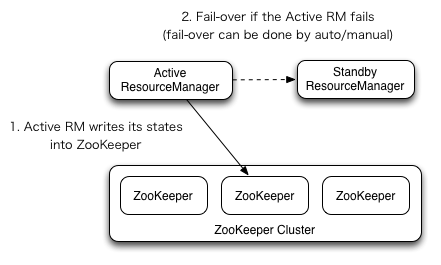

# Yarn ResourceManager High Availability

- [原理](#原理)
  - [体系结构](#体系结构)
  - [手动转换和故障转移](#手动转换和故障转移)
  - [自动故障转移](#自动故障转移)
  - [RM 故障转移中的 Client、ApplicationMaster、NodeManager](#rm-故障转移中的-clientapplicationmasternodemanager)
  - [Active-RM 状态恢复](#active-rm-状态恢复)
  - [ZKRMStateStore 详情](#zkrmstatestore-详情)
- [配置清单](#配置清单)
- [RM HA](#rm-ha)
- [RM HA 和 NameNode HA 实现上的差异](#rm-ha-和-namenode-ha-实现上的差异)

在 Hadoop 生态中(Hadoop2.x及以后版本), JobTracker 和 TaskTracker 演变为 Yarn 作为 Hadoop 的资源管理器。 同时, MapReduce、Spark、Flink、等计算框架也支持 Yarn 来调度, 因此, Yarn 高可用极为重要。 关于 Yarn 相关内容, 详情查看[Apache Hadoop YARN Architecture](https://hadoop.apache.org/docs/r2.7.3/hadoop-yarn/hadoop-yarn-site/YARN.html), 这里对 Yarn ResourceManager 的 HA 做一个简单介绍。 文章大部分来自官方文档。

## 原理

### 体系结构



ResourceManager HA 通过 Active/Standby 体系结构实现, 即在任意时刻, 都有一个 RM(ResourceManager) 处于 Active 状态, 一个或多个 RM 处于 Standby 状态, 如果 Active RM 发生故障, 由 Standby 的 RM 接管 Active RM 的工作。 启动自动故障转移时, 通过 Admin 接口或集成故障转移器将 Standby RM 转换为 Active RM。

### 手动转换和故障转移

不启动自动故障转移时, 管理员必须手动将其中一个 RM 转换成 Active 状态。 要从另一个 RM 进行故障转移到另一个 RM, 需要先将 Active-RM 转换成 Standby, 并将备用的 RM 转换成 Active。 这些操作可以通过 Yarn admin client 完成。

### 自动故障转移

RM 可以选择基于 zookeeper 的 `ActiveStandbyElector` 来决定那个 RM 是 Active 的, 当 Active 的 RM 停止或无响应时, 自动选择一个 Standby RM 作为 Active RM 来接管。 RM 的 HA 不需要单独的守护进程(如 HDFS 的 ZKFC), 而是由嵌入到 RM 中的 `ActiveStandbyElector` 充当故障检测器和 leader elector。

### RM 故障转移中的 Client、ApplicationMaster、NodeManager

当存在多个 RM 时, Client 和 所有节点的配置(`yarn-site.xml`)中需要列出所有的 RM, Client、AM(ApplicationMaster)、NodeManager 将循环尝试连接 RM, 知道连接到 Active 的 RM。 如果 Active 的 RM 停止了, 将继续轮询, 直到能连接到新的 Active 的 RM 为止。 可以通过实现 `org.apache.hadoop.yarn.client.RMFailoverProxyProvider` 或者 配置 `yarn.client.failover-proxy-provider` 来实现。

### Active-RM 状态恢复

启用 ResourceManager 后, 将 RM 状态转换成 Active 状态需要加载 RM 内部状态, 并根据 RM Restart 特性尽可能从之前停止的位置继续执行。 对于之前提交给 RM 托管的 Application, 都会生成一个新的 Application。 Application 可以定期 CheckPoint, 以免丢失任何 work。 状态存储必须在 Active & Standby 的 RM 中可见, 目前有两种用于持久化的 `RMStateStore` 实现: `FileSystemRMStateStore` 和 `ZKRMStateStore`。 `ZKRMStateStore` 隐式允许任何时间任何节点对单个 RM 进行写访问, 因此官方推荐使用 `ZKRMStateStore`。 在使用 `ZKRMStateStore` 时, 不需要单独的隔离机制来处理潜在的[脑裂]()情况。 在这种情况下, 多个 RM 可以潜在地承担活动角色。 在使用 `ZKRMStateStore` 时, 官方建议不要在 zookeeper 集群中设置 `zookeeper.DigestAuthenticationProvider`, 同时 zookeeper 管理员用户不能有 Yarn 的 application/user 的凭证信息。

### ZKRMStateStore 详情

- zookeeper 中存储 RM HA 的信息:
  1. /yarn-leader-election
     1. /cluster/ActiveBreadCrumb
     2. /cluster/ActiveStandbyElectorLock
  2. /rmstore
     1. /ZKRMStateRoot/RMAppRoot
     2. /ZKRMStateRoot/AMRMTokenSecretManagerRoot
     3. /ZKRMStateRoot/EpochNode
     4. /ZKRMStateRoot/RMDTSecretManagerRoot
     5. /ZKRMStateRoot/RMVersionNode

主要包含 Application 和 SECRET_MANAGER(安全与权限相关) 的信息。

## 配置清单

配置项 | 描述
---|---
yarn.resourcemanager.zk-address | zk-quorum的地址。同时用于状态存储和leader选举。
yarn.resourcemanager.ha.enabled | Enable RM HA.
yarn.resourcemanager.ha.rm-ids | RM 的逻辑 ID, 比如 `rm1`, `rm2`
yarn.resourcemanager.hostname.rm-id | 为每个 rm-id 声明一个对应的主机名, 也可以声明 RM 的服务地址来替换。
yarn.resourcemanager.address.rm-id | 为每个 rm-id 声明一个对应的 RM 服务地址, 也可以声明 rm 对应主机名来替换。
yarn.resourcemanager.scheduler.address.rm-id | For each rm-id, specify scheduler host:port for ApplicationMasters to obtain resources. If set, overrides the hostname set inv yarn.resourcemanager.hostname.rm-id.
yarn.resourcemanager.resource-tracker.address.rm-id | For each rm-id, specify host:port for NodeManagers to connect. If set, overrides the hostname set in yarn.resourcemanager.hostname.rm-id.
yarn.resourcemanager.admin.address.rm-id | For each rm-id, specify host:port for administrative commands. If set, overrides the hostname set in yarn.resourcemanager.hostname.rm-id.
yarn.resourcemanager.webapp.address.rm-id | For each rm-id, specify host:port of the RM web application corresponds to. You do not need this if you set yarn.http.policy to HTTPS_ONLY. If set, overrides the hostname set in yarn.resourcemanager.hostname.rm-id.
yarn.resourcemanager.webapp.https.address.rm-id | For each rm-id, specify host:port of the RM https web application corresponds to. You do not need this if you set yarn.http.policy to HTTP_ONLY. If set, overrides the hostname set in yarn.resourcemanager.hostname.rm-id.
yarn.resourcemanager.ha.id | Identifies the RM in the ensemble. This is optional; however, if set, admins have to ensure that all the RMs have their own IDs in the config.
yarn.resourcemanager.ha.automatic-failover.enabled | 启动自动故障转移, 启用 RM HA 后默认开启。
yarn.resourcemanager.ha.automatic-failover.embedded | 启用后, 通过内置的 leader 选举来选 Active RM。 启用 RM HA 时默认开启。
yarn.resourcemanager.cluster-id | 集群标识, 确保 RM 不会接管另一个集群(即不会成为其他集群的 Active RM)。
yarn.client.failover-proxy-provider | Client、AM、NM 连接 Active RM 故障转移的类。
yarn.client.failover-max-attempts | `FailoverProxyProvider` 尝试故障转移的最大次数。
yarn.client.failover-sleep-base-ms | 故障转移之间计算延迟的 sleep 毫秒数。
yarn.client.failover-sleep-max-ms | 故障转移之间的 sleep 最大毫秒数。
yarn.client.failover-retries | 每次连接 RM 的重试次数。
yarn.client.failover-retries-on-socket-timeouts | 每次连接 RM 的 socket 超时重试次数。

可以根据以上配置项对 RM HA 进行优化。

简单文件 sample:

```xml
<property>
  <name>yarn.resourcemanager.ha.enabled</name>
  <value>true</value>
</property>
<property>
  <name>yarn.resourcemanager.cluster-id</name>
  <value>cluster1</value>
</property>
<property>
  <name>yarn.resourcemanager.ha.rm-ids</name>
  <value>rm1,rm2</value>
</property>
<property>
  <name>yarn.resourcemanager.hostname.rm1</name>
  <value>master1</value>
</property>
<property>
  <name>yarn.resourcemanager.hostname.rm2</name>
  <value>master2</value>
</property>
<property>
  <name>yarn.resourcemanager.webapp.address.rm1</name>
  <value>master1:8088</value>
</property>
<property>
  <name>yarn.resourcemanager.webapp.address.rm2</name>
  <value>master2:8088</value>
</property>
<property>
  <name>yarn.resourcemanager.zk-address</name>
  <value>zk1:2181,zk2:2181,zk3:2181</value>
</property>
```

## RM HA

## RM HA 和 NameNode HA 实现上的差异

TODO 比较 RM 和 NameNode 在 HA 的实现上的区别。
