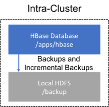
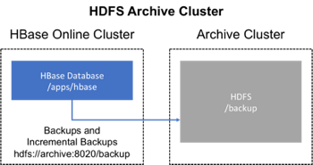
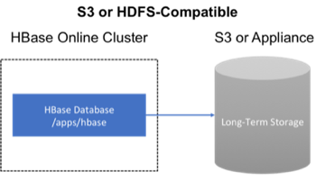

# HBase Backup and Resotre

- [Overview](#overview)
- [术语](#术语)
- [计划](#计划)
  - [在同一个集群备份](#在同一个集群备份)
  - [在一个指定的集群备份](#在一个指定的集群备份)
  - [备份到云或存储供应商设备](#备份到云或存储供应商设备)
- [First-time configuration steps](#first-time-configuration-steps)
  - [允许 hbase 系统用户使用 Yarn](#允许-hbase-系统用户使用-yarn)
- [HBase 配置修改](#hbase-配置修改)
- [Backup 和 Restore 指令](#backup-和-restore-指令)
  - [创建一个 Backup Image](#创建一个-backup-image)
    - [Positional Command-Line Arguments](#positional-command-line-arguments)
    - [Named Command-Line Arguments](#named-command-line-arguments)
  - [Merging Incremental Backup Images](#merging-incremental-backup-images)
  - [Using Backup Sets](#using-backup-sets)
- [Administration of Backup Images](#administration-of-backup-images)
  - [管理 Backup Progress](#管理-backup-progress)
  - [管理 Backup History](#管理-backup-history)
  - [Describing a Backup Image](#describing-a-backup-image)
  - [Delete a Backup Image](#delete-a-backup-image)
  - [Backup Repair Command](#backup-repair-command)
- [Configuration keys](#configuration-keys)
  - [Require properties](#require-properties)
  - [Optional properties](#optional-properties)
- [Best Practices](#best-practices)
  - [Formulate a restore strategy and test it](#formulate-a-restore-strategy-and-test-it)
  - [secure a full backup image first](#secure-a-full-backup-image-first)
  - [Define and use backup sets for groups of tables that are logical subsets of the entries dataset](#define-and-use-backup-sets-for-groups-of-tables-that-are-logical-subsets-of-the-entries-dataset)
  - [Document the backup and resotre strategy, and ideally log information about each backup](#document-the-backup-and-resotre-strategy-and-ideally-log-information-about-each-backup)
- [Scenario: Safeguarding Application Datasets on S3](#scenario-safeguarding-application-datasets-on-s3)
- [Security of Backup Data](#security-of-backup-data)
- [Technical Details of Incremental Backup and Restore](#technical-details-of-incremental-backup-and-restore)
- [A Warning of File System Growth](#a-warning-of-file-system-growth)
- [Capacity Planning](#capacity-planning)
  - [Full Backups](#full-backups)
  - [Incremental Backup](#incremental-backup)
- [Limitations of the Backup and Restore Utility](#limitations-of-the-backup-and-restore-utility)

## Overview

备份和恢复是许多数据库提供的标准操作。 有效的备份和恢复策略有助于确保用户在发生意外故障时能够恢复数据。 HBase 备份和恢复特性有助于确保使用 HBase 作为规范数据存储库的企业能够从灾难性故障中恢复。 另一个重要的特性是能够将数据库恢复到特定的时间点, 通常称为快照。

HBase 备份和恢复功能提供了在 HBase 集群中的表上创建完整备份和增量备份的功能。 完整备份是应用增量备份构建迭代快照的基础。 增量备份可以按照计划运行, 以捕获随时间发生的更改, 例如使用 Cron 任务。 增量备份比完全备份更具成本效益, 因为它们只捕获自上次备份以来的更改, 而且还允许管理员将数据库恢复到任何之前的增量备份。 此外, 如果不希望还原备份的整个数据集, 这些实用程序还支持表级数据的备份和恢复。

备份和恢复功能补充了 HBase 复制功能。 虽然 HBase 复制对于创建数据的 `hot copies` 非常理想(复制的数据可以立即用于查询), 但是备份和恢复特性对于创建数据的 `code copies` 非常理想(必须通过手动步骤来恢复系统)。 以前, 用户只能通过 `ExportSnapshot` 功能创建完整备份。 增量备份实现是对 `ExportSnapshot` 提供的一种新改进。

## 术语

备份和恢复特性引入了新的术语, 可用于理解控制如何在系统中流动。

- A backup: 一种数据和元数据的逻辑单元, 可以在特定时间点将表恢复到其状态。
- Full backup: 在某个时间点完全封装表内容的一种备份。
- Incremental backup: 一种备份类型, 它包含自完全备份以来表中的更改。
- Backup set: 用户定义的名称, 它引用可以执行备份的一个或多个表。
- Backup ID: 标识一个备份与其他备份的唯一名称, 例如backupId_1467823988425

## 计划

### 在同一个集群备份

该策略将备份存储在与备份位置相同的集群上。 这种方法只适用于测试, 因为它不能在软件本身已经提供的基础上提供任何额外的安全性。



### 在一个指定的集群备份

这种策略提供了更强的容错能力, 并提供了灾难恢复的路径。在此设置中, 通过向备份实用程序提供备份目标集群的 HDFS URL, 将备份存储在单独的 HDFS 集群上。 通常应该备份到不同的物理位置, 例如不同的数据中心。

通常, 专用于备份的HDFS集群使用更经济的硬件配置文件来节省资金。



### 备份到云或存储供应商设备

保护 HBase 增量备份的另一种方法是将数据存储在所提供的安全服务器上, 这些服务器属于第三方供应商, 并且位于站点之外。 供应商可以是公共云提供商, 也可以是使用 Hadoop 兼容的文件系统(如S3和其他 HDFS 兼容的文件系统)的存储供应商。



> HBase 备份实用程序不支持备份到多个目标。 解决方法是从 HDFS 或 S3 手动创建备份文件的副本。

## First-time configuration steps

为使用备份和恢复功能, 必须进行必要的配置更改。 由于这个特性显著地利用了 YARN 的 MapReduce 框架来并行处理这些 I/O 繁重的操作, 所以配置更改扩展到了 `hbase-site.xml` 之外。

### 允许 hbase 系统用户使用 Yarn

Yarn 的 `container-executor.cfg` 配置文件必须具有以下属性设置: `allowe.system .users=hbase`。 该配置文件的条目中不允许有空格。

用于备份和恢复的有效 `container-executor.cfg` 文件示例:

```cfg
yarn.nodemanager.log-dirs=/var/log/hadoop/mapred
yarn.nodemanager.linux-container-executor.group=yarn
banned.users=hdfs,yarn,mapred,bin
allowed.system.users=hbase
min.user.id=500
```

## HBase 配置修改

在 `hbase-site.xml` 中添加以下配置并重启:

```xml
<property>
  <name>hbase.backup.enable</name>
  <value>true</value>
</property>
<property>
  <name>hbase.master.logcleaner.plugins</name>
  <value>org.apache.hadoop.hbase.backup.master.BackupLogCleaner,...</value>
</property>
<property>
  <name>hbase.procedure.master.classes</name>
  <value>org.apache.hadoop.hbase.backup.master.LogRollMasterProcedureManager,...</value>
</property>
<property>
  <name>hbase.procedure.regionserver.classes</name>
  <value>org.apache.hadoop.hbase.backup.regionserver.LogRollRegionServerProcedureManager,...</value>
</property>
<property>
  <name>hbase.coprocessor.region.classes</name>
  <value>org.apache.hadoop.hbase.backup.BackupObserver,...</value>
</property>
<property>
  <name>hbase.master.hfilecleaner.plugins</name>
  <value>org.apache.hadoop.hbase.backup.BackupHFileCleaner,...</value>
</property>
```

## Backup 和 Restore 指令

包括管理员将运行的用于创建, 恢复和合并备份的命令行实用程序。 检查特定备份会话的详细信息的工具见 [Administration of Backup Images](#administration-of-backup-images).

通过运行 `hbase backup help <command>` 来访问帮助信息。

### 创建一个 Backup Image

> 对于还使用 Apache Phoenix 的 HBase 集群: 在备份中包含 SQL 系统编目表。 在需要恢复 HBase 备份的情况下, 对系统编目表的访问能够恢复 Phoenix 与恢复数据的互操作性。

运行备份和恢复实用程序的第一步是执行完整备份, 并将数据存储在与源文件不同的映像中。 至少, 在依赖增量备份之前, 必须这样来获得基线。

```bash
hbase backup create <type> <backup_path>
```

命令运行完成后, 控制台打印一条成功或失败状态消息。成功消息包含一个备份 ID。 备份 ID 是HBase主机从客户机接收到备份请求的 Unix 时间(也称为Epoch时间)。

> 记录成功备份后出现的备份 ID。 如果源集群发生故障, 需要使用还原操作恢复数据集, 那么随时可用备份 ID 可以节省时间。

#### Positional Command-Line Arguments

*type*: 要执行的备份类型: `full` 或 `incremental`。 增量备份需要已经存在的完整备份。

*backup_path*: 指定在何处存储备份映像的完整文件系统 URI。 有效的前缀是 `hdfs:`,  `webhdfs:`, `s3a:` 或其他兼容的 Hadoop 文件系统实现。

#### Named Command-Line Arguments

- `-t <table_name[, table_name]>`

要备份的以逗号分隔的表列表。 如果没有指定表, 则备份所有表。 不支持正则表达式或通配符, 必须显式列出所有表名。 与 `-s` 选项互斥。 这些命名选项之一是必需的。

- `-s <backup_set_name>`

(可选)指定要将数据复制到备份目的地的并行工作者的数量。 备份目前由 MapReduce 作业执行, 因此该值对应于作业生成的映射器的数量。

- `-b <bandwidth_per_worker>`

(可选)指定每个工作者的带宽, 单位为每秒MB。

- `-d`

(可选)启用“DEBUG”模式, 该模式打印关于备份创建的附加日志。

- `-q`

(可选)允许指定用于创建备份的 MapReduce 作业所在的 Yarn 队列的名称。 这个选项对于防止备份任务从其他非常重要的 MapReduce 作业中窃取资源非常有用。

- `-c`

(可选)执行恢复的 `dry-run`。 检查操作, 但不执行。

- `-m <target_table>`

(可选)要还原到的以逗号分隔的表列表。 如果未提供此选项, 则使用原始表名。 当提供此选项时, 必须在 `-t` 选项中提供相同数量的条目。

### Merging Incremental Backup Images

此命令可用于将两个或多个增量备份映像合并到单个增量备份映像中。这可用于将多个小型增量备份映像合并为单个大型增量备份映像。此命令可用于将小时增量备份合并到每日增量备份映像中，或将每日增量备份合并到每周增量备份中。

```bash
hbase backup merge <backup_ids>
```

### Using Backup Sets

## Administration of Backup Images

### 管理 Backup Progress

### 管理 Backup History

### Describing a Backup Image

### Delete a Backup Image

### Backup Repair Command

## Configuration keys

### Require properties

### Optional properties

## Best Practices

### Formulate a restore strategy and test it

### secure a full backup image first

### Define and use backup sets for groups of tables that are logical subsets of the entries dataset

### Document the backup and resotre strategy, and ideally log information about each backup

## Scenario: Safeguarding Application Datasets on S3

## Security of Backup Data

## Technical Details of Incremental Backup and Restore

## A Warning of File System Growth

## Capacity Planning

### Full Backups

### Incremental Backup

## Limitations of the Backup and Restore Utility
