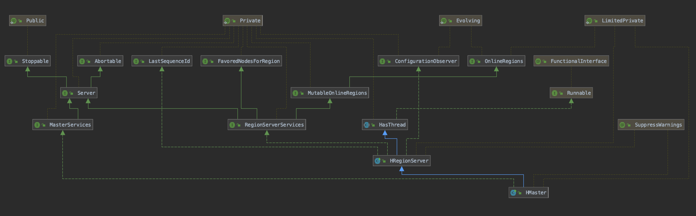

# HBase 的各种流程

- [启动流程](#启动流程)
  - [集群启动流程](#集群启动流程)
  - [Master 启动流程](#master-启动流程)
  - [HRegionServer 启动流程](#hregionserver-启动流程)
- [读流程](#读流程)

## 启动流程

### 集群启动流程

通过 `start-hbase.sh` 来启动 HBase 集群。 通过 `$bin/hbase --config "$HBASE_CONF_DIR" org.apache.hadoop.hbase.util.HBaseConfTool hbase.cluster.distributed | head -n 1` 来确定启动模式, 即是否集群模式。 启动步骤如下:

```shell
distMode=`$bin/hbase --config "$HBASE_CONF_DIR" org.apache.hadoop.hbase.util.HBaseConfTool hbase.cluster.distributed | head -n 1`

if [ "$distMode" == 'false' ]
then
  "$bin"/hbase-daemon.sh --config "${HBASE_CONF_DIR}" $commandToRun master
else
  "$bin"/hbase-daemons.sh --config "${HBASE_CONF_DIR}" $commandToRun zookeeper
  "$bin"/hbase-daemon.sh --config "${HBASE_CONF_DIR}" $commandToRun master
  "$bin"/hbase-daemons.sh --config "${HBASE_CONF_DIR}" \
    --hosts "${HBASE_REGIONSERVERS}" $commandToRun regionserver
  "$bin"/hbase-daemons.sh --config "${HBASE_CONF_DIR}" \
    --hosts "${HBASE_BACKUP_MASTERS}" $commandToRun master-backup
fi
```

`commandToRun` 默认为 `start`。 启动执行脚本 `hbase-daemons.sh`。 通过脚本 `hbase-daemon.sh` 启动 Master。 Master 启动后, 启动 Zookeeper, 如果配置 Zookeeper 不通过 HBase 管理, 则跳过, 详细启动逻辑见 `zookeeper.sh`。通过 `regionservers.sh` 启动所有配置的 RegionServer。 实质上是通过 ssh 到各 RegionServer 所在机器上执行启动脚本 `hbase-daemon.sh` 启动 RegionServer。

在这些启动脚本中, 启动各个组件最终通过 `hbase` 脚本启动, 脚本参数如下:

```txt
Usage: hbase [<options>] <command> [<args>]
Options:
  --config DIR         Configuration direction to use. Default: ./conf
  --hosts HOSTS        Override the list in 'regionservers' file
  --auth-as-server     Authenticate to ZooKeeper using servers configuration
  --internal-classpath Skip attempting to use client facing jars (WARNING: unstable results between versions)

Commands:
Some commands take arguments. Pass no args or -h for usage.
  shell           Run the HBase shell
  hbck            Run the HBase 'fsck' tool. Defaults read-only hbck1.
                  Pass '-j /path/to/HBCK2.jar' to run hbase-2.x HBCK2.
  snapshot        Tool for managing snapshots
  wal             Write-ahead-log analyzer
  hfile           Store file analyzer
  zkcli           Run the ZooKeeper shell
  master          Run an HBase HMaster node
  regionserver    Run an HBase HRegionServer node
  zookeeper       Run a ZooKeeper server
  rest            Run an HBase REST server
  thrift          Run the HBase Thrift server
  thrift2         Run the HBase Thrift2 server
  clean           Run the HBase clean up script
  classpath       Dump hbase CLASSPATH
  mapredcp        Dump CLASSPATH entries required by mapreduce
  pe              Run PerformanceEvaluation
  ltt             Run LoadTestTool
  canary          Run the Canary tool
  version         Print the version
  backup          Backup tables for recovery
  restore         Restore tables from existing backup image
  regionsplitter  Run RegionSplitter tool
  rowcounter      Run RowCounter tool
  cellcounter     Run CellCounter tool
  pre-upgrade     Run Pre-Upgrade validator tool
  CLASSNAME       Run the class named CLASSNAME
```

### Master 启动流程

HMaster 类图:



HMaster 启动采用了 ToolRunner 机制。

```java
public static int run(Configuration conf, Tool tool, String[] args) throws Exception {
  if (conf == null) {
      conf = new Configuration();
  }
  GenericOptionsParser parser = new GenericOptionsParser(conf, args);
  tool.setConf(conf);
  String[] toolArgs = parser.getRemainingArgs();
  return tool.run(toolArgs);
}
```

ToolRunner 启动参数和配置文件加载完后, 执行相应的 run 方法启动 Master。 由 `org.apache.hadoop.util.Tool` 的实现 `org.apache.hadoop.hbase.master.HMasterCommandLine#run` 完成 Master 的启动。 对应的方法为 `org.apache.hadoop.hbase.master.HMasterCommandLine#startMaster()`。

Master 启动由 2 种情况: 本地启动; 集群启动。 集群的启动如下:

```java
logProcessInfo(getConf());
HMaster master = HMaster.constructMaster(masterClass, conf);
if (master.isStopped()) {
  LOG.info("Won't bring the Master up as a shutdown is requested");
  return 1;
}
master.start();
master.join();
if(master.isAborted())
  throw new RuntimeException("HMaster Aborted");
```

首先启动 Master 实例, 启动后选择一个作为 Active Master。 详细过程见 `org.apache.hadoop.hbase.master.HMaster#startActiveMasterManager(int infoPort)`。 执行完以上步骤后, 去执行 `org.apache.hadoop.hbase.regionserver.HRegionServer#run()` 方法的内容, 详细描述见 RegionServer 启动流程。

```java
public void run() {
  try {
    if (!conf.getBoolean("hbase.testing.nocluster", false)) {
      Threads.setDaemonThreadRunning(new Thread(() -> {
        try {
          int infoPort = putUpJettyServer();
          startActiveMasterManager(infoPort);
        } catch (Throwable t) {
          // Make sure we log the exception.
          String error = "Failed to become Active Master";
          LOG.error(error, t);
          // Abort should have been called already.
          if (!isAborted()) {
            abort(error, t);
          }
        }
      }), getName() + ":becomeActiveMaster");
    }
    // Fall in here even if we have been aborted. Need to run the shutdown services and
    // the super run call will do this for us.
    super.run();
  } finally {
    ...
  }
}
```

### HRegionServer 启动流程

HRegionServer 类图可以参考上面 HMaster 类图。

## 读流程
