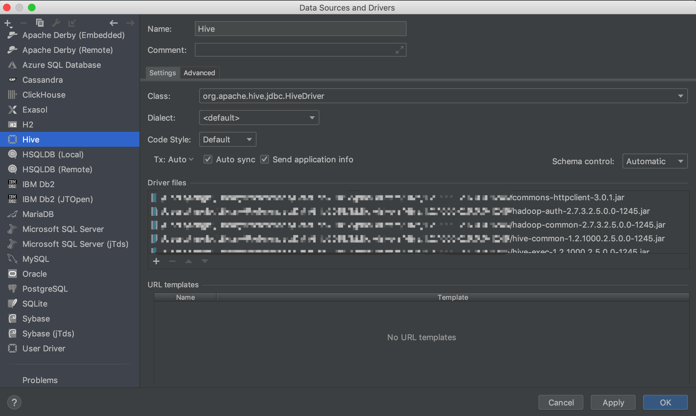
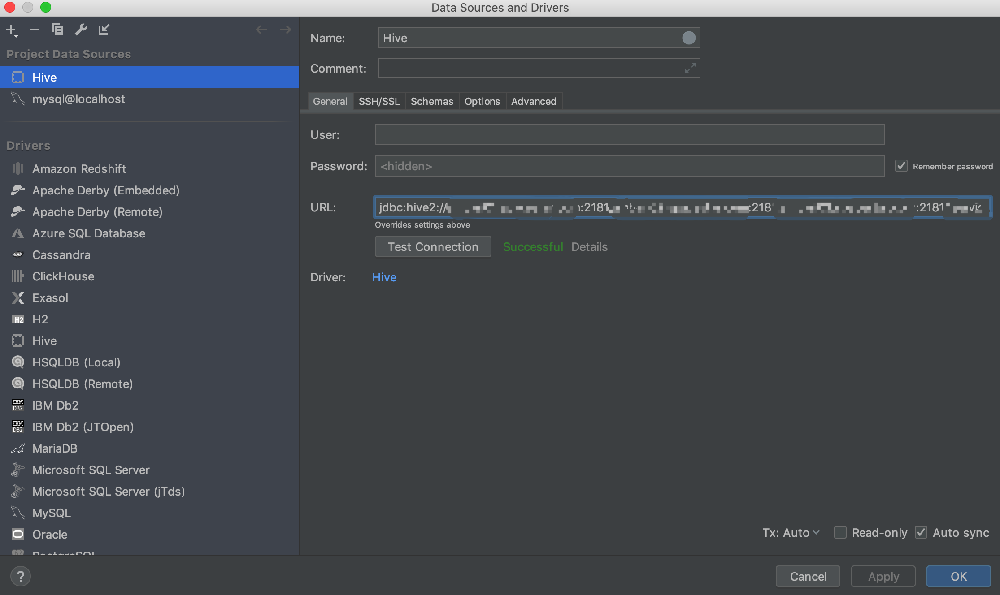
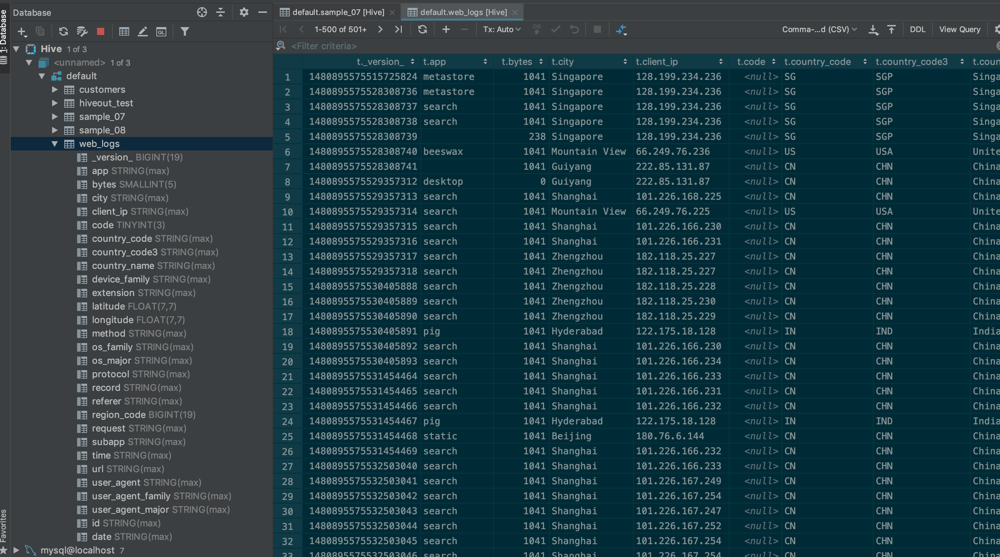

# DataGrip 连接 Hive

- [DataGrip 简介](#datagrip-简介)
- [连接 Hive 步骤](#连接-hive-步骤)
  - [1. 添加 Driver](#1-添加-driver)
  - [2. 连接 Hive](#2-连接-hive)

## DataGrip 简介

DataGrip 出自 JetBrains 公司, 是一款跨平台的数据库管理客户端工具, 可在 Windows, OS X 和 Linux 上使用; 同时支持多种数据库: SQL Server, Oracle, PostgreSQL, MySQL, DB2, Sybase, SQLite, Derby, HyperSQL 和 H2: 方便连接到数据库服务器, 执行 SQL, 创建表, 创建索引以及导出数据等。 类似的 IDE 很多，比如 Navicat, dbeaver等。

DataGrip 支持的数据源除了主流数据库外, 还支持与所有遵循 JDBC 的数据源连接: 如 Hive。 这一点是 DataGrip 的最大优势。

关于 DataGrip 的用法, 用过 IntelliJ 和 Pycharm 的连接数据库的功能类似, 上手应该很容易。 更多用法参考官网: [DataGrip](https://www.jetbrains.com/datagrip/)。

和 Navicate 相比, 个人更喜欢用 DataGrip, 首先是 Dark Theme, 标准风格; 其次, DataGrip 和其他 JetBrains 的产品一样, 有很强大的联想功能, 使用时可以省很多功夫。

## 连接 Hive 步骤

这个实际上是突发奇想, 因为想到 DataGrip 连接数据库的时候, 会在首次连接这种数据库的时候下载相应的 Driver, 那有些 DataGrip 默认选项中没有的数据源可以通过加载 JDBC 的方式去连接么? 由于经常使用的 IntelliJ 和 Pycharm 的影响, 第一反应是去看看有没有插件来支持, 很遗憾, 没有 Hive 的插件。 于是去官方插件库里找, 结果搜出个这 [Hive connection?](https://intellij-support.jetbrains.com/hc/en-us/community/posts/207110045-Hive-connection-)。 有了上面的依据, 可以做接下来的操作了。

### 1. 添加 Driver

DataGrip 左侧的管理栏的添加包含添加数据源, Schema, Table, Column 与 **Driver**。 所以只需要在添加 Driver 这一栏添加上 Hive JDBC Driver 即可。

由于 hive-jdbc 不是包含所有依赖的包(这里是做了 HA 的 HiveServer, 通过 ZK 连接, 也可以直接连接 HiveServer), 所以需要导入 Driver 的全部 jar, 如下：

```text
commons-httpclient-3.0.1.jar
commons-logging-1.1.3.jar
curator-client-2.6.0.jar
curator-framework-2.6.0.jar
hadoop-auth-2.7.3.2.5.0.0-1245.jar
hadoop-common-2.7.3.2.5.0.0-1245.jar
hive-common-1.2.1000.2.5.0.0-1245.jar
hive-exec-1.2.1000.2.5.0.0-1245.jar
hive-jdbc-1.2.1000.2.5.0.0-1245.jar
hive-metastore-1.2.1000.2.5.0.0-1245.jar
hive-service-1.2.1000.2.5.0.0-1245.jar
httpclient-4.4.jar
httpcore-4.4.jar
slf4j-api-1.7.5.jar
zookeeper-3.4.6.2.5.0.0-1245.jar
```

具体配置如下:



### 2. 连接 Hive

和连接其他数据库类似, 配置好连接名, JDBC URL, 用户, 密码 即可。 见下图:



URL 可以有两种形式:

- `jdbc:hive://<hiveserver_host>:port`: 直接连接某个 HiveServer
- `jdbc:hive://<zookeeper_server1>:<port>,<zookeeper_server2>:<port>;zooKeeperNamespace=<hiveserver_namespace>`: 通过 Zookeeper 连接 HiveServer(需要多几个依赖)

连接后如下图所示:



功能使用同 MySQL 等数据库的使用。
