# spark

- [基本概念](#基本概念)
  - [组件说明](#组件说明)
- [RDD](#rdd)
- [Spark SQL](#spark-sql)
  - [Dataset](#dataset)
  - [DataFrame](#dataframe)
- [Spark Streaming](#spark-streaming)
  - [Discretized Streams(DStream)](#discretized-streamsdstream)
  - [Input DStreams and Receivers](#input-dstreams-and-receivers)
    - [Queue of RDDs as a Stream](#queue-of-rdds-as-a-stream)
    - [Transformations on DStream](#transformations-on-dstream)
    - [UpdateStateByKey Operation](#updatestatebykey-operation)
    - [Typical Datasource Imtegration](#typical-datasource-imtegration)
  - [Window Operation](#window-operation)
  - [DataFrame and SQL Operations](#dataframe-and-sql-operations)
  - [Check poing](#check-poing)
    - [When to enable Checkpointing](#when-to-enable-checkpointing)
    - [How to configure Checkpoint](#how-to-configure-checkpoint)
  - [Exactly once](#exactly-once)
  - [MLlib Operations](#mllib-operations)
  - [Monitoring](#monitoring)
- [Structured Streaming](#structured-streaming)
  - [Programming Model](#programming-model)
    - [Basic Concepts](#basic-concepts)
    - [Handling Event-time and late Data](#handling-event-time-and-late-data)
    - [Fault Tolerance](#fault-tolerance)
  - [Api using DataSets and DataFrames](#api-using-datasets-and-dataframes)
    - [Creating streaming DataFrames and streaming Datasets](#creating-streaming-dataframes-and-streaming-datasets)
    - [Operations on streaming DataFrames/Datasets](#operations-on-streaming-dataframesdatasets)
      - [Basic Operations](#basic-operations)
      - [Window Operations](#window-operations)
        - [Handling Late Data and Watermarking](#handling-late-data-and-watermarking)
    - [Starting Streaming Queries](#starting-streaming-queries)
    - [Managing Streaming Queries](#managing-streaming-queries)
    - [Monitoring Streaming Queries](#monitoring-streaming-queries)
    - [Recovering from Failures with Checkpointing](#recovering-from-failures-with-checkpointing)
    - [Recovery Semantics after Changes in a Streaming Query](#recovery-semantics-after-changes-in-a-streaming-query)
  - [Continuous Processing](#continuous-processing)
- [MLlib](#mllib)
- [GraphX](#graphx)
- [作业提交方式](#作业提交方式)

## 基本概念

- RDD: Resilient Distributed Dataset, 弹性分布式数据集。
- Operation: 作用于 RDD 的各种操作, 包括 Transformation 和 Action。
- Job: 作业, 一个 Job 包含多个 RDD 及作用于相应 RDD 的各种操作。
- Stage: 一个作业分为多个阶段。
- Partition: 数据分区, 一个 RDD 中的数据可以分成多个不同的区。
- DAG: Directed Acycle Graph, 有向无环图, 反应 EDD 之间的依赖关系。
- Narrow Dependency: 窄依赖, 子 RDD 依赖于父 RDD 中固定的 Data Partition。
- Wide Dependency: 宽依赖, 子 RDD 依赖于父 RDD 中的所有 Data Partition 都有依赖。
- Caching Management: 缓存管理, 对 RDD 的中间计算结果进行缓存管理, 以加快整体的处理速度。

### 组件说明

1. Spark SQL
2. Spark Streaming
3. MLlib
4. GraphX

## RDD

[RDD Programming Guide](http://spark.apache.org/docs/latest/rdd-programming-guide.html)

`RDD` 是 Spark 的最基本抽象, 是对分布式内存的抽象使用, 以操作本地集合的方式来操作分布式数据集的抽象实现。

`RDD` 用于支持在并行计算时能够高效地利用中间结果, 支持更简单的编程模型, 同时也具有像 MapReduce 等并行计算框架的高容错性, 能够高效地进行调度及可扩展性。 `RDD` 的容错通过记录 `RDD` 转换操作的 lineage 关系来进行, lineage 记录了 `RDD` 的家族关系, 当出现错误的时候, 直接通过 lineage 进行恢复。 `RDD` 最合数据挖掘, 机器学习及图计算, 因此这些应用涉及到大家的迭代计算, 基于内存能够极大地提升其在分布式环境下的执行效率; `RDD` 不适用于诸如分布式爬虫等需要频繁更新共享状态的任务。

`RDD` 在 Spark 中是一个只读的 (val类型), 经过分区的记录集合。 `RDD` 在 Spark 中只有两种创建方式:

1. 从存储系统中创建
2. 从其它 `RDD` 中创建。

`RDD` 是一个不可分割的分布式对象集, 每个 `RDD` 可以被分为多个分区, 这些分区运行在集群中的不同节点上。

## Spark SQL

[Spark SQL, DataFrames and Datasets Guide](http://spark.apache.org/docs/latest/sql-programming-guide.html)

特点:

1. 无缝的将 SQL 语句集成到 Spark 应用程序中
2. 统一的数据访问方式
3. 兼容 Hive
4. 可采用 JDBC/ODBC 连接

### Dataset

`Dataset` 是 Spark 1.6 中添加的新接口, 它提供了RDDs(强类型, 使用强大lambda函数的能力)和 Spark SQL 优化执行引擎的优点。 可以从 JVM 对象构造数据集, 然后使用功能转换(map, flatmap, filter 等)进行操作。 `Dataset` API 在 Scala 和 Java中可用。 Python 不支持 Dataset API, 由于 Python 的动态特性, Dataset API 的优势已经可用。

### DataFrame

`DataFrame` 是一种以 `RDD` 为基础的分布式数据集, 与传统 `RDBMS` 的表结构类似。 与一般的 `RDD` 不同的是, `DataFrame` 带有 schema 元信息, 即 `DataFrame` 所表示的表数据集的每一列都带有名称和类型, 它对于数据的内部结构具有很强的描述能力。

特点:

1. 支持单机(KB级)到集群(PB级别)的数据处理
2. 支持多种数据格式和存储系统
3. 通过 Spark SQL Catalyst 优化器可以进行高效的代码生成和优化
4. 能够无缝继承所有大数据处理工具
5. 提供 Scala, Java, Python, R API

## Spark Streaming

- [Spark Streaming Programming Guide](http://spark.apache.org/docs/latest/streaming-programming-guide.html)
- [Where to Go from Here](http://spark.apache.org/docs/latest/streaming-programming-guide.html#where-to-go-from-here)

Spark Streaming 是 Spark 核心 API 的扩展, 支持对实时数据流进行可伸缩, 高吞吐量和容错的流处理。 可以从 Kafka, Flume, Kinesis, TCP 等多个数据源获取数据, 也可以使用 map, reduce, join, window 等高级函数表示的复杂语法进行处理。 可以将处理过的数据推送到文件系统, 数据库和实时 DashBoard。 可以将 Spark 的机器学习和图形处理算法应用于数据流。

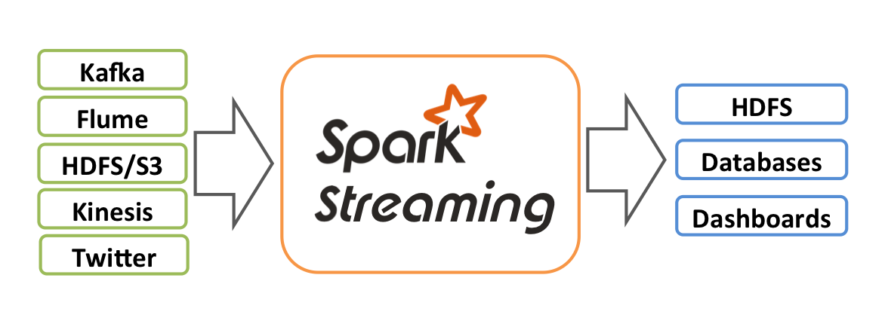

工作原理如下: Spark Streaming 接收实时输入数据流, 并将数据划分为 batch, 然后由 Spark engine 处理这些数据, 生成最终的 batch 结果流。

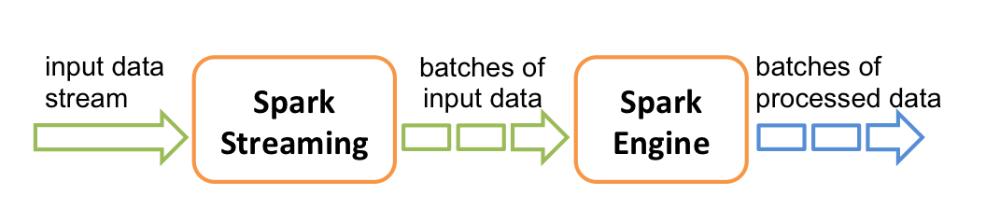

### Discretized Streams(DStream)

`DStream` 是 Spark 流提供的基本抽象。 它表示连续的数据流, 无论是从源接收的输入数据流, 还是通过转换输入流生成的经过处理的数据流。 在内部,  `DStream` 由一系列连续的 `RDDs` 表示。 DStream 中的每个 RDD 都包含来自某个时间间隔的数据, 如下图所示。

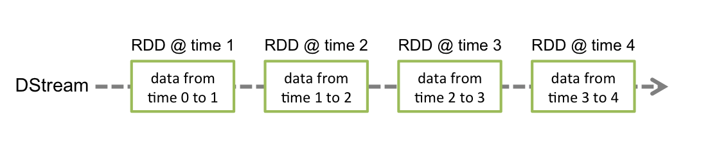

在 `DStream` 上应用的任何操作都转换为底层 RDDs 上的操作。 例如, 在行 `DStream` 中的每个 `RDD` 上应用 `flatMap` 操作来生成单词 `DStream` 的 RDDs。如下图所示。

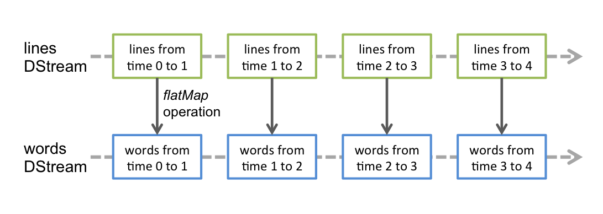

### Input DStreams and Receivers

输入的 `DStreams` 表示从 Streaming 源接收数据流的 DStreams。 每个 `DStream` 都与一个 `Reciever` 对象关联, 该对象接收数据并将其存储在 Spark 的内存中进行处理。

- Spark 提供两种内置的 Streaming 源
1. Basic source: 在直接 `StreamingContext` API 中可以直接使用的, 如: 文件系统, Socket 连接。
2. Advanced source: 从类似 Kafka, Flume, Kinesis 等通过额外的程序类获。

如果希望并行接收多个数据流, 可以创建多个 输入 `DStream`, 该步骤将创建多个 `Receiver`, 这些接收器将同时接收多个数据流。 需要注意的是: Spark worker/executor 是一个长期运行的 Task, 因此占用分配给 Spark Streaming 应用的一个核心。 Spark Streaming 应用需要分配足够的内核(或线程)来处理接收到的数据, 一边运行 Receiver。

`DStream` 也可以通过自定义 Receiver 来获取, 见: [Custom Reciever Guide](http://spark.apache.org/docs/latest/streaming-custom-receivers.html)。

#### Queue of RDDs as a Stream

为使用测试数据测试 Spark Streaming 应用, 还可以使用 `streamingContext.queueStream(queueOfRDDs)`, 基于 RDDs 队列创建 `DStream`。 推入队列的每个 RDD 将被视为 `DStream` 中的一批数据, 并像 Stream 一样处理。 `StreamingContext` 更多细节参考接口文档: [scala](http://spark.apache.org/docs/latest/api/scala/index.html#org.apache.spark.streaming.StreamingContext), [Java](http://spark.apache.org/docs/latest/api/java/index.html?org/apache/spark/streaming/api/java/JavaStreamingContext.html), [Python](http://spark.apache.org/docs/latest/api/python/pyspark.streaming.html#pyspark.streaming.StreamingContext)。

#### Transformations on DStream

转换操作与 RDD 类似。

Transformation | Meaning
---|---
map(func) | TODO
flatMap(func) | TODO
filter(func) | TODO
repartition(numPartitions) | TODO
union(otherStream) | TODO
count() | TODO
reduce(func) | TODO
countByValue() | TODO
reduceByKey(func, [numTasks]) | TODO
join(otherStream, [numTasks]) | TODO
transform(func) | TODO
updateStateByKey(func) | TODO

#### UpdateStateByKey Operation

`updaeStateByKey` 允许在使用新信息不断更新状态时维护任意状态。 包含以下两个步骤:

1. Define the state: 状态可以是任意数据类型
2. Define the state update function: 通过函数制定如何使用输入 Stream 的前一个状态和新值更新状态。

在每个 batch 处理中, Spark 将为所有现有 key 更新状态, 不管这些 key 是否新数据。 如果 update 函数不返回任何值, `k-v pair` 将被消除。

#### Typical Datasource Imtegration

- kafka: [Spark Streaming + Kafka Integration Guide](http://spark.apache.org/docs/latest/streaming-kafka-integration.html)
- Flume: [Spark Streaming + Flume Integration Guide](http://spark.apache.org/docs/latest/streaming-flume-integration.html)
- Kinesis: [Spark Streaming + Kinesis Integration](http://spark.apache.org/docs/latest/streaming-kinesis-integration.html)

### Window Operation

Spark 提供窗口计算, 允许在滑动的数据窗口上应用转换, 如下图:

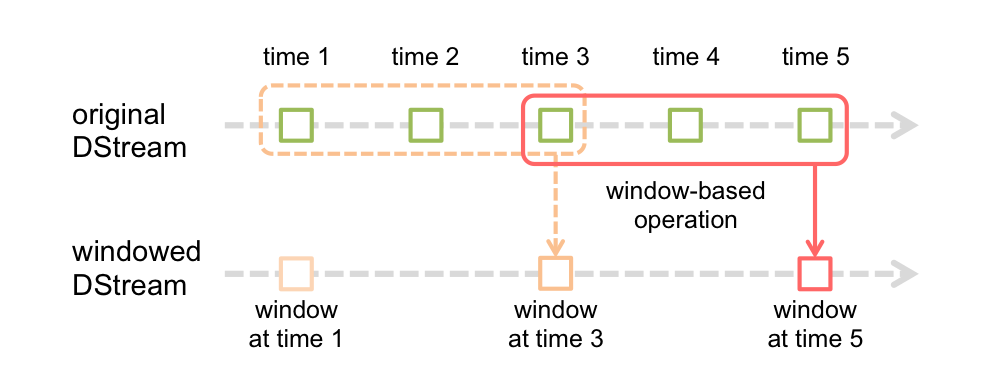

窗口滑过 `Source DStream` 时, 位于该窗口的 Source RDD 就被组合起来对其进行操作, 从而生成窗口化 `DStream` 的 RDD。任何窗口都需要指定两个参数: 

- window length: 窗口长度(size)
- sliding interval: 窗口操作执行的时间间隔

```scala
// Reduce last 30 seconds of data, every 10 seconds
val windowedWordCounts = pairs.reduceByKeyAndWindow((a:Int, b:Int) => (a + b), Seconds(30), Seconds(30))
```

```java
JavaPairDStream<String, Integer> windowedWordCounts = pair.reduceByKeyAndWindow((i1, i2) -> i1 + i2, Durations.seconds(30), Durations.seconds(10));
```

```python
windowedWorkCounts = pairs.reduceByKeyAndWindow(lambda x, y: x + y, lambdax, y: x - y, 30, 10)
```

### DataFrame and SQL Operations

- link: [DataFrame and SQL](http://spark.apache.org/docs/latest/sql-programming-guide.html)

通过 `SparkContext` 创建一个 `SparkSession`, 该 `SparkContext` 是通过 `StreamingContext` 创建, 可以在驱动程序失败时重启。 这是通过创建一个延迟实例化的 `SparkSession` 来实现的。 usecase:

```scala
val words:DStream(String) = ...
words.foreachRDD {rdd =>
  // Get the singleton instance of SparkSession
  val spark = SparkSession.builder.config(rdd.sparkContext.getConf().getOrCreate())
  import spark.implicits._

  // Convert RDD[String] to DataFrame
  val wordsDataFrame = rdd.toDF("word")

  // Create a temporary view
  wordsDataFrame.createOrReplaceTempView("words")

  // Do word Count on DataFrame using SQL and print it
  val wordCountsDataFrame = spark.sql("select word, count(*) as total from words group by word")

  wordCountsDataFrame.show()
}
```

### Check poing

一个 Streaming 应用程序必须全天候运行, 因此必须能够适应与应用程序逻辑无关的故障(如: 系统故障, JVM 崩溃等)。 为此, Spark Streaming 需要又足够的信息 checkpoint 以便能够从故障中恢复。 有两种数据是 checkpoint 的。

- Metadata Checkpoint: 将定义六计算的信息保存到 HDFS 等容错存储中, 用于运行 Streaming Application 的驱动程序的节点故障中恢复。 元数据包括:
  - Configuration: 用于创建应用程序的配置
  - DStream operations: 定义 Streaming Application 的 DStream 操作集
  - Incomplete batches: 作业已排队但尚未完成的 batch
- DataCheckpoint: 将生成的 RDD 保存到可靠的存储中。 在一些跨多个 batch 组合数据的有状态转换中是很有必要的。 在这类转换中, 生成的 RDDs 依赖于前几个 batch 的 RDDs, 这会导致依赖链的长度不断增加。 为避免恢复时间无限制增加(与依赖链成正比), 有状态转换中间的 RDD 会定期 checkpoint 到可靠的存储(如: HDFS) 中, 以切断依赖链。

Metadata Checkpoint 主要用于驱动程序从故障中恢复, Data 或 RDD Checkpoint 主要作用在有状态转换的基本功能中。

#### When to enable Checkpointing

具备以下任意要求的 Application 应当启用 Checkpoint:

- Usage of stateful transformations(有状态转换时): 如果应用程序中使用 `updateStateByKey` 或 `reduceByKeyAndWindow`(具有逆函数), 该情况下必须提供 Checkpoint 目录, 允许周期性的 RDD Checkpoint
- Recovering from failures of the driver running the application(从运行应用程序的驱动程序故障中恢复): Metadata Checkpoint 用于使进度信息恢复

#### How to configure Checkpoint

Checkpoint 可以通过在容错, 可靠的文件系统中设置一个目录来启用, Checkpoint 信息将保存在该目录中。 通过 `streamingContext.checkpoint(checkpointDirectory)` 完成。 如果需要从故障中恢复, 应用程序应具有以下行为:

- 第一次启动程序时, 创建一个新的 `StreamingContext`, 设置所有 Stream, 调用 `start()`
- 在程序失败后重启时, 应从 Checkpoint 目录中的 Checkpoint 数据重新创建 `StreamingContext`。

```scala
// Function to create and setup a new StreamingContext
def functionToCreateContext(): StreamingContext = {
  val ssc = new StreamingContext(...) // new Context
  val lines = ssc.socketTextStream(...) // create DStream
  ...
  ssc.checkpoint(checkpointDirectory) // set checkpoint directory
  ssc
}

// Get additional setup on context that needs to be done irrespective of whether it is being started or restarted
context. ...

// Start the context
context.start()
context.awaitTermination()
```

```java
JavaStreamingContextFactory contextFactory = new JavaStreamingContextFactory() {
  @Override
  JavaStreamingContext jssc = new JavaStreamingContext(...) {
    JavaDStream<String> lines = jssc.socketTextStream(...);
    ...
    jssc.checkpoint(checkpointDirectory);
    return jssc;
  }
};

JavaStreamingContext context = JavaStreamingContext.getOrCreate(checkpointDirectory, contextFactory);

context. ...

context.start();
context.awaitTermination();
```

```python
def functionToCreateContext():
  sc = SparkContext(...)
  ssc = StreamingContext(...)
  lines = ssc.socketTextStream(...)
  return ssc

context = StreamingContext.getOrCreate(checkpointDirectory, functionToCreateContext)

context. ...

context.start()
context.awaitTermination()
```

### Exactly once

### MLlib Operations

### Monitoring

## Structured Streaming

[Structured Streaming Programming Guide](http://spark.apache.org/docs/latest/structured-streaming-programming-guide.html)

Streaming/batch 统一

### Programming Model

#### Basic Concepts

---
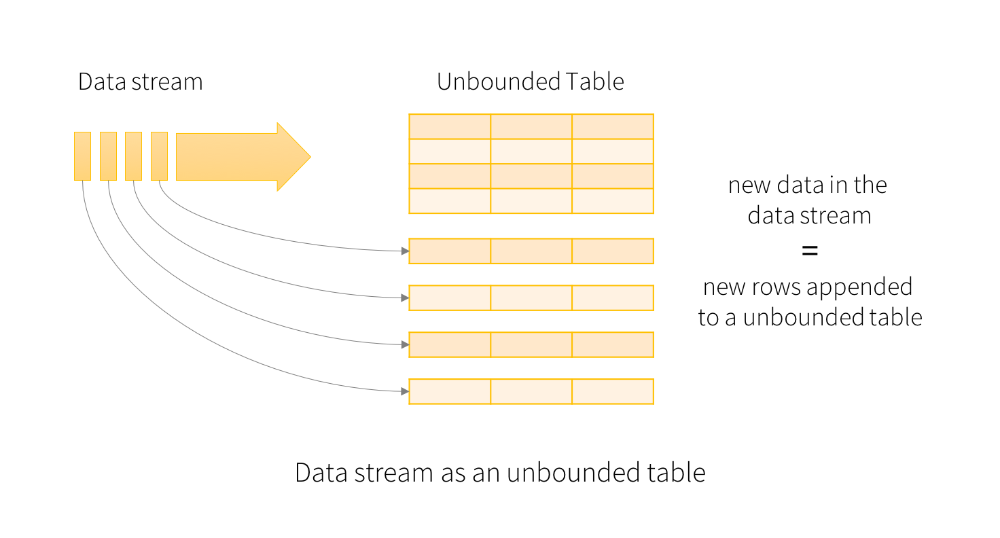

---
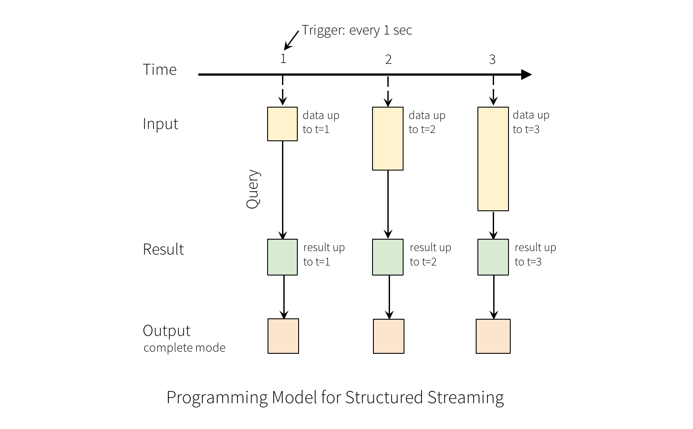

---
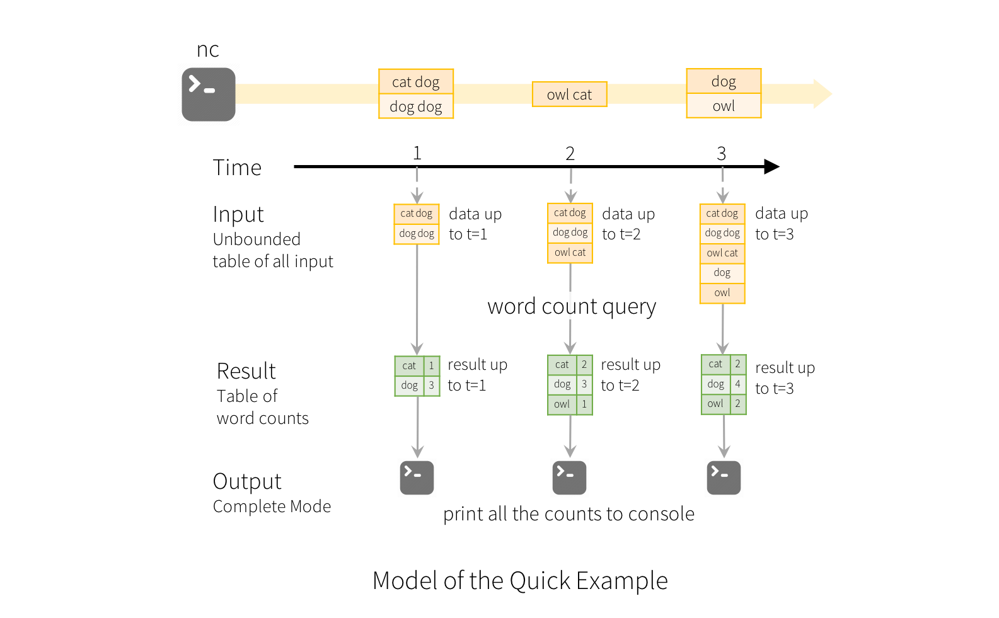

#### Handling Event-time and late Data

#### Fault Tolerance

### Api using DataSets and DataFrames

#### Creating streaming DataFrames and streaming Datasets

#### Operations on streaming DataFrames/Datasets

##### Basic Operations

##### Window Operations

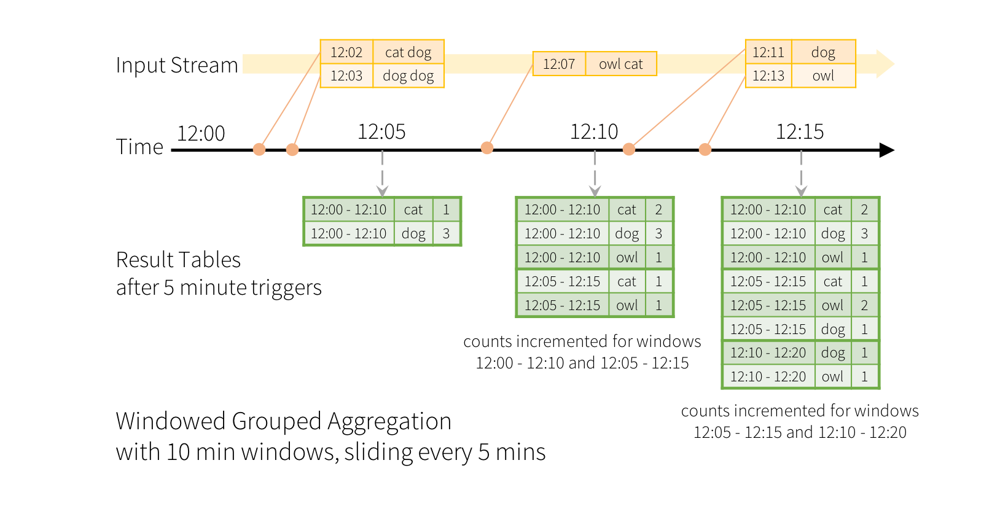

###### Handling Late Data and Watermarking

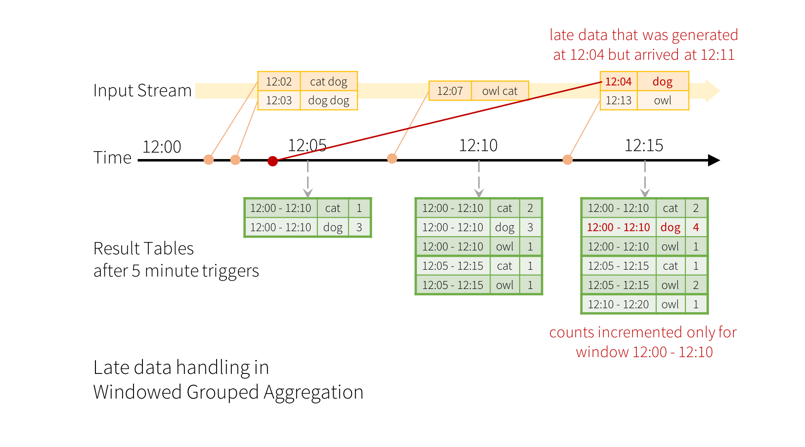

---
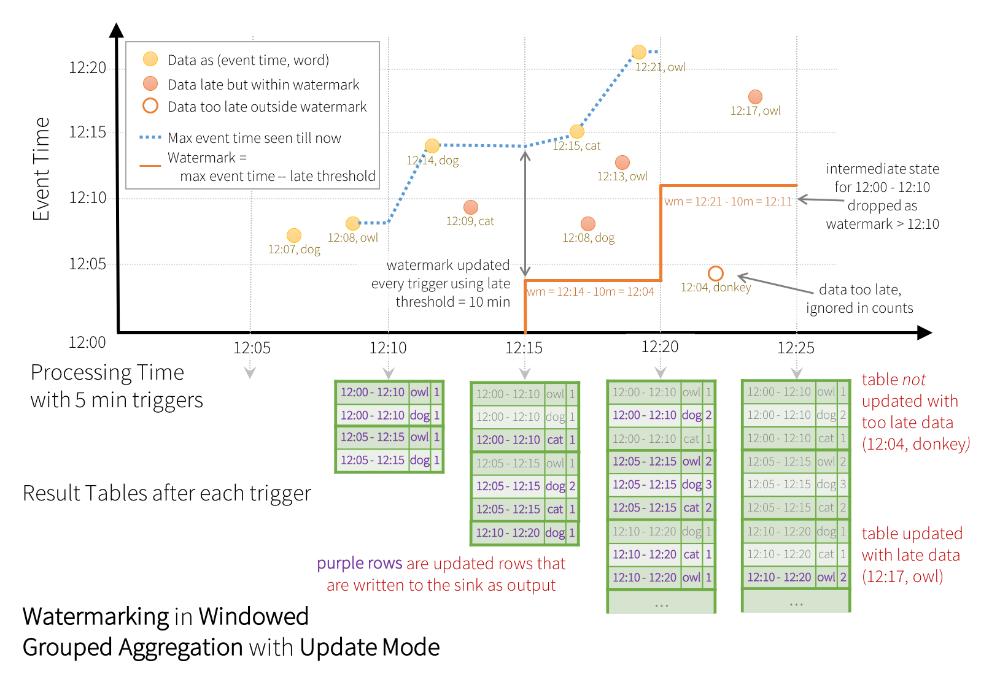

---
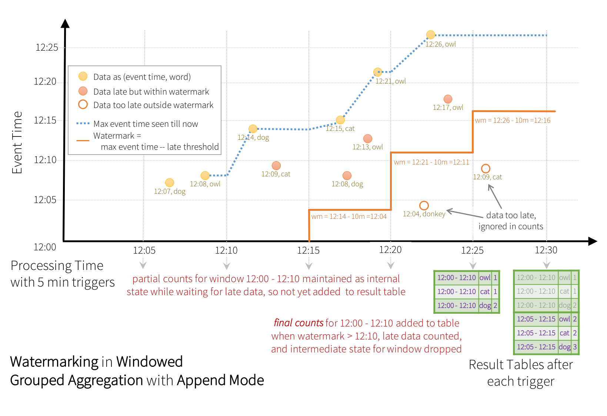

#### Starting Streaming Queries

#### Managing Streaming Queries

#### Monitoring Streaming Queries

#### Recovering from Failures with Checkpointing

#### Recovery Semantics after Changes in a Streaming Query

### Continuous Processing

## MLlib

[Machine Learning Library (MLlib) Guide](http://spark.apache.org/docs/latest/ml-guide.html)

## GraphX

[GraphX Programming Guide](http://spark.apache.org/docs/latest/graphx-programming-guide.html)

GraphX是Spark中图形和图形并行计算的一个新组件。 在高层次上, GraphX通过引入一个新的图形抽象来扩展 Spark RDD:一个带有附加到每个顶点和边缘的属性的有向多图。 为了支持图形计算, GraphX公开了一组基本操作符(例如子图、joinVertices和aggregateMessages)以及Pregel API的优化变体。 此外, GraphX还包括越来越多的图形算法和构建器, 以简化图形分析任务。

## 作业提交方式

[Submitting Applications](http://spark.apache.org/docs/latest/submitting-applications.html)

1. 本机调试, 设置 `master` 为 `local` 模式运行 spark 作业, 一般用于调试, 不用连接集群。

```java
SparkSession spark = SparkSession
    .builder()
    .appName("${appName}")
    .master("local")
    .getOrCreate();
```

2. 集群运行, 一般本机调试后会将作业打成 jar 包 通过 `spark-submit` 提交运行, 生产环境一般使用该种方式。

3. 本地作业运行到远程集群。

```java
SparkSession spark = SparkSession
    .builder()
    .appName("${appName}")
    .master("{spark://${host}:${port}}") // example: spark://172.24.0.3:7077
    .getOrCreate();
```
