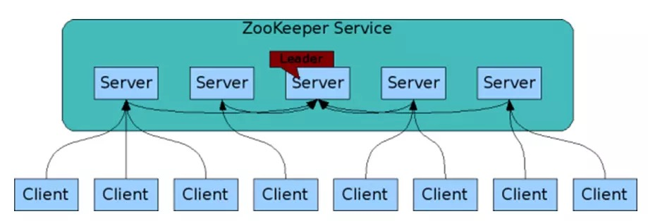

# zookeeper

参考: [zookeeper 基本原理](http://www.cnblogs.com/wade-luffy/p/5767811.html)

ACL分为两个维度，一个是属组，一个是权限，子目录/文件默认继承父目录的ACL。而在Zookeeper中，node的ACL是没有继承关系的，是独立控制的。Zookeeper的ACL，可以从三个维度来理解：一是scheme; 二是user; 三是permission，通常表示为`scheme:id:permissions`。  
sasl: sasl的对应的id，是一个通过sasl authentication用户的id，zookeeper-3.4.4中的sasl authentication是通过kerberos来实现的，也就是说用户只有通过了kerberos认证，才能访问它有权限的node.

## zookeeper 简单介绍

Zookeeper 就是一种用于分布式应用程序的高性能协调服务，它的特点就是数据是存于内存中的，持久化实现在日志中。它的内存类似于树形结构，且高吞吐低延迟，可以帮助我们实现分布式统一配置中心，服务注册，分布式锁等
组成 ZooKeeper 服务的服务器必须彼此了解。它们维护内存中的状态图像，以及持久性存储中的事务日志和快照。只要大多数服务器可用，ZooKeeper 服务就可用。客户端连接到单个 ZooKeeper 服务器。客户端维护 TCP 连接，通过该连接发送请求，获取响应，获取监视事件以及发送 tick。如果与服务器的TCP连接中断，则客户端将连接到其他服务器。

### 数据结构简单

类似于 Unix 文件系统树形结构，每个目录成为 Znode 节点。同一个节点下的子节点名称不能相同，且命名是有规范的，它的路径是没有相对路径的概念的，都是绝对路径，任何开始都以 `/` 开始，最后就是，它存放数据的大小有限制。

### 数据模型特点

层次命名空间：就是上面已经提到的，类似于 unix 的文件系统，以 `/` 为根，节点可以包含关联数据和子节点，绝对路径 Znode：名称唯一，命名有规范，类型分4种：持久，顺序，临时，临时顺序。

### 命名规范

节点名称除下列限制外，可以使用任何unicode字符：

1. null字符(`\u0000`)不能作为路径名的一部分；
2. 以下字符不能使用，因为它们不能很好地显示，或者以令人困惑的方式呈现:`\u0001 - \u0019` 和 `\u007F - \u009F`。
3. 不允许使用以下字符: `\ud800 - uf8fff`， `\uFFF0 - uFFFF`。
4. “.”字符可以用作另一个名称的一部分，但是 `.` 和 `..` 不能单独用于指示路径上的节点，因为ZooKeeper不使用相对路径。
下列内容无效: `/a/b/. / c` 或 `c / a / b / . . /`。
5. “zookeeper”是保留节点名。

### Zookeeper 的重要特点——有序

提供多种方式跟踪时间，ZooKeeper给每个更新贴上一个数字，这个数字反映了所有ZooKeeper事务的顺序，严格的顺序意味着可以在客户机上实现复杂的同步原语 解释 `czxid`、 `version`、 `zoo.cfg` 中 `ticks` 配置。

- Zxid ：Zookeeper中每次写请求都对应一个唯一的事务id，称为 Zxid，它是全局的且有序的，如果 Zxid1 小于 Zxid2，那 Zxid1 就一定是发生在 Zxid2 前
- version numbers ： 版本号，对节点的写请求都会导致该节点的3种版本号增加（其实套路和乐观锁差不多），dataVersion（对znode数据的更改次数），cversion（对znode子节点的更改次数），aclVersion（对znode ACL的更改次数
- ticks ： 当使用多服务器Zookeeper时，服务器使用一个“滴答”来定义事件的时间，如状态上传，会话超时等，它通过最小会话超时（默认是滴答时间x2）间接公开，如果客户端请求超过这个时间，那客户端就不再能连接上服务器端
- real time：Zookeeper并不使用真实时间

```txt
cZxid：创建该节点的zxid
ctime：该节点的创建时间
mZxid：该节点的最后修改zxid
mtime：该节点的最后修改时间
pZxid：该节点的最后子节点修改zxid
cversion：该节点的子节点变更次数
dataVersion：该节点数据被修改的次数
aclVersion：该节点的ACL变更次数
aphemeraOwner：临时节点所有者会话id，非临时的为0
dataLength：该节点数据长度
numChildren：子节点数
```

### zookeeper 的第二个特点---可复制

数据可复制，可备份。zookeeper可以快速地搭建一个集群，内部自带了这样的一些工具与机制，我们只需要设置一些配置即可，保证服务可靠，不会成为单点故障



### zookeeper 的第三个特点——迅速

1. Zookeeper 的数据加载在内存中，意味着 Zookeeper 可以具备高吞吐和低延时的效果。
2. 以读取为事务的话更快。
3. 操作的 znode 大小为 1MB。

## Zookeeper 的理论

### Session

1.一个客户端连接一个会话，由zookeeper分配唯一会话id
2.客户端以特定的时间间隔发送心跳以保持会话有效，
3.超过会话超时时间未收到客户端的心跳，则判断客户端无效（默认2倍tickTime）
4.会话中额请求是FIFO（先进先出原则）的顺序执行

### znode 的数据构成

- 节点数据：存储的基本信息(状态，配置，位置等）
- 节点元数据：`stat` 命令下的一些数据
- 数据大小：限制1M

### znode 的节点类型

1. 持久节点：直接通过create path value所创建
2. 临时节点：create -e path value
3. 顺序节点：create -s path value

**注意:**

1. session会话失效时，临时节点就会被删除
2. 顺序节点的创建，后为10位十进制序号，每个父节点拥有一个计数器，这个计数器也是有限制的，到2147483647之后将溢出
3. 顺序节点在会话结束仍然存在

### Watch 监听机制

客户端能在 `znodes` 上设置 `watch`，监听 `znode` 的变化，包括增删改查，通过 `stat path`，`ls path`，`get path` 皆可查看
触发watch事件的条件有4种，create，delete，change，child（子节点事件）

- watch 的重要特性：

1. 仅一次性：watch触发后会立即删除，要持续监听变化的话就要持续提供设置watch，这也是watch的注意事项
2. 有序性：客户端先得到watch通知才可查看变化结果

- watch 的注意事项

1. 刚刚提及到的它的仅一次性
2. 获取事件和发送 watch，获取 watch，这些请求有可能存在延时，所以不能绝对可靠得到每个节点发生的每个更改
3. 一个 watch 对象只会被通知一次，如果一个 watch 同时注册了多个接口（exists, getData）,如果此时删除节点，虽然这个事件对 exists 和getData都有效，但是watch只会被调用一次

阻塞线程唤醒机制—客户端可以被动接受其他客户端进程状态通知。

### zookeeper 的特性

1. 顺序一致性(Sequential Consistency)，保证客户端操作是按顺序生效的；
2. 原子性(Atomicity)，更新成功或失败。没有部分结果。
3. 单个系统映像，无论连接到哪个服务器，客户端都将看到相同的内容
4. 可靠性，数据的变更不会丢失，除非被客户端覆盖修改。
5. 及时性，保证系统的客户端当时读取到的数据是最新的。
