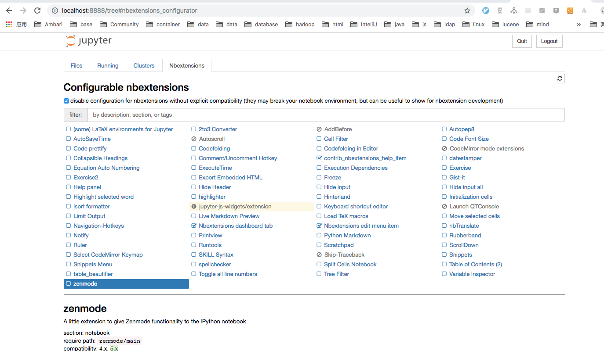

# 基本环境搭建

- 工具集
    1. python *这里选用python3*
    2. tensorflow
    3. jupyter notebook *(交互式编程, 能够直观的展现执行结果)*

## jupyter

1. `jupyter_contrib_nbextensions`, `jupyter_nbextensions_configurator`

效果图:

