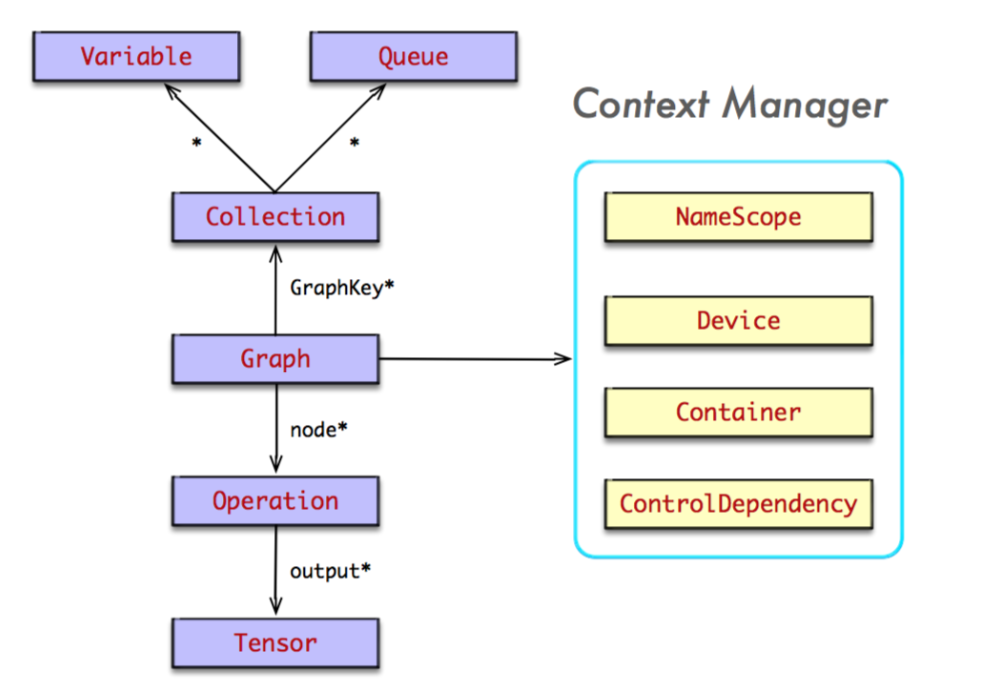

# 分布式 TensorFlow

按照系统的层次结构, TensorFlow 技术栈构成如下:

层 | 功能 | 组件
:-:|:-:|:-:
视图层 | 可视化 | TensorBoard
工作流层 | 数据集准备, 存储, 加载 | Keras
计算图层 | 图构造/操作/优化/执行前向计算/后向传播 | TensorFlow Core
数值计算层 | Kernel 实现矩阵乘法/卷积计算 | Eigen/cuBLAS/cuDNN
网络层 | 通信 | GRPC/RDMA
设备层 | 硬件 | CPU/GPU/ASIC
<center>TensorFlow 技术栈</center>

## 1. TensorFlow 系统架构

### 1.1 系统架构

TensorFlow 以 C API 为界, 将整个系统分为前端和后端两个子系统。

1. 前端系统: 提供变成模型, 负责构造计算图。
2. 后端系统: 提供运行时环境, 负责执行计算图。

后端系统的设计和实现进一步分解为:

1. 运行时: 分别提供本地模式和分布式模式, 并共享大部分设计和实现。
2. 计算层: 由哥哥 Operation 的 Kernel 实现组成, 在运行时, Kernel 实现执行 Operation 的具体数学运算。
3. 通信层: 给予 GRPC 实现足见见的数据交换, 并能够在支持 IB 网络节点间实现 RDMA 通信。
4. 设备层: 计算设备是 Operation执行的主要载体, TensorFlow 支持多种异构的计算设备类型。

从操作的角度看待系统行为, TensorFlow 运行时就是完成图计算的构造, 编排 及运行。

1. 表达图: 构造计算图, 但不执行图。
2. 编排图: 将计算图的节点以最佳的执行方案部署在集群中哥哥计算设备上执行。
3. 运行图: 按照 [拓扑排序](https://en.wikipedia.org/wiki/Topological_sorting) 执行图中的节点, 并启动每个 Operation 的 Kernel 计算。


<center>tensorflow 架构图</center>

#### 1.1.1 Client

Client 是前端系统的主要组成部分, 是一个支持多语言的变成环境。 Client 基于 TensorFlow 的编程接口, 构造图计算。 目前, TensorFlow 支持 Python 和 C++ 的编程接口较为完善, 对 Python 的 API 支持最为全面。

在 Client 构建图计算时, TensorFlow 并未执行任何图计算, 知道与后台计算引擎建立 Session, 并以 Session 为桥梁, 建立 Client 与 Master 之间的通道, 并将 `Protobuf` 格式的 `GraphDef` 序列化后传递给 Master, 启动图计算的执行过程。

#### 1.1.2 Master

在分布式的运行时环境中, Client 执行 Session.run 时, 传递整个计算图给后端的 Master。 此时, 计算图时完整的, 常称为 **Full Graph**。 随后, Master 根据 `Session.run` 传递来的 `fetches, feeds` 参数列表, 反向遍历 Full Graph, 并按照依赖关系对其试试剪枝, 最终计算得到最小依赖子图, 常称为 **Client Graph**

接着, Master 负责将 Client Graph 按照任务的名称分裂(SplitByTask) 为多个 Graph Partition。 其中, 每个Worker 对应一个 Graph Partition。 随后, Master 将 Graph Partition 分别注册到相应的Worker 上, 以便在不同的 Worker 上并发执行这些 Graph Partition。 最后 Master 同志所有 Worker 启动相应的 Graph Partition 的执行过程。

其中, Worker 之间可能存在数据依赖关系, Master 并不参与两者之间的数据交换, 它们两两之间互相通信, 独立完成交换数据, 知道完成所有计算。

#### 1.1.3 Worker

对于每个任务, TensorFlow 都将启动一个 Worker 实例。 Worker 主要负责以下几方面的指责:

1. 处理来自 Master 的请求。
2. 对注册的 Graph Partition 按照本地计算设备集实施二次分裂(SplitByDevice), 并通知各个计算设备并发执行各个 Graph Partition。
3. 按照拓扑排序算法在某个计算设备上执行本地子图, 并调度 Operation 的 Kernel 实现。
4. 协同任务之间的数据通信。

首先, Worker 收到 Master 发送来的 图执行命令, 此时的计算图相对于 Worker 是完整的, 也称为 **Full Graph**, 对应 Master 的一个 Graph Partition。 随后, Worker 根据当前可用的硬件环境(包括 CPU/GPU) 资源, 按照 Operation 设备的约束规范将图分裂为多个 Graph Partition, 其中每个计算设备对应一个 Graph Partition。 接着, Worker 启动所有的 Graph Partition 的执行。 最后, 对于每个计算设备, Worker 将按照计算图中节点之间的依赖关系执行拓扑排序算法, 并一次调用 Operation 的 Kernel 实现, 完成 Operation 的运算(一种典型的多态实现技术)。

其中, Worker 还要负责将 Operation 运算结果发送到其他 Worker 上, 或接受来自其他 Worker 发送来的运算结果, 以便实现 Worker 之间的数据交互。 TensorFlow 特花实现了源设备和目标设备之间的 Send/Recv。

1. 本地 CPU 与 GPU 之间, 使用 `cudaMemcpyAsync` 实现异步拷贝。
2. 本地 GPU 之间使用端到端的 DMA 操作, 避免主机端 CPU 的拷贝。

对任务见的通信, TensorFlow 支持多种协议:

1. GRPC over TCP。
2. [RDMA over Converged Ethernet](https://en.wikipedia.org/wiki/RDMA_over_Converged_Ethernet)。

#### 1.1.4 Kernel

Kernel 是 Operation 在某种硬件设备的特定实现, 负责执行 Operation 的具体运算。 目前 TensorFlow 系统中包含 200多哥标准 Operation, 包括数值计算, 多维数组操作, 控制流, 状态管理等。

一般, 每个 Operation 根据设备类型都会存在一个优化了的 Kernel 实现, 完成该 Operation 的计算。

### 1.2 图控制

### 1.3 会话管理

## 2. 编程模型

### 2.1 计算图

#### 2.1.1 Python 前端

在 Python 的前端系统中, 并没有 Node, Edge 的概念, 仅存在 Operation. Tensor 的概念。 实际上, Python 系统中, Operation 表示 Node 实例, 而 Tensor 表示 Edge 实例。

##### Operation

Operation 用于表达某种抽象的数学计算, 表示计算图中的节点。 Operation 是 Python 系统中最重要的一个领域对象, 也是 TensorFlow 运行时最小的计算单位。

- 领域模型

Operation 表示某种抽象计算, 上有输出的零个或多个 Tensor 作为其输入, 经过计算后, 输出零个或多个 Tensor 至下游的节点, 从而上下游的 Operation 之间产生了数据依赖关系。 特殊情况: Operation 可能持有上游的控制依赖变的集合, 表示潜在的计算依赖关系。

在计算图构造期间, 通过 Operation 构造器(OP Constructor) 构造 Operation 实例, 并将其注册至默认的图实例中。 与此同时, Operation 反过来通过 graph 持有该图实例。

Operation 的元数据由 OpDef 与 NodeDef 持有, 它们以 ProtoBuf 的格式存在, 描述了 Operation 最本质的东西。 其中, OpDef 描述了 Operation 的静态属性信息, 例如 Operation 的名称, 输入/输出参数列表, 属性集定义等信息。 而 NodeDef 描述了 Operation 的动态属性值信息。


- 运行 Operation

可以从该 Operation 为末端反响遍历图, 寻找最小依赖的子图, 并在默认的 Session 中执行该子图。

```python
class Operation(object):
  def run(self, feed_dict=None, session=None):
    """Runs this operation in a Session
    Calling this method will execute all preceding operations that
    produce the inputs needed for this operation
    """
    _run_using_default_session(sefl, feed_dict, session)
```

`_run_using_default_session(sefl, feed_dict, session)` 将使用默认的 Session 运行该 Operation。

##### Tensor

在图构造期, Tensor 在图中并未承载数据, 仅表示 Operation 输出的一个符号句柄。 事实上, 需要通过 `Session.run` 计算才能得到 Tensor 所持有的真实数据。

- 生产者与消费者

Tensor 是两个 Operation 数据交换的桥梁, 它们之间构造了典型的 **生产者与消费者**之间的关系, 上游 Operation 作为生产者, 经过某种抽象计算, 生产了一个 Tensor, 并以此作为该上游 Operation 的输出之一, 并使用 `output_index` 作为标识。 该 Tensor 被传递给下游 Operation, 并作为下游 Operation 的输入, 下游 Operation 充当该 Tensor 的消费者。


<center>Tensor: 生产者-消费者</center>

- 领域模型

Tensor 通过 op 持有扮演生产者角色的 Operation, 并使用 index 表示该 Tensor 在该 Operation 输出列表中的索引。 也就是说可以使用 `op:index` 的二元组信息在图中唯一标识一个 Tensor 实例。

此外, Tensor 持有 Operation 的消费者列表, 用于追踪该 Tensor 输出到哪些 Operation 实例, 因此, Tensor 充当了计算图的边, 构建了 Operation 之间的数据依赖关系。


- 建立关联

- 属性集

- 评估

##### TensorShape

Tensor 使用 `TensorShape` 描述其形状信息, 它持有该 Tensor 的数据类型以及 Dimension 列表, 每个 Dimension 描述了该维度的大小。 其中, TensorShape 与 Dimension 都是值对象, 包含一些使用的数学计算方法, 例如计数, 合并, 兼容性检查等。


可以通过 TensorShape 推算出 Tensor 所包含的元素个数。

- 工厂方法

几个实用的工厂方法: `scalar`, `vector`, `matrix` 分别用于构造 $0$ 维, $1$ 维, $2$ 维 TensorShape 实例

- 部分定义

当构造计算图时, 对其 TensorShape 暂时不确定可以使用 `None` 表示. 存在两种情况:

1. rank 大小未知, 称该 TensorShape 未知, 如果 rank 大小已知, 则称该 TensorShape **部分定义**。

- 完全含义

如果 TensorShape 每个维度的大小已经确定, 则称**完全定义**

- 属性集

可以使用 `ndims` 属性返回 TensorShape 的 rank 大小, 使用 `dims` 属性返回 Dimension 列表。

- 转换

可以使用 `as_proto` 将其转换为 `TensorShapeProto` 表示, 当一个 TensorShape 的 Dimension 未知时, 为能够实施序列化, 需要将 None 转换为 -1。

也可以使用 `as_list` 将其转为 Dimension 列表。 如果 TensorShape 的 rank 大小未知, 则抛出 ValueError 异常。

相反地, 使用 `as_shape` 将 Deimension 列表, 或 `TensorShapeProto` 转换为了 TensorShape 实例。

当构造 TensorShape 时, 当 TensorShapeProto 的某一维度大小为 -1 时, 将其转换为 `None` 表示。

##### Graph

Graph 是 TensorFlow 中最重要的领域对象, TensorFlow 的运行时就是完成 Graph 的构造, 传递, 剪枝, 优化, 分裂, 执行。

- 领域模型

一个 Graph 包含一系列 Operation 对象, 表示计算单元的集合。 同时间接持有一系列 Tensor 对象, 表示数据单元的集合。



为快速索引图中的节点信息, 在当前图的作用域内为每个 Operation 分配唯一的 id, 并在途中存储 `_nodes_by_id` 的数据字典。 为根据节点名称快速索引节点信息, 图中存储了 `_nodes_by_name`

```python
class Graph(object):
  def __init__(self):
    self._lock = threading.Lock()
    self._nodes_by_id = dict()
    self._next_id_counter = 0
    self._nodes_by_name = dict()
    self.version = 0
```

在图构造期间, Operation 通过 Operation 构造期创建。最终被添加至当前的 Graph 实例中。 当图被冻结后, 便不能往图中追加节点了, 使得 Graph 实例在多线程中被安全共享。

```python
class Graph(object):
  def _add_op(self, op)
    self._check_not_finalized()
    with self._lock :
      self._nodes_by_id[op._id] = op
      self._nodes_by_name[op.name] = op
      self._version = max(self._version, op._id)
```

- 分组

为更好管理 Graph 中的节点, 每个 Operation 上打上特定的标签实现节点的分类。 相同类型的节点被划归在同一个 Collection 中, 并使用唯一的 GraphKey 标识该集合。 以便根据 GraphKey 快速索引相关节点信息。 系统与定义了常用的 GraphKey, 也可自行定义。

- 图实例

- 命名空间

- 控制依赖

- 容器

##### 图构造器

## 3. TensorFlow 运行模型

### 本地执行

### 分布式 TensorFlow
