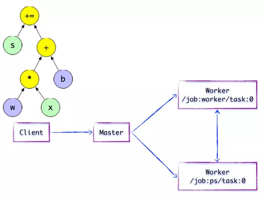

# TensorFlow Share

- [I. Before](#i-before)
- [II. TensorFlow 是什么](#ii-tensorflow-是什么)
  - [基本概念](#基本概念)
  - [Ecosystem](#ecosystem)
  - [Releases](#releases)
- [III. 接口分类](#iii-接口分类)
  - [1. Eager Execution](#1-eager-execution)
  - [2. Estimator](#2-estimator)
  - [3. 低阶 API](#3-低阶-api)
  - [4. 加速器](#4-加速器)
- [IV. TensorFlow 系统架构与设计](#iv-tensorflow-系统架构与设计)
  - [1. Client](#1-client)
  - [2. Distributed Master](#2-distributed-master)
  - [3. Worker Service](#3-worker-service)
  - [4. Kernel Implements](#4-kernel-implements)
- [V TensorBoard](#v-tensorboard)
- [VI. TensorFlow Cluster](#vi-tensorflow-cluster)
  - [1. TensorFlow Server Cluster](#1-tensorflow-server-cluster)
  - [2. Build Cluster with Docker](#2-build-cluster-with-docker)
  - [3. k8s](#3-k8s)
- [VII. TensorFlow with Spark](#vii-tensorflow-with-spark)
  - [1. TensorFlowOnSpark](#1-tensorflowonspark)
  - [2. spark-tensorflow-connector](#2-spark-tensorflow-connector)
- [VIII. 附录](#viii-附录)
  - [1. parameter server](#1-parameter-server)
  - [2. Remote Direct Memory Access](#2-remote-direct-memory-access)

## I. Before

- 关于机器学习, 可以通过 Google 的 [MLCC 课程](https://developers.google.cn/machine-learning/crash-course/) 来了解 机器学习的一些基础知识, 文中所涉及到的相关术语也可以在 [术语库](https://developers.google.cn/machine-learning/glossary/) 中找到。
- 关于对 TensorFlow 及周边生态, 除了官方文档, 还可以在 [YouTube 的 TensorFlow 频道](https://www.youtube.com/channel/UC_x5XG1OV2P6uZZ5FSM9Ttw)上发现一些信息(PS: 很多没有中文字幕)
- 如果本级没有基础环境, 或者只是想看看这玩意跑出来是个什么东西的同学, 可以在 [Colaboratory](https://colab.research.google.com) 进行相关代码的执行, 同时可以直接在这里执行 github 上的 jupyter notebook。 关于 Colaboratory 的详细介绍, 没有翻墙工具的同学可以看看这篇文章: [Google免费GPU使用教程（Google Colab Colaboratory）](https://www.234du.com/1154.html)。
- 对于机器学习, 有时需要在执行过程中观察计算的中间状态, 这里推荐使用 Jupyter Notebook 来调试算法, 减少调试成本(PS: 该工具同时可以支持 Spark, 但是对 Spark 而言, 有一个支持更完善的 Notebook, Apache Zepplin, 这个也是 HDP 中默认支持的组件)。
- 关于 TensorFlow, 推荐几个 tutorial 仓库: [TensorFlow-Course](https://github.com/osforscience/TensorFlow-Course), [掘金 tensorflow-docs cn](https://github.com/xitu/tensorflow-docs), [tflearn TensorFlow 高阶 API 构造 Deep Learning](https://github.com/tflearn/tflearn)

## II. TensorFlow 是什么

[TensorFlow™](https://www.tensorflow.org) 是一个用于进行高性能数值计算的开放源代码软件库。 借助其灵活的架构, 用户可以轻松地将计算工作部署到多种平台 (CPU, GPU, TPU) 和设备(桌面设备, 服务器集群, 移动设备, 边缘设备等)。TensorFlow™ 最初是由 Google Brain 团队 (隶属于 Google 的 AI 部门) 中的研究人员和工程师开发的, 可为机器学习和深度学习提供强力支持, 并且其灵活的数值计算核心广泛应用于许多其他科学领域。

### 基本概念

- tensor 的定义:

张量是对**矢量**和**矩阵**向潜在的更高维度的泛化。 TensorFlow 在内部将张量表示为基本数据类型的 n 维数组。


- flow 的定义

TensorFlow 使用数据流图将计算表示为独立的指令之间的依赖关系。 这可生成低级别的编程模型, 在该模型中, 首先定义数据流图, 然后创建 TensorFlow 会话, 以便在一组本地和远程设备上运行图的各个部分。


[数据流](https://en.wikipedia.org/wiki/Dataflow_programming)是一种用于并行计算的常用编程模型。 在数据流图中, 节点表示计算单元, 边缘表示计算使用或产生的数据。

### Ecosystem

首先, TensorFlow 的客户端 API 中, 对 Python 的支持相对完善, 同时能够很好的与一些通用的数据处理工具(Pandas, Numpy 等)一起工作。

目前 TensorFlow 家族包含: TensorFlow, [TensorFlow.js](https://js.tensorflow.org/), [TensorFlow Lite](https://www.tensorflow.org/lite/), [Swift for TensorFlow](https://www.tensorflow.org/swift), [TensorFlow Extended (TFX)](https://www.tensorflow.org/tfx/), [TensorFlow Hub](https://www.tensorflow.org/hub/), [TensorFlow Probability](https://github.com/tensorflow/probability), [Tensor2Tensor](https://github.com/tensorflow/tensor2tensor), [XLA](https://www.tensorflow.org/xla/), [TensorFlow Research Cloud](https://www.tensorflow.org/tfrc/), [model](https://github.com/tensorflow/models), [Magenta](https://magenta.tensorflow.org/) 等, 详细内容[请参考](https://www.tensorflow.org/resources/)。

除了 TensorFlow 家族中的这些组件, TensorFlow 还支持与一些其他数据处理方式集成, 包括 Hadoop 与 Spark(大数据集的行业内主流解决方案)。 对 Hadoop 和 Spark 的支持可以在 [ecosystem](https://github.com/tensorflow/ecosystem) 中找到, 同时该项目还包含了通过 Docker, Kubernates 中进行分析计算工作。

### Releases

Tensorflow 最新的 Stable 版本为 `1.12.0`, 见 [Release Note](https://github.com/tensorflow/tensorflow/releases), `1.12.0` 的 Release Note 主要有:

- 增加特性
    1. `tf.contrib.saved_model` 增加 [Kares](https://keras.io/) 模型支持, 并在 [TensorFlow Serving](https://github.com/tensorflow/serving) 中使用。
    2. 支持在 `tf.data.Dataset` 中使用 `Keras` 模型进行 evaluating。
    3. TensorFlow 二进制文件默认使用 `XLA` 支持连接进行构建。
    4. 支持 [apache ignite](https://ignite.apache.org) 的数据集。

- Bug Fix  
  ...

- 其他修改  
  ...

## III. 接口分类

### 1. Eager Execution

[Eager Execution](https://www.tensorflow.org/guide/eager) 是一种命令式编程环境, 使用 Python 控制流程而不是图控制流程, 简化了动态模型的规范, 可立即评估操作, 无需构建图。

### 2. Estimator

[Estimator](https://www.tensorflow.org/guide/estimators) 是 TensorFlow 官方提供的一个高阶 API, 更好的整合了原生态 TensorFlow 提供的功能, 可以极大简化机器学习编程。

基本使用见[get start demo](http://public.gitlab.asoco.com.cn/vidi/tensorflow_first_demo/blob/master/tensorflow_practice/get_start)

### 3. 低阶 API

提供基础算法接口, 需要通过这些接口自行构建计算图, 同时还需要自行构建相关参数和超参数。 eg: [mnist_demo2](http://public.gitlab.asoco.com.cn/vidi/tensorflow_first_demo/blob/master/tensorflow_practice/mnist_demo/mnist_demo2.ipynb)

### 4. 加速器

- GPU

在一套标准系统中通常有多台计算设备, TensorFlow 支持 CPU 和 GPU 这两种设备, 均用 strings 表示:

> - `"/cpu:0"`: 机器的 CPU.
> - `"/device:GPU:0"`: 机器的第一个 GPU（如果有一个）。
> - `"/device:GPU:1"`: 机器的第二个 GPU（以此类推）。

加速器接口包含使用 GPU 加速和使用 TPU 加速。 官方示例代码如下:

```Python
import tensorflow as tf
# 手动分配设备
# a 和 b 被分配到 GPU:0
with tf.device('/device:GPU:0'):
  a = tf.constant([1.0, 2.0, 3.0, 4.0, 5.0, 6.0], shape=[2, 3], name='a')
  b = tf.constant([1.0, 2.0, 3.0, 4.0, 5.0, 6.0], shape=[3, 2], name='b')
c = tf.matmul(a, b)
# Creates a session with log_device_placement set to True.
sess = tf.Session(config=tf.ConfigProto(log_device_placement=True))
# Runs the op.
print(sess.run(c))
```

```text
Device mapping:
/job:localhost/replica:0/task:0/device:GPU:0 -> device: 0, name: Tesla K40c, pci bus
id: 0000:05:00.0
b: /job:localhost/replica:0/task:0/cpu:0
a: /job:localhost/replica:0/task:0/cpu:0
MatMul: /job:localhost/replica:0/task:0/device:GPU:0
[[ 22.  28.]
 [ 49.  64.]]
```

详细内容参考[使用 GPU API](https://www.tensorflow.org/guide/using_gpu)。

- TPU

关于 TPU, 参考 [wikipedia Tensor processing unit](https://en.wikipedia.org/wiki/Tensor_processing_unit)。 TPU(Tensor processing unit), 张量处理单元, 是一种人工智能加速器专用集成电路, 由 Google 专门为神经网络, 机器学习开发。

## IV. TensorFlow 系统架构与设计

关于 TensorFlow, 推荐阅读 [TensorFlow内核剖析](https://github.com/horance-liu/tensorflow-internals)。

TensorFlow 的系统结构以 `C API` 为界, 将整个系统分为 `前端` 和 `后端` 两个子系统：

- 前端系统: 提供编程模型, 负责构造计算图
- 后端系统: 提供运行时环境, 负责执行计算图


以下 4 个基本组件是系统分布式运行机制的核心:

1. [Client](#1-client)
2. [Distributed Master](#2-distributed-master)
3. [Worker Service](#3-worker-service)
4. [Kernel Implements](#4-kernel-implements)


### 1. Client

`Client` 基于 `TensorFlow` 的编程接口, 构造计算图。 到建立 `Session` 之前, TensorFlow 未执行任何计算, 直到建立 `Session` 后, 并以 `Session` 为桥梁与建立与后端运行时的通道, 将 `GraphDef` 发送到 `Distributed Master`。



### 2. Distributed Master

在分布式的运行时环境中, `Distributed Master` 根据 `Session.run` 的 `Fetching` 参数, 从计算图中反向遍历, 找到所依赖的最小子图。

然后 `Distributed Master` 负责将该子图再次分裂为多个 `子图片段`, 以便在不同的进程和设备上运行这些 `子图片段`。

最后, `Distributed Master` 将这些图片段派发给 `Work Service`。 随后 `Work Service` 启动 `本地子图` 的执行过程。

`Distributed Master` 将会缓存 `子图片段`, 以便后续执行过程重复使用这些`子图片段`, 避免重复计算。

)

在执行之前, `Distributed Master` 会实施一系列优化技术, 如 `公共表达式消除`, `常量折叠` 等。 随后, `Distributed Master` 负责任务集的协同, 执行优化后的计算子图。

- 子图片段


`Distributed Master` 将模型参数相关的 `OP` 进行分组, 并放置在 [PS](#parameter-server) 任务上。 其他 `OP` 则划分为另外一组, 放置在 `Worker` 任务上执行。

- SEND/RECV 节点


如果计算图的边被任务节点分割, `Distributed Master` 将负责将该边进行分裂, 在两个分布式任务之间插入 `SEND` 和 `RECV` 节点, 实现数据的传递。

随后, `Distributed Master` 将 `子图片段` 派发给相应的任务中执行, 在 `Worker Service` 成为 `本地子图`, 它负责执行该子图的上的 `OP`。

### 3. Worker Service

对于每个任务, 都将存在相应的 `Worker Service`, 它主要负责如下3个方面的职责：

- 处理来自Master的请求
- 调度 `OP` 的 `Kernel` 实现, 执行本地子图
- 协同任务之间的数据通信


对于任务之间的数据传递, TensorFlow支持多协议, 主要包括:

> - [gRPC](https://grpc.io) over TCP
> - [RDMA over Converged Ethernet](#2-remote-direct-memory-access)

### 4. Kernel Implements


`TensorFlow` 的运行时包含 200 多个标准的 OP, 包括数值计算, 多维数组操作, 控制流, 状态管理等。 每一个 `OP` 根据设备类型都会存在一个优化了的 `Kernel` 实现。 在运行时, 运行时根据本地设备的类型, 为 `OP` 选择特定的 `Kernel` 实现, 完成该 `OP` 的计算。

## V TensorBoard

为方便 TensorFlow 程序的理解, 调试与优化, TensorFLow 提供了名为 TensorBoard 的可视化工具, 可以通过 TensorBoard 展现 TensorFlow 图, 绘制图像生成的定量指标以及附加数据(如其中传递的图像)。

TensorBoard 通过读取 TensorFlow 的事件文件来运行。TensorFlow 的事件文件包含运行 TensorFlow 时生成的总结数据。 更多信息参考[TensorBoard：可视化学习](https://www.tensorflow.org/guide/summaries_and_tensorboard)

## VI. TensorFlow Cluster

### 1. TensorFlow Server Cluster

- TensorFlow Server

TensorFlow Server 是一个进程内的 `TensorFlow` 服务器, 用于分布式训练。

`tf.train.Server` 实例封装了能够参与分布式训练的一组设备和一个 `tf.Session` 目标。服务器属于集群 (由 `tf.train.ClusterSpec` 指定), 并对应于指定作业中的特定任务。 服务器可以与同一集群中的任何其他服务器通信。

```python
# 启动一个 TensorFlow Server 实例
tf.train.ClusterSpec({"local": ["localhost:2222"]})
```

- Cluster

TensorFlow 集群 是参与 TensorFlow 图的分布式执行的一组 task, 每个任务都与一个 TensorFlow Server 相关联, 该服务器包含一个可用于创建会话的 master 和一个在图中执行操作的 worker, 集群还可以划分为一个或多个 job, 其中每个 job 包含一个或多个 task。

```python
tf.train.ClusterSpec({
    "worker": [
        "worker0.example.com:2222",
        "worker1.example.com:2222",
        "worker2.example.com:2222"
    ],
    "ps": [
        "ps0.example.com:2222",
        "ps1.example.com:2222"
    ]})
```

提交计算图到 TensorFlow Server:

```python
with tf.Session("grpc://worker1.example.com:2222") as sess:
  for _ in range(10000):
    sess.run(train_op)
```

这里将计算图通过 grpc 发送给 `worker1.example.com:2222` 这个 TensorFlow Server, 这个节点就用来作为 Master, 将计算图拆分, 下发给其他的 worker 和 ps, 接下来各 Server 各自计算分配到的 job, 中间涉及到的数据交互直接在这些工作的节点之间完成, 最终将各自结果汇总给 Master, Master 组装出最终结果, 返回给客户端。

### 2. Build Cluster with Docker

通过 Docker 创建 TensorFlow 集群, 参考 [distributed_tensorflow_server](http://public.gitlab.asoco.com.cn/vidi/distributed_tensorflow_server)。

### 3. k8s

没玩过, 可以查看官方提供的支持: [tensorflow/ecosystem kubernetes](https://github.com/tensorflow/ecosystem/tree/master/kubernetes)。

## VII. TensorFlow with Spark

目前 Spark 与 TensorFlow 结合的解决方案主要有两种思路:

> 1. 不改变原有基于 TensorFlow 的计算和处理代码, 在 Spark 集群中进行计算, 并使用 TensorFlow 的 GPU 加速。
> 2. 不改变原有基于 Spark lib 的计算和处理代码, 在 Spark 集群中进行计算, 并使用 TensorFlow 的 GPU 加速。

### 1. TensorFlowOnSpark

[TensorFlowOnSpark](https://github.com/yahoo/TensorFlowOnSpark)

### 2. spark-tensorflow-connector

[spark-tensorflow-connector](https://github.com/tensorflow/ecosystem/tree/master/spark/spark-tensorflow-connector)

## VIII. 附录

### 1. parameter server

关于 `parameter server`, 看的迷迷糊糊的, 建议直接 Google, 关于这个, 百度找到的东西质量真心不高, 这边给几个参考:

- [Scaling Distributed Machine Learning with the Parameter Server](https://www.cs.cmu.edu/~muli/file/parameter_server_osdi14.pdf)
- [Parameter Server for Distributed Machine learning](https://medium.com/coinmonks/parameter-server-for-distributed-machine-learning-fd79d99f84c3)
- [Quora What is the Parameter Server?](https://www.quora.com/What-is-the-Parameter-Server)

### 2. Remote Direct Memory Access

DMA(Remote Direct Memory Access) 技术全称远程直接数据存取, 就是为了解决网络传输中服务器端数据处理的延迟而产生的。 RDMA通过网络把资料直接传入计算机的存储区, 将数据从一个系统快速移动到远程系统存储器中, 而不对操作系统造成任何影响, 这样就不需要用到多少计算机的处理功能。 它消除了外部存储器复制和上下文切换的开销, 因而能解放内存带宽和CPU周期用于改进应用系统性能。 详细参考:

- [wikipedia Remote direct memory access](https://en.wikipedia.org/wiki/Remote_direct_memory_access)
- [wikipedia RDMA over Converged Ethernet](https://en.wikipedia.org/wiki/RDMA_over_Converged_Ethernet)
- [Remote Direct Memory Access](https://searchstorage.techtarget.com/definition/Remote-Direct-Memory-Access)
- [IEEE paper](https://ieeexplore.ieee.org/document/5238675)
