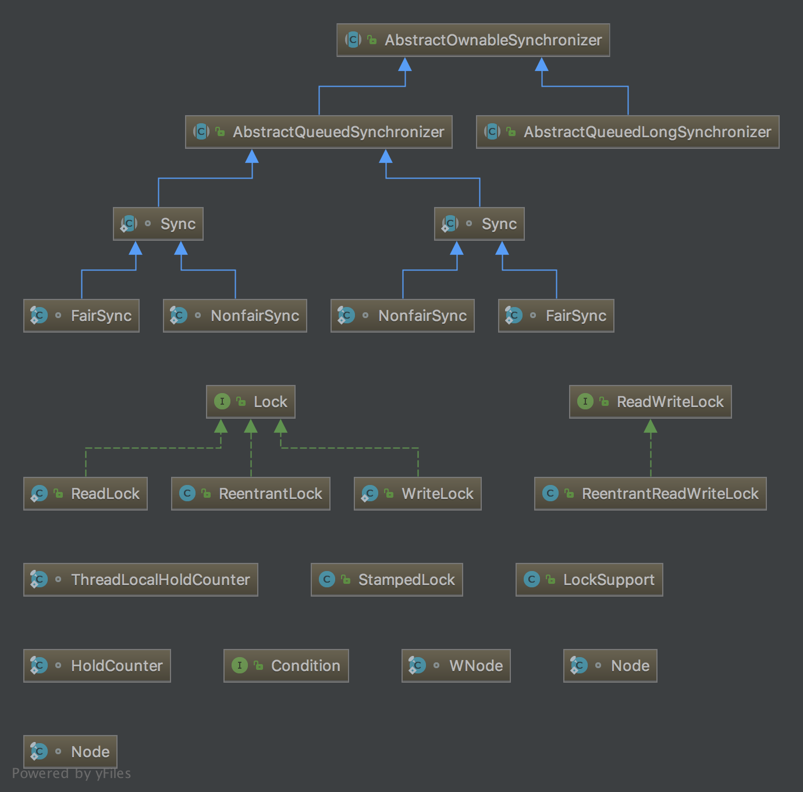

# concurrent(java.util.concurrent)


- 作用: 同步, 并发, 锁

Java 5 之前, 实现同步主要使用  synchronized 关键字, Java 5 新增 `java.util.concurrent` 包及两个子包 `atomic`, `locks` 子包:
  1. `atomic` 自包定义了关于原子操作的类
  2. `locks` 子包定义了关于锁的抽象的类

## 基本概念

### 阻塞

一个线程在执行过程中暂停, 等待某个条件触发。

## 常用接口、类

- 锁
  1. java.util.concurrent.locks.Lock
  2. java.util.concurrent.locks.ReentrantLock
  3. java.util.concurrent.locks.ReadWriteLock
  4. java.util.concurrent.locks.ReentrantReadWriteLock
  > 注意：在 finally 语句中调用 unlock()

- 同步方法
  1. java.util.concurrent.Semaphore: 信号量
  2. java.util.concurrent.BlockingQueue: 阻塞队列

- 线程池
  1. java.util.concurrent.Executors
    > newCachedThreadPool: 创建可缓存的线程池。程池的大小超过了处理任务所需要的线程, 那么就会回收部分空闲 (60秒不执行任务) 的线程, 当任务数增加时， 此线程池又可以智能的添加新线程来处理任务。 此线程池不会对线程池大小做限制, 线程池大小完全依赖于操作系统 (或者说JVM) 能够创建的最大线程大小。
    > newFixedThreadPool: 创建固定大小的线程池
    > newScheduledThreadPool: 创建一个大小无限制的线程池, 此线程池支持定时以及周期性执行任务。
    > newSingleThreadExecutor: 创建一个单线程的线程池。
  2. aa

### 重要接口

1. ExecutorService: 程池的大小超过了处理任务所需要的线程, 那么就会回收部分空闲 (60秒不执行任务) 的线程, 当任务数增加时, 此线程池又可以智能的添加新线程来处理任务。 此线程池不会对线程池大小做限制, 线程池大小完全依赖于操作系统 (或者说JVM) 能够创建的最大线程大小。程池的大小超过了处理任务所需要的线程, 那么就会回收部分空闲 (60秒不执行任务) 的线程, 当任务数增加时, 此线程池又可以智能的添加新线程来处理任务。 此线程池不会对线程池大小做限制, 线程池大小完全依赖于操作系统 (或者说JVM) 能够创建的最大线程大小。

  - Executors 必须显式停止, 否则将持续监听新的任务 Java 进程停止不会停止Executors。(停止应用时应当停止所有的 Executors )

2. Callable & Future
  > Executor 支持另一种类型的任务 —— Callable, 类似于 Runnable, 不同在于 Callable 能够返回一个值。
  > 可以用来写连接池。

3. ExecutorService.invokeAll()
  > 提交多个 callable, 生成一个 callable 的集合, 返回一个 future 列表。

4. ExecutorService.invokeAny()
  > 批量提交 callable 的另一种方法, 但等待过程会阻塞到第一个 callable 中止返回 callable 的结果。

5. ExecutorService.shutdown() vs ExecutorService.shutdownNow()
  > 区别:
  >

## lock(java.util.concurrent.locks) & synchronized

### synchronized

- synchronized 是 Java 的关键字, 是一种同步锁。 能够修饰的对象有以下几种:
  > 代码块: 被修饰的代码块称为同步语句块, 作用范围是代码块中的内容。
  > 方法: 被修饰的方法称为同步方法, 作用范围是整个方法。
  > 静态方法: 作用范围是整个静态方法。
  > 类: 作用的对象是这个类的所有对象

- explain

  两个或多个并发线程访问同一对象中的 synchronized 的代码块时, 只能有一个线程执行, 其他线程便进入等待状态, 直到获取锁的线程释放锁。synchronized 不需要手动去释放锁, 在 synchronized 代码块执行完成后自动释放。 获取锁的线程释放锁的情况:
  > 获取锁的线程执行完了该代码块, 然后线程释放对锁的占有。
  > 线程执行发生异常，此时JVM会让线程自动释放锁。
  > 占有锁线程进入 WAITING 状态从而释放锁, 例如在该线程中调用wait()方法等。(?)

- usage

  1. 修饰代码块
  ```Java
  public void method(){
    synchronized(this){
      // your code block
    }
  }
  ```

  2. 修饰方法
  ```java
  public synchronized method(){
    // your method
  }
  ```

  3. 修饰静态方法
  ```java
  public synchronized static method(){
    // your method
  }
  ```

  4. 修饰类
  ```java
  synchronized(ClassName.class){
    // your code
  }
  ```

### lock(java.util.concurrent.locks)

- 基本概念
  1. 可重入锁: 可重入锁是指同一个线程可以多次获取同一把锁
  2. 可中断锁: 可中断锁是指线程尝试获取锁的过程中, 是否可以响应中断
  3. 公平锁与非公平锁: 公平锁是指多个线程同时尝试获取同一把锁时, 获取锁的顺序按照线程达到的顺序, 而非公平锁则允许线程“插队”(即在当前线程释放锁后, 排队等待的线程还未唤醒时, 新来的线程直接抢占该锁)。 synchronized是非公平锁, 而ReentrantLock的默认实现是非公平锁, 但是也可以设置为公平锁
  4. CAS(Compare and Swap) 操作: CAS操作简单的说就是比较并交换, 包含三个操作数
    1. 内存位置 (V)
    2. 预期原值 (A)
    3. 新值 (B)

java.util.concurrent.locks 包提供另一种方式实现同步访问。

- 特点:
  1. 相对 synchronized, lock 提供了更广泛的锁操作, 能够以更优雅的方式处理线程同步问题。 能够更加灵活的使用锁定和条件。
  2. 通过 Lock 可以知道线程有没有成功获取到锁

- java.util.concurrent.locks 类图



  1. Lock(interface)
    > 支持那些语义不同 (重入、公平等) 的锁定规则, 可以在非阻塞式结构的上下文中使用这些规则。

  2. ReadWriteLock(interface)
    > 读取者可以共享而写入者独占的锁定

  3. Condition(interface)
    > 可能会与锁定有关联的条件变量

  4. AbstractOwnableSynchronizer(abstract class)
    > 用来定义锁定以及依赖于排队阻塞线程的其他同步器。

- Lock 重要方法

  1. lock()
    > 获取锁
    > 在 finally 块中调用 unlock() 方法来释放锁

  2. tryLock() & tryLock(long time, TimeUnit unit)
    > 尝试获取锁, 有 boolean 返回值, tryLock() 不会等待, tryLock(long time, TimeUnit unit) 会等待一定时间(参数 time 的时间)。

  3. unlock()
    > 释放锁

  4. newCondition
    > 创建 condition, 实现控制线程的等待与通知。

- AbstractOwnableSynchronizer
  > 自旋锁

- AQS

- 重要类
  1. ReentrantLock
    > AbstractQueuedSynchronizer: 用于构建锁和同步容器的框架。
    > 使用一个FIFO的队列表示排队等待锁的线程

  2. ReadWriteLock
    > readLock() & writeLock(), 返回一个 Lock 实例。
    > 1. ReentrantReadWriteLock:
    > 读锁和写锁
    > 只要没有线程在写入变量, 认定读取可变变量是安全的。
    > 只要没有线程有写入锁, 读锁可以被多个线程持有。
