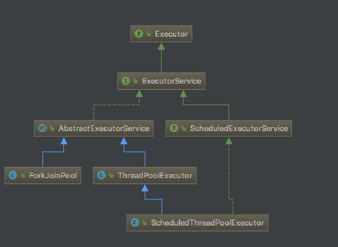

# java.util.concurrent package 整理

Java 1.5 发行版中增加了 `java.util.concurrent` 包, 该包包含 `Executor Framework`, 并发集合`concurrent collection`, 同步器`synchronizer`。

- 并发集合为标准集合接口(`List`, `Queue`, `Map`)提供了高性能的并发实现。这些类自己管理同步。 并发集合并不能排除并发活动, 将其锁定没什么用, 只会让程序更慢。 无法对并发集合进行原子的调用。
- 同步器是一些能够使线程能够等待另一个线程的对象, 允许其协同操作。 较常用的是 `CountDownLatch` & `Semaphore`

线程安全的级别:

- 不可变(immutable): 这个类的实例是不可变的, 所以不需要外部的同步。 (eg:`String`, `Long`, `BigInteger`)
- 无条件的线程安全(unconditionally thread-safe): 这个类的实例是可变的, 但有着足够的内部同步, 所以其实例可以被并发使用, 无需任何外部同步。 (eg:`Random`, `ConcurrentHashMap`)
- 有条件的线程安全:
- 非线程安全:
- 线程对立:

## Core AQS

## Thread Pool

Executor 是用于定义自定义线程类子系统的简单标准化接口, 类图如下:

## 并发 collection

- java.util.concurrent.ConcurrentHashMap

## Future 相关

异步操作

## Queue 相关

`java.util.concurrent.BlockingQueue` -> `java.util.concurrent.ArrayBlockingQueue` & `java.util.concurrent.LinkedBlockingQueue`

## locks 相关

`java.util.concurrent.Lock` vs `synchronized`

## atomic 相关

CAS

## wait & notify
