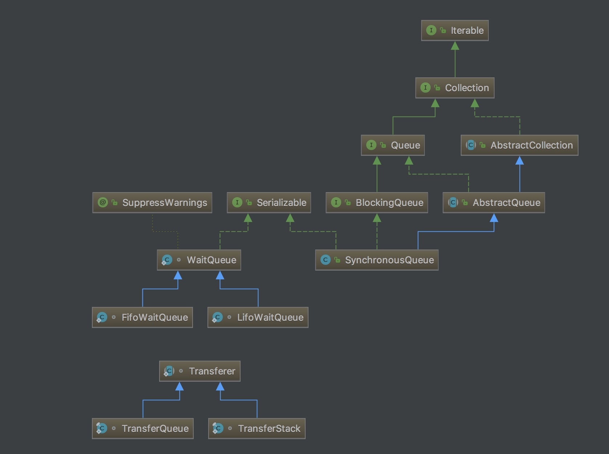

# 并发管理数据结构

- [并发管理数据结构](#%E5%B9%B6%E5%8F%91%E7%AE%A1%E7%90%86%E6%95%B0%E6%8D%AE%E7%BB%93%E6%9E%84)
    - [1. 阻塞队列](#1-%E9%98%BB%E5%A1%9E%E9%98%9F%E5%88%97)
    - [2. 数组阻塞队列](#2-%E6%95%B0%E7%BB%84%E9%98%BB%E5%A1%9E%E9%98%9F%E5%88%97)
    - [3. 链阻塞队列](#3-%E9%93%BE%E9%98%BB%E5%A1%9E%E9%98%9F%E5%88%97)
    - [4. 具有优先级的阻塞队列](#4-%E5%85%B7%E6%9C%89%E4%BC%98%E5%85%88%E7%BA%A7%E7%9A%84%E9%98%BB%E5%A1%9E%E9%98%9F%E5%88%97)
    - [5. 同步队列(SynchronousQueue)](#5-%E5%90%8C%E6%AD%A5%E9%98%9F%E5%88%97synchronousqueue)

## 1. 阻塞队列

## 2. 数组阻塞队列

## 3. 链阻塞队列

## 4. 具有优先级的阻塞队列

## 5. 同步队列(SynchronousQueue)

`package java.util.concurrent.SynchronousQueue` 结构:



等待队列:

```graph
WaitQueue -> LifoWaitQueue
WaitQueue -> FifoWaitQueue 
```

Transferer

```
Transferer -> TransfererQueue
Transferer -> TransfererStack
```