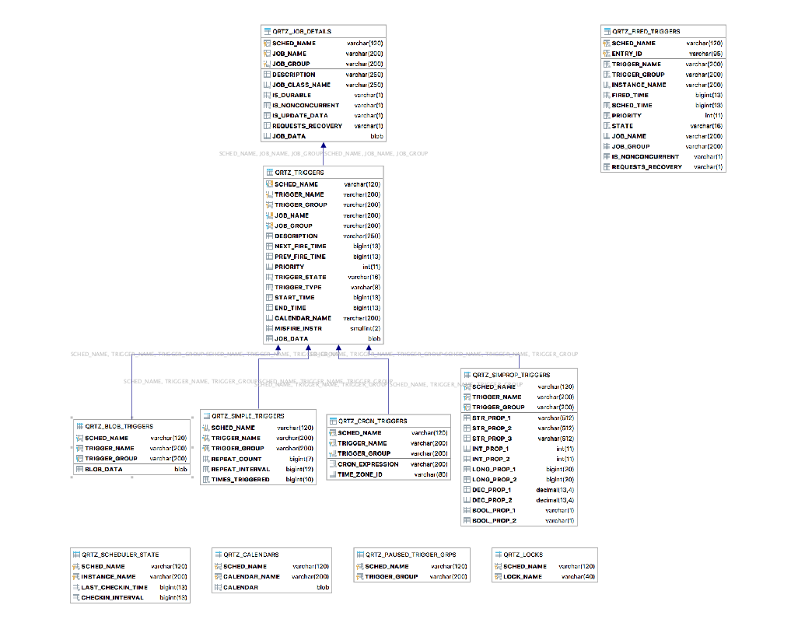

# quartz
- [quartz](#quartz)
    - [1. base learn](#1-base-learn)
    - [2. db configure](#2-db-configure)
        - [2.1 数据库表](#%0821-%E6%95%B0%E6%8D%AE%E5%BA%93%E8%A1%A8)
    - [3. 原理](#3-%E5%8E%9F%E7%90%86)
## 1. base learn

## 2. db configure

### 2.1 数据库表

## 3. 原理
