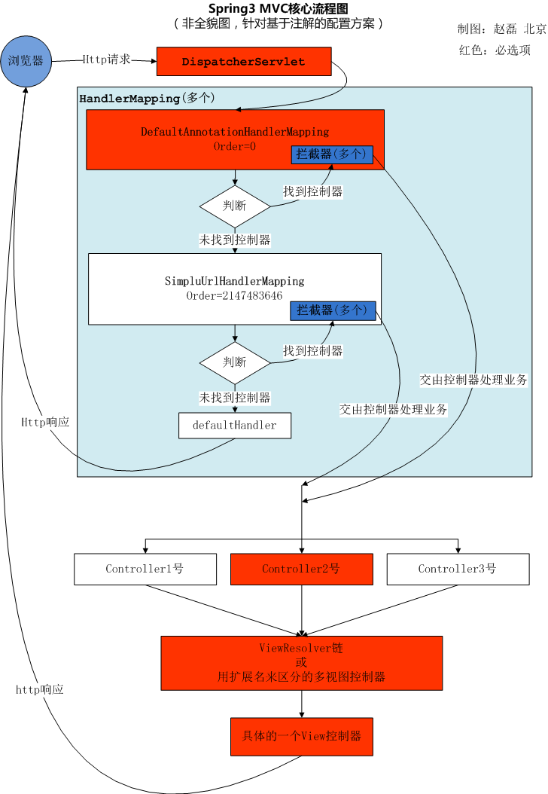

1. 配置 control 代码
2. IOC
3. AOP(日志)
4.

## base

### 核心类和接口

1. DispatcherServlet 前置控制器。
2. HandlerMapping (interface) 处理请求的映射
  1. SimpleUrlHandlerMapping (HandlerMapping 接口的实现类) 通过配置文件, 把一个URL映射到Controller。
  2. DefaultAnnotationHandlerMapping (HandlerMapping 接口的实现类), 通过注解，把一个URL映射到Controller类上。
3. HandlerAdapter (interface) 处理请求的映射
  1. AnnotationMethodHandlerAdapter (HandlerAdapter 接口的实现类), 通过注解，把一个URL映射到Controller类的方法上。
4. Controller (interface) 控制器, 添加 ```@Controller``` 注解注解的类就可以担任控制器 (Action) 的职责。
5. HandlerInterceptor (interface) 拦截器, 实现这个接口, 来完成拦截的器的工作。
6. ViewResolver (interface)
  1. UrlBasedViewResolver (ViewResolver 接口的实现类), 通过配置文件，把一个视图名交给到一个View来处理。
  2. InternalResourceViewResolver (ViewResolver 接口的实现类), 比上面的类，加入了JSTL的支持。
7. View (interface)
  1. JstlView
8. LocalResolver
9. HandlerExceptionResolver(interface) 异常处理类
  1. SimpleMappingExceptionResolver (HandlerExceptionResolver 接口的实现类)。
10. ModelAndView

### 核心流程图



### DispatcherServlet 说明

使用 Spring MVC, 配置 DispatcherServlet 是第一步。  
DispatcherServlet 是一个 Servlet, 所以可以配置多个 DispatcherServlet。
DispatcherServlet 是前置控制器, 配置在 web.xml 文件中的。拦截匹配的请求, Servlet 拦截匹配规则要自已定义, 把拦截下来的请求, 依据某某规则分发到目标 Controller(写的 Action ) 来处理。

“某某规则”: 是根据你使用了哪个 HandlerMapping 接口的实现类的不同而不同

example:

```xml
<web-app>  
    <servlet>  
        <servlet-name>example</servlet-name>  
        <servlet-class>org.springframework.web.servlet.DispatcherServlet</servlet-class>  
        <load-on-startup>1</load-on-startup>  
    </servlet>  
    <servlet-mapping>  
        <servlet-name>example</servlet-name>  
        <url-pattern>*.form</url-pattern>  
    </servlet-mapping>  
</web-app>
```

`<load-on-startup>1</load-on-startup>` 是启动顺序, 让这个 `Servlet` 随 `Servletp` 容器一起启动。  
`<url-pattern>*.form</url-pattern>` 会拦截 `*.form` 结尾的请求。  
`<servlet-name>example</servlet-name>` 这个 `Servlet` 的名字是 `example`, 可以有多个 `DispatcherServlet`, 是通过名字来区分的。每一个 `DispatcherServlet` 有自己的 `WebApplicationContext` 上下文对象, 同时保存的 `ServletContext` 中和 Request 对象中。

在 `DispatcherServlet` 的初始化过程中, 框架会在 web 应用的 WEB-INF文件夹下寻找名为[servlet-name]-servlet.xml 的配置文件，生成文件中定义的bean
