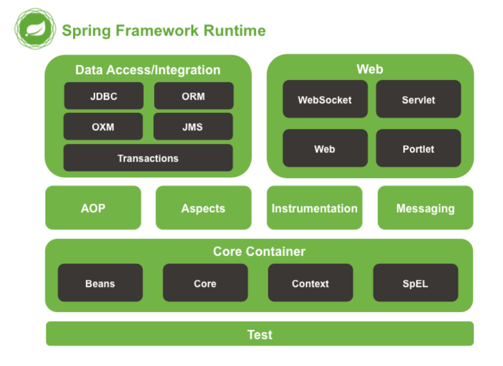
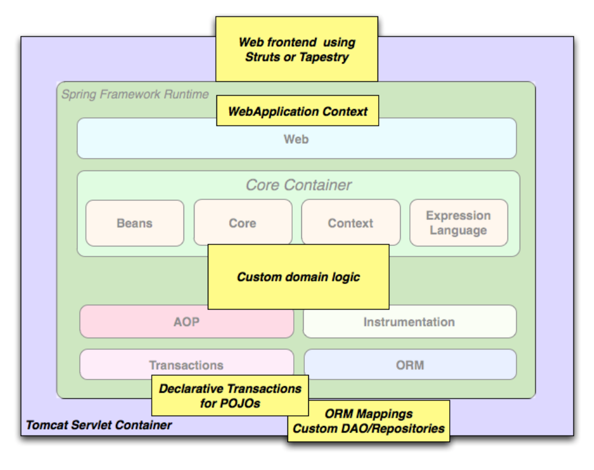
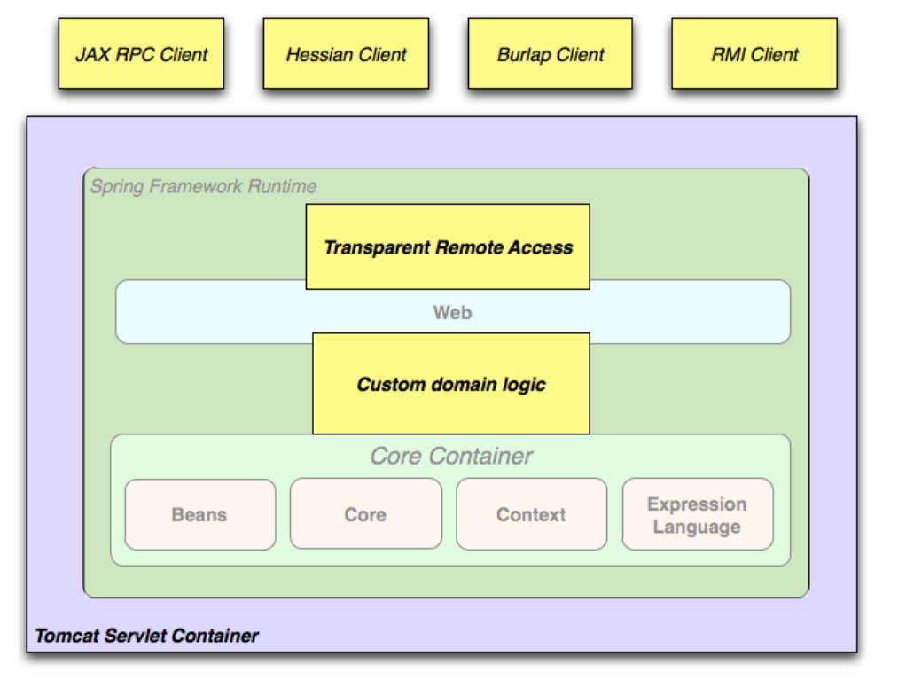
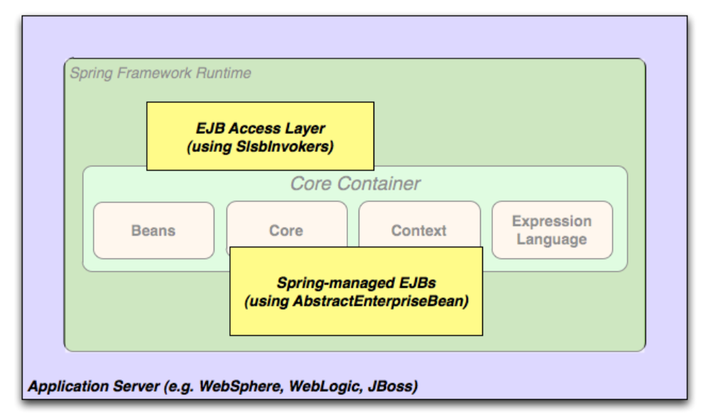
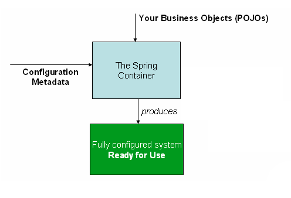

# Spring 框架参考文档

原文地址: [Spring Framework Reference Documentation](https://docs.spring.io/spring/docs/4.3.19.BUILD-SNAPSHOT/spring-framework-reference/htmlsingle/)

- 目录

- [Spring 框架参考文档](#spring-%E6%A1%86%E6%9E%B6%E5%8F%82%E8%80%83%E6%96%87%E6%A1%A3)
    - [I. Spring 框架概览](#i-spring-%E6%A1%86%E6%9E%B6%E6%A6%82%E8%A7%88)
        - [1.开始](#%081%E5%BC%80%E5%A7%8B)
        - [2. Spring 框架介绍](#2-spring-%E6%A1%86%E6%9E%B6%E4%BB%8B%E7%BB%8D)
            - [2.1 DI 和 IoC](#21-di-%E5%92%8C-ioc)
            - [2.2 模块](#22-%E6%A8%A1%E5%9D%97)
                - [2.2.1 概述](#221-%E6%A6%82%E8%BF%B0)
                - [2.2.2 核心容器](#222-%E6%A0%B8%E5%BF%83%E5%AE%B9%E5%99%A8)
                - [2.2.3 AOP and Instrumentation](#223-aop-and-instrumentation)
                - [2.2.4 Messaging](#224-messaging)
                - [2.2.5 数据访问/集成](#225-%E6%95%B0%E6%8D%AE%E8%AE%BF%E9%97%AE%E9%9B%86%E6%88%90)
                - [2.2.6 Web](#226-web)
                - [2.2.7 Test](#227-test)
            - [2.3 使用场景](#23-%E4%BD%BF%E7%94%A8%E5%9C%BA%E6%99%AF)
                - [2.3.1 依赖关系管理 和 命名约定](#231-%E4%BE%9D%E8%B5%96%E5%85%B3%E7%B3%BB%E7%AE%A1%E7%90%86-%E5%92%8C-%E5%91%BD%E5%90%8D%E7%BA%A6%E5%AE%9A)
                - [2.3.2 日志](#232-%E6%97%A5%E5%BF%97)
    - [II. What's New in Spring Framework 4.x](#ii-whats-new-in-spring-framework-4x)
    - [III. 核心技术](#iii-%08%E6%A0%B8%E5%BF%83%E6%8A%80%E6%9C%AF)
        - [7. IoC 容器](#7-ioc-%E5%AE%B9%E5%99%A8)
            - [7.1 Spring IoC 容器和 Bean 的介绍](#71-spring-ioc-%E5%AE%B9%E5%99%A8%E5%92%8C-bean-%E7%9A%84%E4%BB%8B%E7%BB%8D)
            - [7.2 容器概述](#72-%E5%AE%B9%E5%99%A8%E6%A6%82%E8%BF%B0)
                - [7.2.1 配置元数据](#721-%E9%85%8D%E7%BD%AE%E5%85%83%E6%95%B0%E6%8D%AE)
                - [7.2.2 实例化容器](#722-%E5%AE%9E%E4%BE%8B%E5%8C%96%E5%AE%B9%E5%99%A8)
                - [7.2.3](#723)
            - [7.3 Bean 概述](#73-bean-%E6%A6%82%E8%BF%B0)
                - [7.3.1 Bean 命名](#731-bean-%E5%91%BD%E5%90%8D)
                - [7.3.2 初始化 Bean](#732-%E5%88%9D%E5%A7%8B%E5%8C%96-bean)
                - [7.3.3](#733)
            - [7.4 Dependencies](#74-dependencies)
                - [7.4.1 依赖注入](#741-%E4%BE%9D%E8%B5%96%E6%B3%A8%E5%85%A5)
                - [7.4.4 Lazy-initialization Bean](#744-lazy-initialization-bean)
            - [7.5 Bean 范围](#75-bean-%E8%8C%83%E5%9B%B4)
            - [7.9 基于 Java 注解的容器配置](#79-%E5%9F%BA%E4%BA%8E-java-%E6%B3%A8%E8%A7%A3%E7%9A%84%E5%AE%B9%E5%99%A8%E9%85%8D%E7%BD%AE)
            - [7.12 基于 Java 代码的容器配置](#712-%E5%9F%BA%E4%BA%8E-java-%E4%BB%A3%E7%A0%81%E7%9A%84%E5%AE%B9%E5%99%A8%E9%85%8D%E7%BD%AE)
                - [7.12.3 使用 @Bean 注解](#7123-%E4%BD%BF%E7%94%A8-bean-%E6%B3%A8%E8%A7%A3)
        - [8. Resources](#8-resources)
        - [9. Validation, Data Binding, and Type Conversion](#9-validation-data-binding-and-type-conversion)
        - [10. Spring Expression Language](#10-spring-expression-language)
        - [11. Aspect Oriented Programming with Spring](#11-aspect-oriented-programming-with-spring)
            - [11.8 通过 AspectJ 和 Spring 来依赖注入 domain 对象](#118-%E9%80%9A%E8%BF%87-aspectj-%E5%92%8C-spring-%E6%9D%A5%E4%BE%9D%E8%B5%96%E6%B3%A8%E5%85%A5-domain-%E5%AF%B9%E8%B1%A1)
        - [12. Spring AOP APIs](#12-spring-aop-apis)
    - [IV. Test](#iv-test)
    - [V. Data Access](#v-data-access)
    - [VI. The Web](#vi-the-web)
    - [VII. Integration](#vii-integration)
    - [VIII. Appendices](#viii-appendices)

## [I. Spring 框架概览](https://docs.spring.io/spring/docs/4.3.19.BUILD-SNAPSHOT/spring-framework-reference/htmlsingle/#overview-getting-started-with-spring)

Spring 框架是一个轻量级的解决方案, 并可能为企业级应用提供一个一站式的服务。 尽管 Spring 是一由多部件组成的, 但是 Spring 允许只引入所需要的部分而不是必须吧其他的也一并引入。 你可以在任何 Web 框架下使用 IoC 容器, 也可以只使用 Hibernate 集成代码活 JDBC 抽象层。 Spring 支持声明式事务管理, 通过 RMI 或 Web 服务进行远程访问, 以及用于持久化保存数据的各种选项。 ~~它提供了全功能的 MVC 框架, 支持将 AOP 显示地集成软件中。??? 有点问题~~

Spring 被设计成 `non-instrusive`, 即逻辑代码一般没有依赖框架本身。 在集成这一层(如s护具访问层), 将存在一些对数据访问技术和 Spring 库的依赖, 但很容易将这些依赖与其他代码库隔离开。

This document is a reference guide to Spring Framework features. If you have any requests, comments, or questions on this document, please post them on the user mailing list. Questions on the Framework itself should be asked on StackOverflow (see https://spring.io/questions).

### 1.开始

参考指南提供关于 Spring 框架的具体细节, 包括 Spring 框架的所有特性和相关概念。

### 2. Spring 框架介绍  

Spring 框架是为 Java 应用程序提供全面的基础框架支持的一个 Java 平台, Spring 处理基础架构, 以便专注于应用程序的开发。

Spring 能够使得应用开发基于 POJOs(plain old Java objects), 并以非入侵方式将企业服务应用于 POJO。 此功能适用于 Java SE 编程模型以及完整和部分 Java EE。

Example: 
> - 使 Java 方法在数据库事务中执行, 而不必处理事物API。
> - 使本地方法称为 HTTP 端点, 无需去处理 Servlet API。
> - 使本地方法成为消息处理程序, 而无需处理 JMS API。
> - 使本地方法成为管理操作, 而无需处理JMX API。

#### 2.1 DI 和 IoC

Java应用程序 (从受限制的嵌入式应用程序到n层服务器端企业应用程序的宽松术语) 通常由协作形成应用程序的对象组成。 因此, 应用程序中的对象彼此依赖。 尽管Java平台提供了丰富的应用程序开发功能, 但它缺乏将基本构建块组织成一个连贯整体的方法, 并将该任务留给架构师和开发人员。 

~~尽管能够通过像工厂、抽象工厂、建造者、装饰者、服务定位器等设计模式来组成应用程序的各种累和对象实例, 但这些模式被描述为模式的作用、应用位置、解决的问题等只是给出名称的最佳实践。不通`Although the Java platform provides a wealth of application development functionality, it lacks the means to organize the basic building blocks into a coherent whole, leaving that task to architects and developers. Although you can use design patterns such as Factory, Abstract Factory, Builder, Decorator, and Service Locator to compose the various classes and object instances that make up an application, these patterns are simply that: best practices given a name, with a description of what the pattern does, where to apply it, the problems it addresses, and so forth. Patterns are formalized best practices that you must implement yourself in your application.`~~

Spring 框架控制反转(IoC)组件通过提供一种 将不同组件 组合成 一个可以使用的 完全工作的 应用程序的 形式化方法来解决这一问题。 Spring 框架将形式化的设计模式编码为可以集成到应用程序中的 first-class 对象。 许多组织和机构以这种方式使用Spring 框架来设计健壮且可维护的应用程序。

> Background  
> "The question is, what aspect of control are [they] inverting?" Martin Fowler posed this question about Inversion of Control (IoC) on his site in 2004. Fowler suggested renaming the principle to make it more self-explanatory and came up with Dependency Injection.

#### 2.2 模块

##### 2.2.1 概述



##### 2.2.2 核心容器

核心容器包含了 `spring-core`, `spring-beans`, `spring-context`, `spring-context-support` 和 `spring-expression(spring Expression Language)` 模块。

`spring-core` 和 `spring-beans` 模块提供了 Spring 框架的最基本的部分, 包含了 IoC 和 DI 的特性。 `BeanFactory` 是工厂模式的复杂实现, 它消除了对程序化单例的需求, 并允许从实际程序逻辑中分离依赖项的配置和规范。

Context(`spring-context`) 模块建立在 `spring-core` 和 `spring-beans` 模块提供的坚实基础之上, 这是一种类似于 `JNDI` 注册表的框架样式方式来访问对象的方法。Context 模块继承了 Bean 模块中的特性, 并且增加了对国际化的支持(如: resource bundles), 事件传播, 资源加载, 显式创建上下文(如: Servlet 容器)。 Context 模块还提供诶类似于 Java EE 的特性(如: EJB, JMX, 基本的远程处理)。 `ApplicationContext` 接口是 Context 模块的焦点, `spring-context-support` 提供集成三方依赖(如: 缓存[`EhCache`, `Guava`, `JCache`], 邮件(`JavaMail`), 任务调度[`CommonJ`, `Quartz`], 模版引擎[`FreeMarker`, `JasperReports`, `Velocity`])到 Spring Application的支持。

`spring-expression` 模块提供了一个强有力的在运行时查询和操作对象的 `Expression Language(表达语言)`。 它是 `JSP 2.1` 规范中指定的统一表达式语言(统一EL)的扩展。 EL 提供配置 `setter` 和 `getter` 的值, 分配 property, 方法调用, 访问数组、集合、索引器中的内容, 逻辑和算数运算符, 命名变量以及从 Spring 的 IoC 容器中按名称检索对象。 EL 还支持表投影和选择以及常用列表聚合。

##### 2.2.3 AOP and Instrumentation

`spring-aop` 模块提供了一个符合 AOP Alliance 标准的允许自定义的面相切面的编程实现, 如: 方法拦截器和切点干净的解耦实现应当分离的功能代码。 使用源级元数据功能, 还能够以类似 `.NET` 属性的方式将行为信息和冰岛代码中。

TODO
**`spring-aspects` 模块提供与 `AspectJ` 集成的支持。**

**`spring-instrument` 模块提供了在某些应用程序服务中使用类检测和类加载的支持的实现。**

##### 2.2.4 Messaging

Spring Framework 4 包含 `spring-messaging` 模块, 该模块是对集成 `Message`, `MessageChannel`, `MessageHandler` 的关键抽象, 可作为基于消息传递的应用程序的基础。 该模块还提供了一系列将消息映射到方法的注解(类似于 Spring MVC 注解的编程模型)。

##### 2.2.5 数据访问/集成

数据访问/集成层由 `JDBC`, `ORM`, `OXM(对象 XML 映射解析)`, `JMS(Java Message Service)`, `Transaction(事物)` 模块组成。

`spring-jdbc` 模块提 JDBC 抽象层, 无需进行繁琐的 JDBC 编码和解析数据库供应商特定的错误代码。

`spring-tx` 模块支持对实现特殊接口和所有 POJO 的类进行编程和声明事务管理。

`spring-orm` 模块为流行的 ORM API 提供集成层, 包括JPA, JDO 和 Hibernate。 通过 `spring-orm` 模块, 所有的 ORM 框架与 Spring 提供的其他功能可以结合使用(~~类似简单声明事务管理的功能???~~)。

`spring-oxm` 模块提供一个抽象层, 支持 OXM(对象/XML映射) 实现, 如 `JAXB`, `Castor`, `XMLBeans`, `JiBX` 和 `XStream`。

`spring-jms` 模块包含用于生产和消费消息的功能。 到 Spring Framework 4.1 开始提供 `spring-messaging` 模块的集成。

##### 2.2.6 Web

Web 层由 `spring-web`, `spring-webmvc`, `spring-websocket` 和 `spring-webmvc-protlet` 模块组成。

`spring-web` 模块提供了基本的面向 Web 的集成功能, 如: multipart(多部分?) 文件上传功能, 用 `Servlet` 的 `listener` 和面向 Web 的 application context(应用程序上下文) 来初始化 IoC 容器。 同时包含了一个 HTTP 客户端和 Spring 远程支持的 Web 相关部分。

`spring-webmvc` 模块(也被称为 `Web-Servlet 模块) 包含 Spring 的 MVC 和 REST Web 服务的实现。 Spring 的 MVC 框架提供了域模型代码和 Web 表单之间的清晰分离, 并于 Spring 框架的其他功能集成在一起。

`spring-webmvc-portlet` 模块(也被称为 `Web-Poerlet` 模块) 提供了在 Portlet 环境中使用 MVC 的具体实现, 包含 基于 Servlet 的 `spring-webmvc` 的基本功能。

##### 2.2.7 Test

`spring-test` 模块通过 `JUnit` 和 `TestNG`提供了 Spring 的组件的单元测试和集成测试。 该模块提供了一致的 `Spring ApplicationContext` 的加载, 并缓存这些 context。 同时, 它还提供 mock 对象用来隔离测试。

#### 2.3 使用场景

前面描述的构建块使 Spring 成为许多场景中的合理选择, 从在资源受限设备上运行的嵌入式应用程序到使用 Spring 的事务管理功能和 Web 框架集成的成熟企业应用程序。

- 典型的完整 Spring web 应用


- Spring 中间层使用第三方的 Web 框架



- 远程处理场景



- EJB - 包装现有的 POJO



##### 2.3.1 依赖关系管理 和 命名约定

依赖关系管理和依赖注入不同。 要将 Spring 的这些优秀功能集成到应用中(如: 依赖注入), 需要组装所需的所有库, 并在编译时和运行时将它们放到 `classpath` 下。 这些依赖不是被注入的虚拟的组件, 而是真实存在的系统文件。 依赖关系管理涉及定位、存储这些资源, 并将它们加载到 `classpath` 中。

- Spring Framework Articats

GroupId | ArtifactId | 描述 
---|---|---
org.springframework | spring-aop | 基于代理的 AOP 支持
org.springframework | spring-aspects | 基于 aspects 的 AspectJ
org.springframework | spring-beans | 包括 `groovy` 的 `bean` 支持
org.springframework | spring-context | 应用的运行时 context(上下文), 包括远程调用和任务调度的抽象
org.springframework | spring-context-support | 支持类, 包括常见的三方库集成到 Spring 程序的上下文中
org.springframework | spring-core | 核心工具, 被其他的 Spring 模块使用
org.springframework | spring-expression | Spring EL 表达式
org.springframework | spring-instrument | 用于 JVM 引导的检测代理程序
org.springframework | spring-instrument-tomcat | 用于 JVM 引导的检测 Tomcat 的代理程序
org.springframework | spring-jdbc | JDBC 支持包, 包括数据源配置和对数据库访问数据的支持
org.springframework | spring-jms | JMS 支持包, 包括用于 发送/接收 JSM 消息的辅助类
org.springframework | spring-messaging | ~~支持通过消息传递结构和协议(Support for messaging architectures and protocols)~~
org.springframework | spring-orm | orm, 包括 JPA, Hibernate 的支持
org.springframework | spring-oxm | 对象/XML的映射
org.springframework | spring-test | 提供单元测试和集成测试
org.springframework | spring-tx | 提供事物管理, 包括 DAO 支持 和 JCA 集成
org.springframework | spring-web | 基础 Web 支持, 包括 Web 客户端和基于 Web 的远程处理
org.springframework | spring-webmvc | 用于 Servlet stack 的 基于 HTTP 的 MVC 和 REST ~~端点(endpoints??)~~
org.springframework | spring-webmvc-portlet | 在 `Portlet` 环境中使用的 MVC 实现
org.springframework | spring-websocket | WebSocket 和 SockJS 的基础框架, 包括 STOMP 消息传递的支持

##### 2.3.2 日志
TODO

## II. What's New in Spring Framework 4.x
TODO
1. 4.0 新特性
2. 4.1 新特性
3. 4.2 新特性
4. 4.3 新特性

## III. 核心技术

该部分涵盖了 Spring 框架的绝对不可或缺的技术。

其中最重要的是 `Inversion of Control(IoC)` 容器, 

### 7. IoC 容器

#### 7.1  Spring IoC 容器和 Bean 的介绍

该部分包含了 Spring 框架实现 IoC 的原则。 IoC 也称为依赖注入(Dependency Inject/DI)。 ~~这是一个过程，通过这个过程，对象定义它们的依赖关系，即它们使用的其他对象，只能通过构造函数参数，工厂方法的参数，或者在构造或从工厂方法返回后在对象实例上设置的属性。~~ 容器在创建 `bean` 的时候注入这些依赖。 这个过程基本是相反的, 因此名称 `Inversion of Control(IoC)`, bean 本身通过使用类的直接构造或诸如 `Service Locator` 模式之类的机制来控制其依赖关系的实例化或位置。

`org.springframework.beans` 和 `org.springframework.context` 是 Spring 框架的 IoC 容器的基础。 `BeanFactory` 接口提供能够管理任何类型对象的高级配置机制。 `ApplicationContext` 是 `BeanFactory` 的一个子接口, 它使得集成 Spring AOP、 国际化、 ~~事件发布(event publication)~~ 和 如同 `WebApplicationContext` 的应用于一个 Web 应用的特定层的上下文 的功能更容哟。

总而言之, `BeanFactory` 提供了配置框架和基本的功能, `ApplicationContext` 添加了更多的企业专有的特性。 `ApplicationContext` 是 `BeanFactory` 的更完善的一个~~超集(superset?)~~。   refer to Section 7.16, “The BeanFactory”.

在 Spring 框架中, 构成应用程序主干并由 Spring IoC 容器管理的对象成为 bean。 Bean 是由 Spring IoC 容器 实例化, 组装 和 管理的对象。 另外, Bean 只是应用程序中的众多对象之一。 Bean 及其之间的依赖关系反映在容器使用的配置元数据中。

#### 7.2 容器概述

`org.springframework.context.ApplicationContext` 接口表示 Spring IoC 容器, 负责实例化、配置和组装上述 Bean。 容器通过配置元数据获取有关要实例化、配置和组装的对象的指令。 配置元数据通过 `XML`, 注解, 或者 Java 代码表示, 它允许通过表达式来组成应用以及这些对象之间的丰富的相互依赖。

接口 `ApplicationContext` 的几个实现是与 Spring 一起提供的。在独立的应用中, 创建 `ClassPathXmlApplicationContext` 或者 `FileSystemXmlApplicationContext` 是很常见的。 虽然 XML 是定义 Bean 的传统方式, 但仍可以通过提供少量 XML 配置来声明性的支持其他元数据方式。 从而使容器使用注解或者代码的方式。

在很多应用场景下, 实例化 Spring IoC 容器的一个或多个实例不需要显示的代码。 如: 在一个 Web 应用的场景, `web.xml` 文件中的简单几行描述即可。

- Spring IoC 容器



##### 7.2.1 配置元数据

Spring IoC 容器从配置元数据中消费, 该配置元数据, 该配置元数据表示如何告诉 Spring 容器在应用程序中实例化, 配置 和组装对象。

配置元数据的传统配置方法是以 XML 的方式提供, 本章大部分内容用于传达 Spring IoC 容器的关键概念和功能。 

> 基于 XML 的元数据不是唯一的配置元数据的形式, Spring IoC 容器本身与实际编写的元数据格式完全分离。 [基于 Java 代码的配置](#712-%E5%9F%BA%E4%BA%8E-java-%E4%BB%A3%E7%A0%81%E7%9A%84%E5%AE%B9%E5%99%A8%E9%85%8D%E7%BD%AE)

有关在 Spring 容器中使用其他形式的元数据的信息, 请参阅: 

- [基于 Java 注解配置](#79-%E5%9F%BA%E4%BA%8E-java-%E6%B3%A8%E8%A7%A3%E7%9A%84%E5%AE%B9%E5%99%A8%E9%85%8D%E7%BD%AE): Spring 2.5 引入了对基于注解的配置元数据
- [基于 Java 代码配置](#712-%E5%9F%BA%E4%BA%8E-java-%E4%BB%A3%E7%A0%81%E7%9A%84%E5%AE%B9%E5%99%A8%E9%85%8D%E7%BD%AE): 从 Spring 3.0 开始, Spring JavaConfig 项目提供的许多功能成为 Spring 框架的一部分。 因此能够使用 Java 在应用程序类外部定义 Bean 而非 XML。 通过 `@Configuration`, `Bean`, `@Import` 和 `@DependsOn` 注解来使用这些新功能。

Spring 配置由至少一个(通常不止一个) bean 定义组成, 基于 XML 的配置元数据通过 `<bean/>` 元素展现, `<bean/>` 元素在 `<beans/>` 元素里。 Java 配置通常在 `@Configuration` 注解的类中使用 `@Bean` 注解。

这些 bean 定义对应于构成应用程序的实际对象。 通常, 定义服务层对象(如: 数据访问层/DAO, ~~presentation objects such as Struts Action instances~~, 基础设施对象如 Hibernate 的 `SessionFactories`, JMS `Queue`, 等)。 通常, 不会在容器中配置细粒度 `domain` 对象, 因为 DAO 和业务逻辑通常负责创建和加载对象。 然而, **也可以使用 `Spring` 与 `AspectJ` 集成来配置在 IoC 容器的控制之外创建的对象。** 请参阅: [通过 AspectJ 和 Spring 来依赖注入 domain 对象](#118-%E9%80%9A%E8%BF%87-aspectj-%E5%92%8C-spring-%E6%9D%A5%E4%BE%9D%E8%B5%96%E6%B3%A8%E5%85%A5-domain-%E5%AF%B9%E8%B1%A1).

- 基于 XML 配置 Spring 元数据的基本结构

```xml
<?xml version="1.0" encoding="UTF-8"?>
<beans xmlns="http://www.springframework.org/schema/beans"
    xmlns:xsi="http://www.w3.org/2001/XMLSchema-instance"
    xsi:schemaLocation="http://www.springframework.org/schema/beans
        http://www.springframework.org/schema/beans/spring-beans.xsd">

    <bean id="..." class="...">
        <!-- collaborators and configuration for this bean go here -->
    </bean>

    <bean id="..." class="...">
        <!-- collaborators and configuration for this bean go here -->
    </bean>

    <!-- more bean definitions go here -->

</beans>
```

具体配置参见: [7.4 Dependencies](#74-dependencies)

##### 7.2.2 实例化容器

实例化 Spring IoC 容器很简单, 提供给 ApplicationContext 构造函数的位置路径实际上是资源字符串, 允许容器从各种外部资源 (如本地文件系统, Java CLASSPATH等) 加载配置元数据。

```java
ApplicationContext context = new ClassPathXmlApplicationContext("services.xml", "daos.xml");
```

> 在学习过关于 Spring IoC 容器后, 也许对 Spring 的 `Resource` 的抽象会知道更多。 详细描述见 [Resource](#8-resources) 。 ~~as described in Chapter 8, Resources, which provides a convenient mechanism for reading an InputStream from locations defined in a URI syntax. In particular, Resource paths are used to construct applications contexts as described in Section 8.7, “Application contexts and Resource paths”.~~

- Service 层的配置: 

```xml
<?xml version="1.0" encoding="UTF-8"?>
<beans xmlns="http://www.springframework.org/schema/beans"
    xmlns:xsi="http://www.w3.org/2001/XMLSchema-instance"
    xsi:schemaLocation="http://www.springframework.org/schema/beans
        http://www.springframework.org/schema/beans/spring-beans.xsd">

    <!-- services -->

    <bean id="petStore" class="org.springframework.samples.jpetstore.services.PetStoreServiceImpl">
        <property name="accountDao" ref="accountDao"/>
        <property name="itemDao" ref="itemDao"/>
        <!-- additional collaborators and configuration for this bean go here -->
    </bean>

    <!-- more bean definitions for services go here -->

</beans>
```

- dao 层的配置:

```xml
<?xml version="1.0" encoding="UTF-8"?>
<beans xmlns="http://www.springframework.org/schema/beans"
    xmlns:xsi="http://www.w3.org/2001/XMLSchema-instance"
    xsi:schemaLocation="http://www.springframework.org/schema/beans
        http://www.springframework.org/schema/beans/spring-beans.xsd">

    <bean id="accountDao"
        class="org.springframework.samples.jpetstore.dao.jpa.JpaAccountDao">
        <!-- additional collaborators and configuration for this bean go here -->
    </bean>

    <bean id="itemDao" class="org.springframework.samples.jpetstore.dao.jpa.JpaItemDao">
        <!-- additional collaborators and configuration for this bean go here -->
    </bean>

    <!-- more bean definitions for data access objects go here -->

</beans>
```

上述例子中, Service 层由 `PetStoreServiceImpl` 对象 和两个数据访问对象 `JpaAccountDao`, `JpaItemDao`(基于 JPA 的 ORM 标准) 组成, `property name` 元素代表 JavaBean 的名称配置, `ref` bean 定义的另一个名称。 `id` 和 `ref` 的联系表示这些类之间的相互依赖关系。具体查看[Dependencies](#74-dependencies)

- 基于 XML 的配置元数据组成

```xml
<beans>
    <import resource="services.xml"/>
    <import resource="resources/messageSource.xml"/>
    <import resource="/resources/themeSource.xml"/>

    <bean id="bean1" class="..."/>
    <bean id="bean2" class="..."/>
</beans>
```

上述例子中, 这个 bean 定义去加载另外三个文件: `service.xml`, `messageSource.xml` & `themeSource.xml`。 所有位置路径与执行导入的定义文件相关, 因此 `service.xml` 必须和 `classpath` 在同一个路径下, `messageSource.xml` & `themeSource.xml` 必须在 `resources`。 

TODO 

##### 7.2.3

`ApplicationContext` 是高级工厂的接口, 能够维护不同 bean 的依赖想的注册表。 通过 `T getBean(String name, Class<T> requiredType)` 方法能够取回相应 bean 的实例。

- `ApplicationContext` 使得能够读取 bean 的定义和访问, 如下:

```java
// create and configure beans
ApplicationContext context = new ClassPathXmlApplicationContext("services.xml", "daos.xml");

// retrieve configured instance
PetStoreService service = context.getBean("petStore", PetStoreService.class);

// use configured instance
List<String> userList = service.getUsernameList();
```

- 通过 Groovy 配置, bootstrap 看起来很小: 

```groovy
ApplicationContext context = new GenericGoovyApplicationContext("services.groovy", "daos.griivy");
```

- TODO

#### 7.3 Bean 概述

IoC 容器能够管理 Bean。 Bean 是通过元数据配置来创建的, 比如: 在 XML 中定义的 `<bean/>`。

在容器内, 这些 Bean 定义表示为 `BeanDefinition` 对象, 其中包含一下元数据: 

- 包限定的类名: 通常是定义的 Bean 的时机实现类。
- Bean 行为配置元素: 说明 bean 在容器中的行为方式(范围、生命周期、回掉等)。
- 被 Bean 的操作所需的 Bean, 这些引用被称为 *collaborators* 或者 *dependencies*。
- 要在新创建的对象中设置的其他配置项, 如: 一些在一个 Bean 中用到的连接, 它们管理着一个 *pool* 或限制大小的 *pool*。

- 定义 Bean

属性 | 解释
---|---
class | [初始化 Bean](#732-%E5%88%9D%E5%A7%8B%E5%8C%96-bean)
name | [Bean 命名](#731-bean-%E5%91%BD%E5%90%8D)
scope | [Bean 范围]()
constructor arguments(构造参数) | [依赖注入](#741-%E4%BE%9D%E8%B5%96%E6%B3%A8%E5%85%A5)
属性(对象的属性) | [依赖注入](#741-%E4%BE%9D%E8%B5%96%E6%B3%A8%E5%85%A5)
autoeiring modo | []()
lazy-initialization mode | []()
initialization method | []()
destruction method | []()

除了包含如何创建特定 Bean 的信息的 Bean 定义之外, `ApplicationContext` 实现还允许用户注册在容器外部创建现有的对象。 这是通过 `getBeanFactory()` 方法访问 `ApplicationContext` 的 `BeanFactory` 来完成的, 该方法返回 `BeanFactory` 的实现 `DefaultListableFeanFactory`, `DefaultListableBeanFactory` 通过 `registerSingleton(...)` 方法和 `registerBeanDefinition(...)` 来支持注册 Bean。 然而, 典型的应用程序仅适用于元数据 Bean 的定义来定义的 Bean。

>  为了使容器在自动装配和其他内省步骤中能够正确推理 Bean, Bean 的元数据和手动供给的单例实例需要尽可能早的被注册。 虽然在某种程度上支持覆盖现有元数据和现有单例实例, 但是在运行时注册新 Bean(与对工厂的实时访问同时) 未获得官方支持, 并可能导致 Bean 容器中的并发访问异常 和/或 不一致状态(可能同时发生)。

##### 7.3.1 Bean 命名

所有 Bean 都有标志符, 这些标识符在托管 Bean 的容器内必须是唯一的。 Bean 通常只有一个标识符, 如果需要多个标识符, 则额外的标识符可以被视为别名。

在基于 XML 的配置元数据, 通过 `id` 或 `name` 属性来  ~~特别说明(定义?)~~  标识符。 `id` 只允许定义一个标识符。 通常, 这些名称是字母数字, 但也可能包含特殊字符。 如果想向 Bean 中引入其他别名, 可以通过用 `,(逗号)`. `;(分号)`. ` (空格)` 分隔的 `name` 属性来定义。

TODO

- 定义 Bean 的化名

在 Bean 定义本身中, 可以为 Bean 提供多个名称, 方法是使用 `id` 属性指定的最多一个名称和 `name` 属性中的任意数量的其他名称。 这些名称可以是同一个 Bean 的等效别名, 并且在某些情况下很有用, 例如允许应用程序中的每个组件通过使用特定于该组件本身的 Bean 名称来引用公共依赖项。

但是, 指定实际定义bean的所有别名并不总是足够的。 有时需要为其他地方定义的 Bean 引入别名。 在大型系统中通常就是这种情况, 其中配置在每个子系统之间分配, 每个子系统具有其自己的一组对象定义。 在基于XML的配置元数据中, 您可以使用 `<alias/>` 元素来完成该配置。

```xml
<alias name="fromName" alias="toName"/>
```
    
在使用此别名定义之后, 同名容器中名为 `fromName的bean` 也可以称为 `toName`。

例如, 子系统A的配置元数据可以通过名称 `subsystemA-dataSource` 引用 `DataSource`, 子系统B的配置元数据可以通过名称 `subsystemB-dataSource` 引用数据源。 在编写使用这两个子系统的主应用程序时, 主应用程序通过名称 `myApp-dataSource` 引用 `DataSource`。 要使所有三个名称引用添加到 `MyApp` 配置元数据的同一对象, 需要使用以下别名定义：

```xml
<alias name="subsystemA-dataSource" alias="subsystemB-dataSource"/>
<alias name="subsystemA-dataSource" alias="myApp-dataSource"/>
```

现在, 每个组件和主应用程序都可以通过一个唯一的名称引用 `DataSource`, 并保证不与任何其他定义冲突(有效的创建命名空间), 但它们引用相同的 Bean。

Java 配置：  
`@Bean` 注解能够提供类似别名的功能, 见 [使用 @Bean 注解](#7123-%E4%BD%BF%E7%94%A8-bean-%E6%B3%A8%E8%A7%A3)

##### 7.3.2 初始化 Bean

Bean 定的的本质是用于创建一个或多个对象。 容器在需要 Bean 时查 Bean 的命名, 并使用由该 Bean 定义封装的配置元数据来创建(或获取)实例。

##### 7.3.3

#### 7.4 Dependencies

##### 7.4.1 依赖注入

##### 7.4.4 Lazy-initialization Bean

#### 7.5 Bean 范围

#### 7.9 基于 Java 注解的容器配置

#### 7.12 基于 Java 代码的容器配置

##### 7.12.3 使用 @Bean 注解

### 8. Resources

### 9. Validation, Data Binding, and Type Conversion

### 10. Spring Expression Language

### 11. Aspect Oriented Programming with Spring

#### 11.8 通过 AspectJ 和 Spring 来依赖注入 domain 对象

### 12. Spring AOP APIs


## IV. Test

1.  Introduction to Spring Testing
2.  Unit Test
org.springframework | spring-. Integration Test
16. Further Resources

## V. Data Access

17. Transaction Manager
18. DAO support
19. Data access with JDBC
20. Object Relational Mapping(ORM) Data Access
    1.  Introduction to ORM with Spring
    2.  General ORM integration consideration
    3.  Hibenrate
    4.  JDO
    5.  JPA
21. Marshalling XML using O/X Mappers

## VI. The Web

22. Web MVC framework
23. View Technologies
24. Integrating with other web frameworks
25. Portlet MVC Framework
26. WebSocket Support
27. CORS Support

## VII. Integration

28. Remoting and web service using Spring
29. Enterprise JavaBeans(EJB) integration
30. JMS
31. JMX
32. JCA CCI
33. Email
34. Task Execution and Schedule
35. Dynamic language support
36. Cache Abstraction

## VIII. Appendices

37. Migrating to Spring Framework 4.x
38. Spring Annotation Programming Model
39. Classic Spring usage
40. Classic Spring AOP usage
41. XML Schema-based configuration
42. Extensible XML authoring
43. Spring JSP Tag Library
44. Spring-form JSP Tag Library
