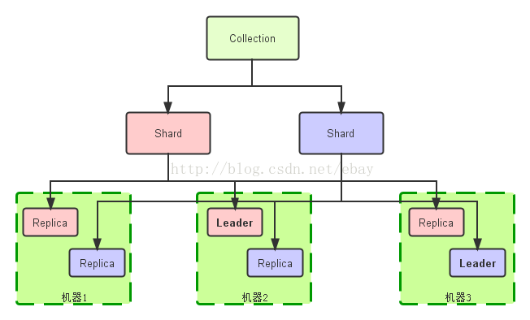
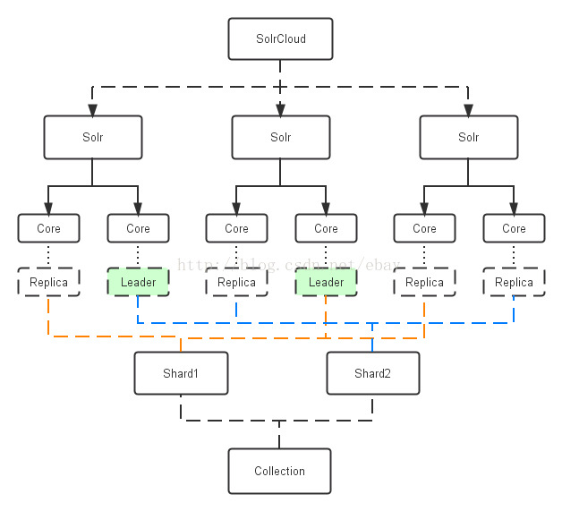
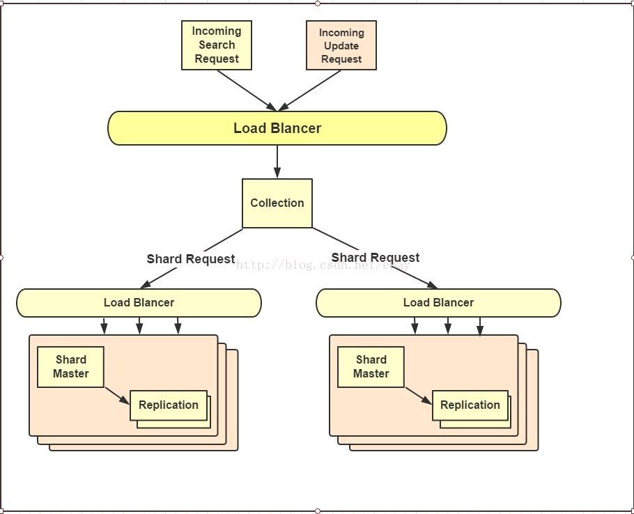

# solr

Lucene 是一个 Java 语言编写的利用倒排原理实现的文本检索类库, Solr 是以 Lucene 为基础实现的文本检索应用服务。

- [apache-solr](http://lucene.apache.org/solr/)
- [Apache Solr Wiki](https://wiki.apache.org/solr/FrontPage)
- [Solr中国](https://www.solr.cc/blog/)

## solr cloud

基本概念:

- Cluster: 一组Solr节点, 逻辑上作为一个单元进行管理, 整个集群使用同一套 Schema 和 SolrConfig  
- Node: 一个运行 Solr 的 JVM 实例  
- Collection: 在 SolrCloud 集群中逻辑意义上的完整的索引, 常常被划分为一个或多个Shard。这些Shard使用相同的 config set, 如果 Shard 数超过一个, 那么索引方案就是分布式索引。
- Core: 也就是 Solr Core，一个 Solr 中包含一个或者多个 SolrCore, 每个 Solr Core 可以独立提供索引和查询功能，Solr Core 额提出是为了增加管理灵活性和共用资源。 SolrCloud 中使用的配置是在 Zookeeper 中的，而传统的 Solr Core 的配置文件是在磁盘上的配置目录中。
- Config Set: Solr Core 提供服务必须的一组配置文件, 每个Config Set有一个名字。必须包含 solrconfig.xml 和 schema.xml, 除此之外，依据这两个文件的配置内容, 可能还需要包含其他文件。Config Set 存储在 Zookeeper 中, 可以重新上传或者使用 upconfig 命令进行更新, 可以用 Solr 的启动参数 bootstrap_confdir 进行初始化或者更新。
- shard: Collection 的逻辑分片。每个 Shard 被分成一个或者多个 replicas, 通过选举确定那个是 Leader。
- Replica: Shard 的一个拷贝。每个 Replica 存在于 Solr 的一个 Core 中。
- Leader: 赢得选举的 Shard replicas, 每个 Shard 有多个 replicas, 这几个 Replicas 需要选举确定一个 Leader。选举可以发生在任何时间。当进行索引操作时, SolrCloud 将索引操作请求传到此 Shard 对应的 leader, leader 再分发它们到全部 Shard 的 replicas。

## Solr Cloud 中完整索引(Collection)逻辑图

在 Solr Cloud 模式下, Collection 是访问 Cluster 的入口。Collection 是逻辑存在的, 可以跨越 Node , 在任意节点上都可以访问 Collection, Shard 也是逻辑存在的, Shard 也是跨 Node 的, 一个 Shard 下面包含 0 个或多个 replica , 但一个 Shard 只能有一个 Leader。

## Solr Cloud 工作模式

SolrCloud 中包含多个 Solr Instance , 每个 Solr Instance 包含多个 Solr Core。 Solr Core 对应一个可以访问的 Solr 索引资源 Replica 。 当 Solr Client 通过 Collection 访问 Solr 集群的时候, 通过 Shard 分片找到对应的 Replica, 即 Solr Core。

 

在 SolrCloud 模式下, 所有 Core 的配置是统一的, Core 有 Leader 和 Replica 两种角色, 每个 Core 一定属于某个 Shard, Core 在 Shard 中扮演 Leader 还是 Replication 由 Solr 内部由 Zookeeper 自动协调。  
访问 SolrCloud 的过程: Solr Client 向 Zookeeper 咨询 Collection 的地址, Zookeeper 返回存活的 Solr instance 以供访问。 插入数据时由 Solr 内部协调数据分发(内部使用一致哈希)

